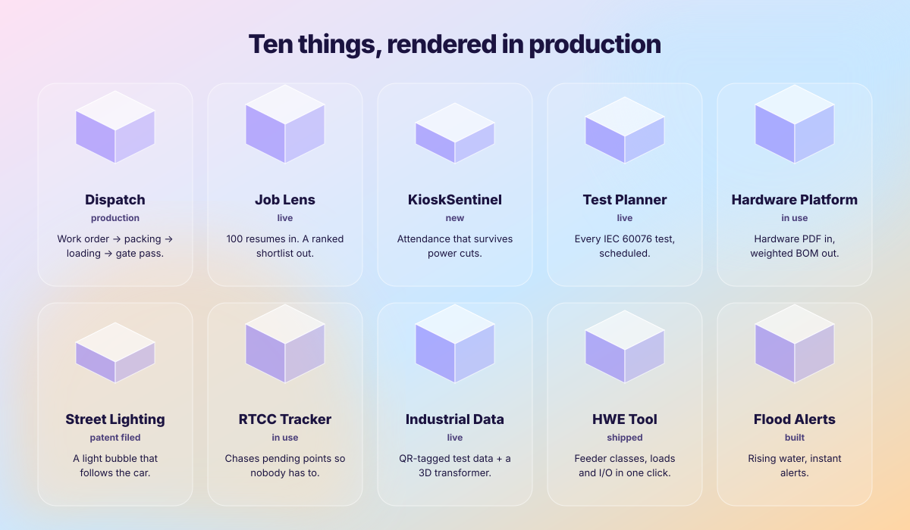

<!-- Glass + 3D: a glass cube turning in true 3D, glass orbs and frosted panels. Night and day backdrops follow your GitHub theme. Built by scripts/gen_glass3d.py -->

<picture><source media="(prefers-color-scheme: dark)" srcset="./assets/glass3d/cube-dark.svg"/></picture>

<picture><source media="(prefers-color-scheme: dark)" srcset="./assets/glass3d/tiles-dark.svg"/></picture>

[Dispatch](https://github.com/KRISH-exe-29/Dispatch-ITTL) · [Job Lens](https://krishna-ittl.github.io/Candidate-Screener/) · [Test Planner](https://transformer-test-planner.vercel.app) · [Hardware Platform](https://github.com/KRISH-exe-29/Fasteners-Project) · [RTCC Tracker](https://github.com/KRISH-exe-29/Pannel-Box-Transformers-) · [Industrial Data](https://github.com/KRISH-exe-29/indotech-transformers)

<a href="mailto:krishnarajus2004@gmail.com">krishnarajus2004@gmail.com</a> · <a href="https://linkedin.com/in/krishnarajus2004">linkedin</a>

