<!-- Neo-brutalist theme: every image has a light and a dark variant (assets/brutal), picked by GitHub's theme. Built by scripts/gen_brutal.py. -->

<picture><source media="(prefers-color-scheme: dark)" srcset="./assets/brutal/hero-dark.svg"/>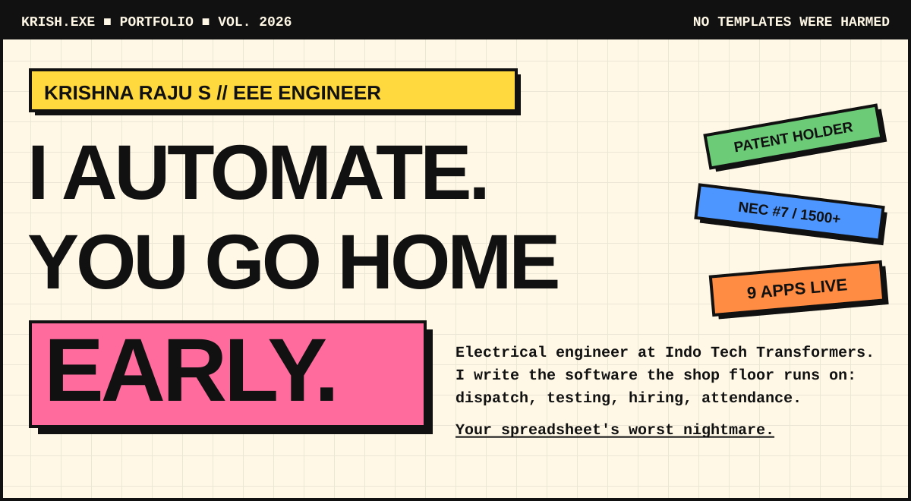</picture>

<picture><source media="(prefers-color-scheme: dark)" srcset="./assets/brutal/ticker-dark.svg"/>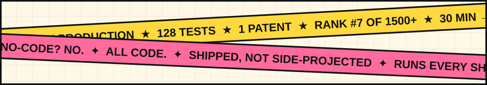</picture>

  
  
  
  

<picture><source media="(prefers-color-scheme: dark)" srcset="./assets/brutal/receipts-dark.svg"/>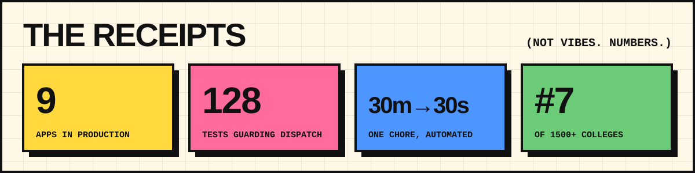</picture>

  <a href="https://github.com/KRISH-exe-29/Dispatch-ITTL"><picture><source media="(prefers-color-scheme: dark)" srcset="./assets/brutal/card-dispatch-dark.svg"/>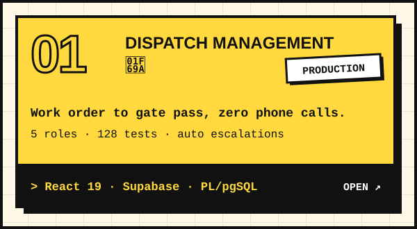</picture></a>
  <a href="https://krishna-ittl.github.io/Candidate-Screener/"><picture><source media="(prefers-color-scheme: dark)" srcset="./assets/brutal/card-job-lens-dark.svg"/>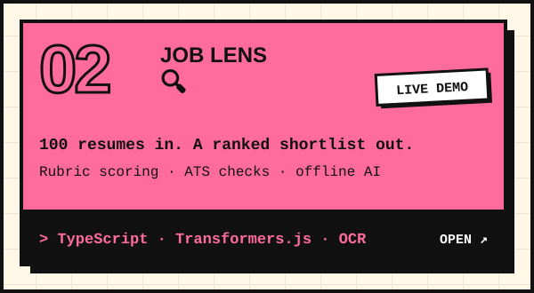</picture></a>
  <picture><source media="(prefers-color-scheme: dark)" srcset="./assets/brutal/card-kiosk-sentinel-dark.svg"/>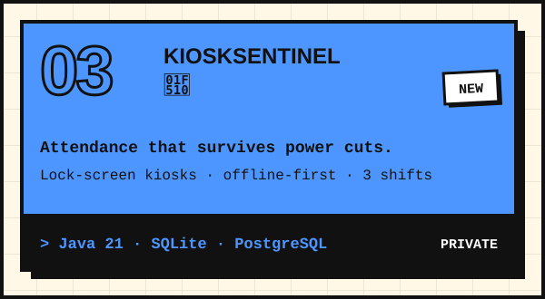</picture>
  <a href="https://transformer-test-planner.vercel.app"><picture><source media="(prefers-color-scheme: dark)" srcset="./assets/brutal/card-test-planner-dark.svg"/>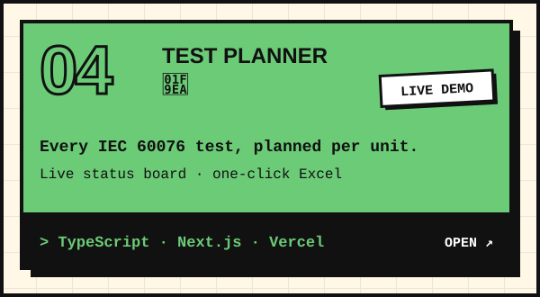</picture></a>
  <a href="https://github.com/KRISH-exe-29/Pannel-Box-Transformers-"><picture><source media="(prefers-color-scheme: dark)" srcset="./assets/brutal/card-rtcc-dark.svg"/>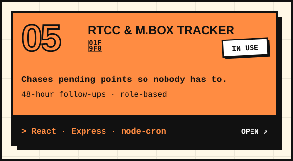</picture></a>
  <a href="https://github.com/KRISH-exe-29/Fasteners-Project"><picture><source media="(prefers-color-scheme: dark)" srcset="./assets/brutal/card-fasteners-dark.svg"/>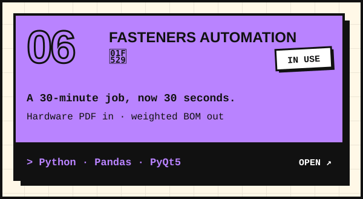</picture></a>
  <a href="https://github.com/KRISH-exe-29/PMS"><picture><source media="(prefers-color-scheme: dark)" srcset="./assets/brutal/card-epms-dark.svg"/>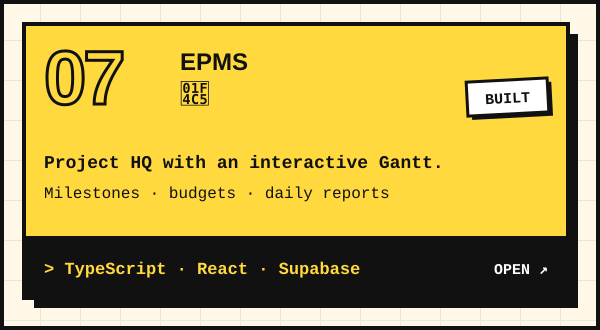</picture></a>
  <a href="https://github.com/KRISH-exe-29/indotech-transformers"><picture><source media="(prefers-color-scheme: dark)" srcset="./assets/brutal/card-industrial-data-dark.svg"/>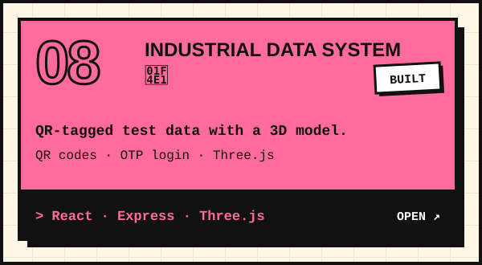</picture></a>
  <a href="https://krishna-ittl.github.io/dmat-practice/"><picture><source media="(prefers-color-scheme: dark)" srcset="./assets/brutal/card-dmat-dark.svg"/>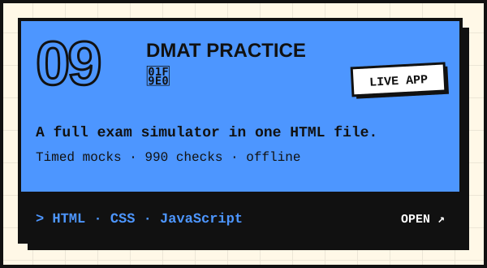</picture></a>
  <picture><source media="(prefers-color-scheme: dark)" srcset="./assets/brutal/card-shop-floor-dark.svg"/>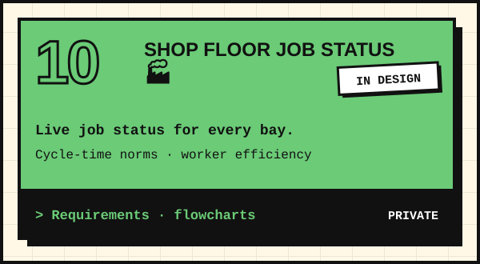</picture>

<picture><source media="(prefers-color-scheme: dark)" srcset="./assets/brutal/flex-dark.svg"/>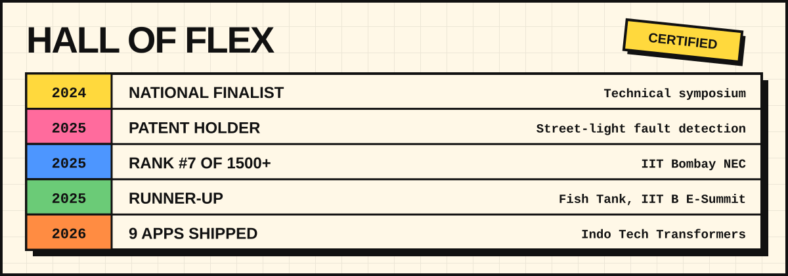</picture>

<picture><source media="(prefers-color-scheme: dark)" srcset="./assets/brutal/weapons-dark.svg"/>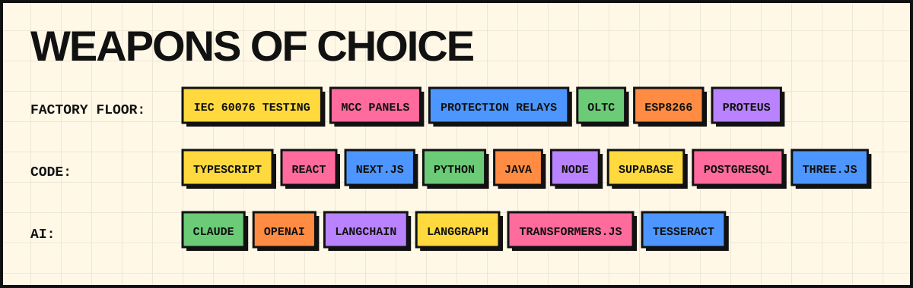</picture>

<picture><source media="(prefers-color-scheme: dark)" srcset="https://streak-stats.demolab.com?user=KRISH-exe-29&hide_border=true&border_radius=24&background=121212&border=F4F1E8&hide_border=false&border_radius=0&ring=FFD93D&fire=FF6B9D&currStreakLabel=FFD93D&currStreakNum=F4F1E8&sideNums=F4F1E8&sideLabels=F4F1E8&dates=F4F1E8"/></picture>

<picture><source media="(prefers-color-scheme: dark)" srcset="./assets/brutal/footer-dark.svg"/></picture>

