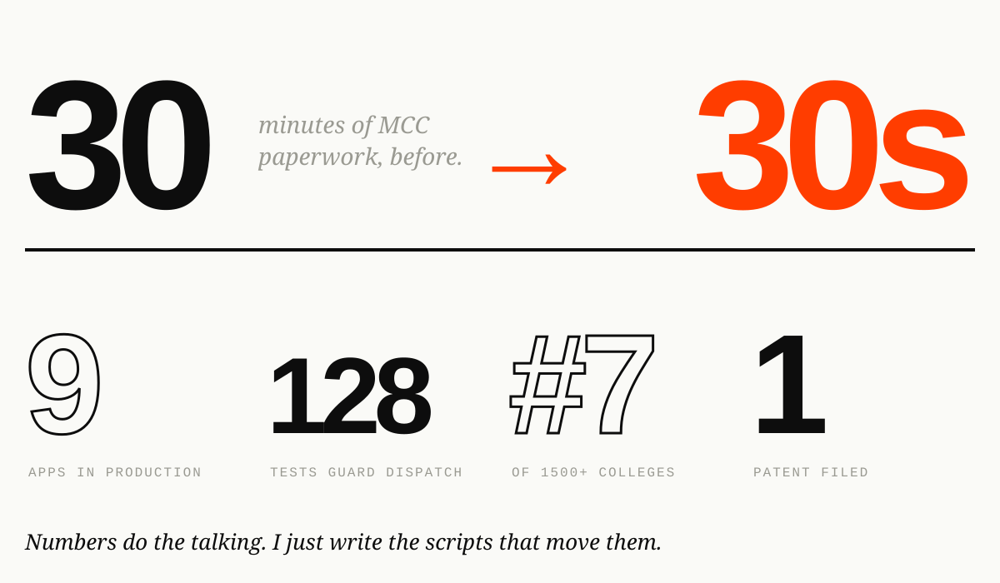
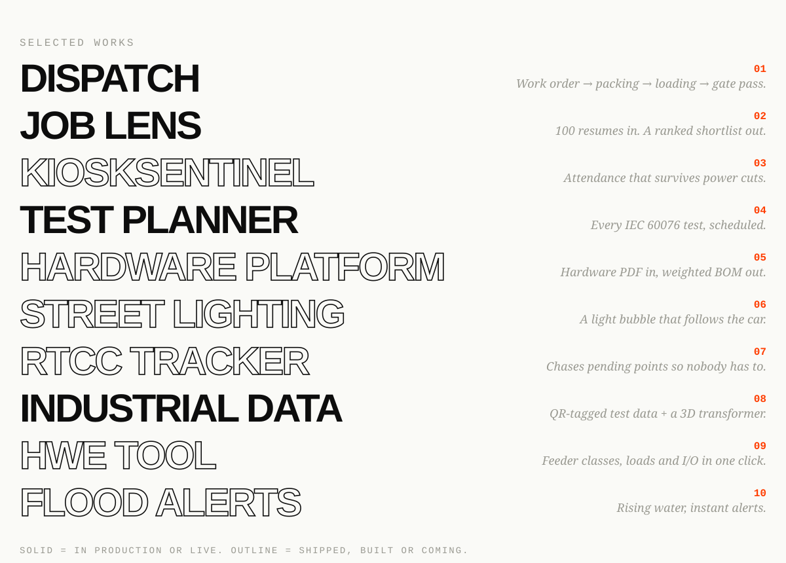

<!-- Typography-first: type is the only visual. Light and dark follow your GitHub theme. Built by scripts/gen_typography.py -->

<picture><source media="(prefers-color-scheme: dark)" srcset="./assets/type/statement-dark.svg"/></picture>

<picture><source media="(prefers-color-scheme: dark)" srcset="./assets/type/numbers-dark.svg"/></picture>

<picture><source media="(prefers-color-scheme: dark)" srcset="./assets/type/works-dark.svg"/></picture>

<code>[dispatch](https://github.com/KRISH-exe-29/Dispatch-ITTL) / [job lens](https://krishna-ittl.github.io/Candidate-Screener/) / [test planner](https://transformer-test-planner.vercel.app) / [hardware platform](https://github.com/KRISH-exe-29/Fasteners-Project) / [rtcc tracker](https://github.com/KRISH-exe-29/Pannel-Box-Transformers-) / [industrial data](https://github.com/KRISH-exe-29/indotech-transformers)</code>

<a href="mailto:krishnarajus2004@gmail.com"><picture><source media="(prefers-color-scheme: dark)" srcset="./assets/type/signoff-dark.svg"/></picture></a>

<a href="https://linkedin.com/in/krishnarajus2004">linkedin</a>

