<!-- ASCII-minimal theme: two animated SVGs (assets/ascii, light + dark, matched to GitHub's page colour); everything else is plain markdown. Built by scripts/gen_ascii.py. -->

<picture><source media="(prefers-color-scheme: dark)" srcset="./assets/ascii/hero-dark.svg"/></picture>

  <a href="mailto:krishnarajus2004@gmail.com">email</a> &nbsp;·&nbsp;
  <a href="https://linkedin.com/in/krishnarajus2004">linkedin</a> &nbsp;·&nbsp;
  <a href="https://krishna-ittl.github.io/Candidate-Screener/">job lens ↗</a> &nbsp;·&nbsp;
  <a href="https://krishna-ittl.github.io/dmat-practice/">dmat ↗</a>

<b>9</b> apps in production &nbsp;·&nbsp; <b>128</b> tests &nbsp;·&nbsp; <b>1</b> patent &nbsp;·&nbsp; <b>#7</b> of 1500+ colleges &nbsp;·&nbsp; <b>30 min → 30 s</b>

---

### work

Less talk. More deploys. Most of these run on a real factory floor, every shift.

| | | |
|:--|:--|:--|
| [**Dispatch Management**](https://github.com/KRISH-exe-29/Dispatch-ITTL) | Work order to gate pass, zero phone calls. | `production` |
| [**Job Lens**](https://krishna-ittl.github.io/Candidate-Screener/) | 100 resumes in. A ranked shortlist out. | `live demo` |
| **KioskSentinel** | Attendance that survives power cuts. | `new` |
| [**Transformer Test Planner**](https://transformer-test-planner.vercel.app) | Every IEC 60076 test, planned per unit. | `live demo` |
| [**RTCC & M.Box Tracker**](https://github.com/KRISH-exe-29/Pannel-Box-Transformers-) | Chases pending points so nobody has to. | `in use` |
| [**Fasteners Automation**](https://github.com/KRISH-exe-29/Fasteners-Project) | A 30-minute job, now 30 seconds. | `in use` |
| [**EPMS**](https://github.com/KRISH-exe-29/PMS) | Project HQ with an interactive Gantt. | `built` |
| [**Industrial Data System**](https://github.com/KRISH-exe-29/indotech-transformers) | QR-tagged test data with a 3D model. | `built` |
| [**dMAT Practice**](https://krishna-ittl.github.io/dmat-practice/) | A full exam simulator in one HTML file. | `live app` |
| **Shop Floor Job Status** | Live job status for every bay. | `in design` |

### lately

- **mapping the shop floor**: live job status for every bay, from cycle-time norms and worker efficiency
- **directing an AI film**: an 11-scene workplace-safety video, cast from our own team
- **hardening KioskSentinel**: attendance kiosks that keep counting through power cuts

### lab

[pdf chat agent](https://github.com/KRISH-exe-29/AI-PDF-Chatbot-Agent-Powered-by-LangChain-and-LangGraph) · [memory agent](https://github.com/KRISH-exe-29/Langchain-Memory-) · [ai pr reviewer](https://github.com/KRISH-exe-29/GPT-based-PR-reviewer-) · [gmail cleanup agent](https://github.com/KRISH-exe-29/Gmail-cleanup-agent)

### record

`2024` &nbsp; **National finalist**, Technical symposium  
`2025` &nbsp; **Patent holder**, Street-light fault detection  
`2025` &nbsp; **Rank #7 of 1500+**, IIT Bombay NEC  
`2025` &nbsp; **Runner-up**, Fish Tank, IIT B E-Summit  
`2026` &nbsp; **9 apps shipped**, Indo Tech Transformers  

### stack

`iec 60076 testing` `mcc panels` `protection relays` `oltc` `esp8266` `proteus` `typescript` `react` `next.js` `python` `java` `node` `supabase` `postgresql` `three.js` `claude` `openai` `langchain` `langgraph` `transformers.js` `tesseract`

---

<picture><source media="(prefers-color-scheme: dark)" srcset="./assets/ascii/dancer-dark.svg"/></picture>

quietly shipping since 2024 &nbsp;·&nbsp; <a href="mailto:krishnarajus2004@gmail.com">krishnarajus2004@gmail.com</a>

