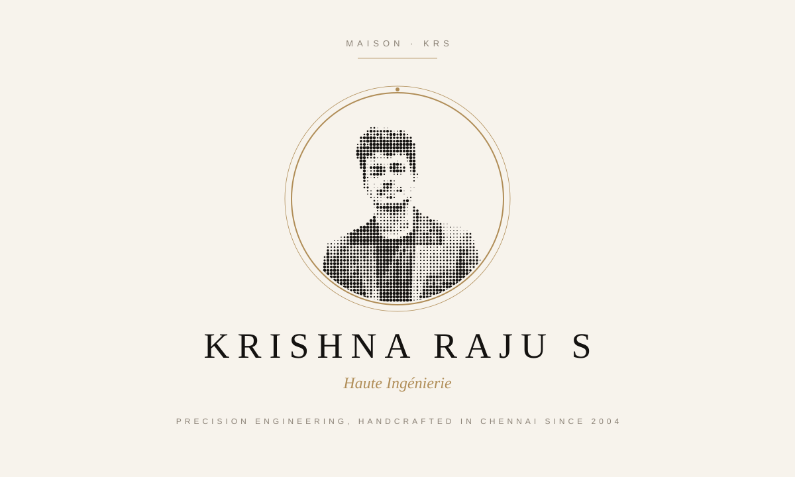
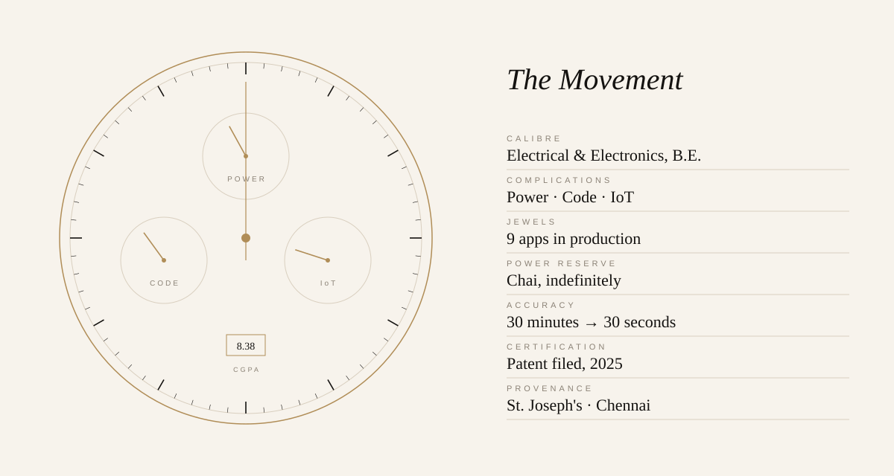
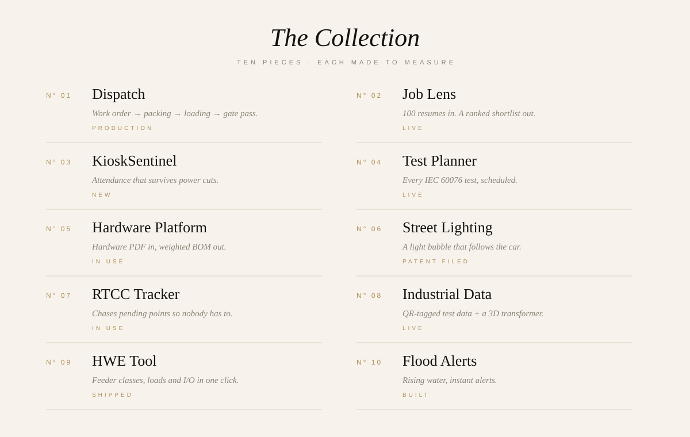

<!-- Luxury / premium: Maison KRS. Ivory by day, noir by night, following your GitHub theme. Built by scripts/gen_luxury.py -->

<picture><source media="(prefers-color-scheme: dark)" srcset="./assets/luxury/maison-dark.svg"/></picture>

<picture><source media="(prefers-color-scheme: dark)" srcset="./assets/luxury/movement-dark.svg"/></picture>

<picture><source media="(prefers-color-scheme: dark)" srcset="./assets/luxury/collection-dark.svg"/></picture>

[N° 01 Dispatch](https://github.com/KRISH-exe-29/Dispatch-ITTL) · [N° 02 Job Lens](https://krishna-ittl.github.io/Candidate-Screener/) · [N° 04 Test Planner](https://transformer-test-planner.vercel.app) · [N° 05 Hardware Platform](https://github.com/KRISH-exe-29/Fasteners-Project) · [N° 07 RTCC Tracker](https://github.com/KRISH-exe-29/Pannel-Box-Transformers-) · [N° 08 Industrial Data](https://github.com/KRISH-exe-29/indotech-transformers)

<a href="mailto:krishnarajus2004@gmail.com"><picture><source media="(prefers-color-scheme: dark)" srcset="./assets/luxury/appointment-dark.svg"/></picture></a>

<a href="https://linkedin.com/in/krishnarajus2004">the atelier on LinkedIn</a>

