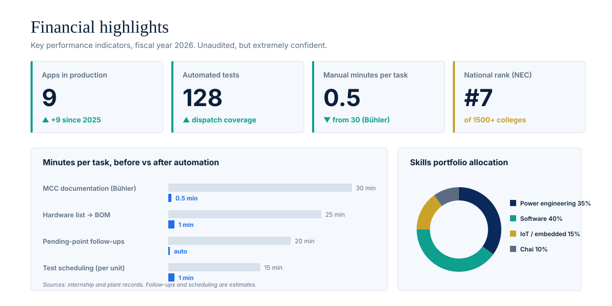
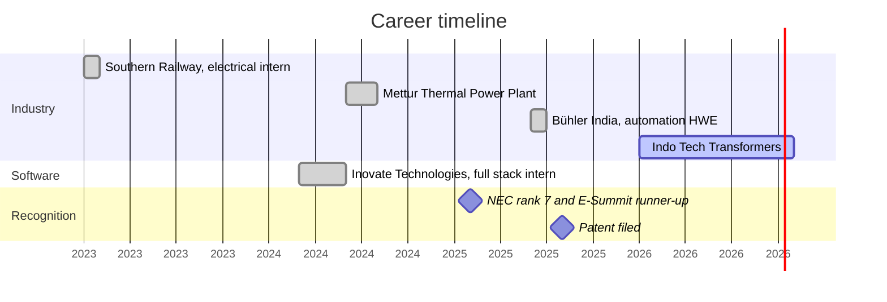

<!-- Corporate / enterprise: an annual report. Images follow your GitHub theme; tables and the Mermaid chart are native GitHub. Built by scripts/gen_corporate.py -->

<picture><source media="(prefers-color-scheme: dark)" srcset="./assets/corporate/cover-dark.svg"/></picture>

  
  
  

## 1. Letter to stakeholders

> Dear stakeholders,
>
> This year we moved from testing transformers to writing the software the plant runs on. Dispatch, testing, hiring and attendance are now digital, nine applications are in production, and a 30-minute documentation task now completes in 30 seconds. We remain committed to deleting boring work at scale.
>
> **Krishna Raju S**, Chief Everything Officer

## 2. Highlights

<picture><source media="(prefers-color-scheme: dark)" srcset="./assets/corporate/kpis-dark.svg"/></picture>

## 3. Product portfolio

| Product | Status | Value proposition | Impact |
|:--|:--|:--|:--|
| [Dispatch](https://github.com/KRISH-exe-29/Dispatch-ITTL) | Production | Work order → packing → loading → gate pass. | 5 roles · 128 tests · auto escalations |
| [Job Lens](https://krishna-ittl.github.io/Candidate-Screener/) | Live | 100 resumes in. A ranked shortlist out. | Offline AI · OCR · Excel reports |
| KioskSentinel | New | Attendance that survives power cuts. | Offline-first · 3 shifts · locked down |
| [Test Planner](https://transformer-test-planner.vercel.app) | Live | Every IEC 60076 test, scheduled. | 40 tests · multi-unit · Excel export |
| [Hardware Platform](https://github.com/KRISH-exe-29/Fasteners-Project) | In Use | Hardware PDF in, weighted BOM out. | 20–30 min → under 60 s |
| Street Lighting | Patent Filed | A light bubble that follows the car. | 60% less energy · GPS fault alerts |
| [RTCC Tracker](https://github.com/KRISH-exe-29/Pannel-Box-Transformers-) | In Use | Chases pending points so nobody has to. | 48-hour auto follow-ups |
| [Industrial Data](https://github.com/KRISH-exe-29/indotech-transformers) | Live | QR-tagged test data + a 3D transformer. | 4 role modules · OTP admin |
| HWE Tool | Shipped | Feeder classes, loads and I/O in one click. | 30 min → 30 s at Bühler |
| Flood Alerts | Built | Rising water, instant alerts. | 90% lower outage risk |

## 4. Corporate history

## 5. Governance

| Board member | Role |
|:--|:--|
| Krishna Raju S | Chairman, CEO, CTO, intern |
| Chai | Independent director, never absent |
| St. Joseph's College of Engineering | Founding investor (B.E. EEE, CGPA 8.38) |

## 6. Risk factors

- The company may automate the boring parts of your job. Shareholders have described this as a feature.
- Exposure to legacy spreadsheets remains high across the industry. Management considers this the growth market.
- Key-person risk: one engineer. Mitigated by documentation and 128 tests.

Forward-looking statements: more apps. Contact investor relations at krishnarajus2004@gmail.com.
