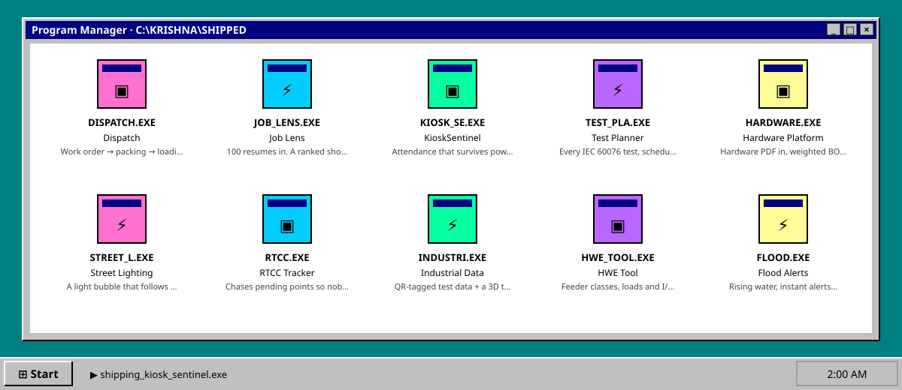

<!-- Vaporwave: Windows 95, palms, a sunset grid. Daytime pastel and midnight neon follow your GitHub theme. Built by scripts/gen_vapor.py -->

<picture><source media="(prefers-color-scheme: dark)" srcset="./assets/vapor/scene-dark.svg"/></picture>

<b>Ｗ Ｅ Ｌ Ｃ Ｏ Ｍ Ｅ　Ｔ Ｏ　Ｔ Ｈ Ｅ　Ｆ Ａ Ｃ Ｔ Ｏ Ｒ Ｙ</b> 
electrical engineer · software builder · chennai, 2004 → forever

<picture><source media="(prefers-color-scheme: dark)" srcset="./assets/vapor/desktop-dark.svg"/></picture>

[DISPATCH.EXE](https://github.com/KRISH-exe-29/Dispatch-ITTL) · [JOB LENS.EXE](https://krishna-ittl.github.io/Candidate-Screener/) · [TEST PLANNER.EXE](https://transformer-test-planner.vercel.app) · [HARDWARE PLATFORM.EXE](https://github.com/KRISH-exe-29/Fasteners-Project) · [RTCC TRACKER.EXE](https://github.com/KRISH-exe-29/Pannel-Box-Transformers-) · [INDUSTRIAL DATA.EXE](https://github.com/KRISH-exe-29/indotech-transformers)

<a href="mailto:krishnarajus2004@gmail.com">ｅｍａｉｌ</a> · <a href="https://linkedin.com/in/krishnarajus2004">ｌｉｎｋｅｄｉｎ</a>

