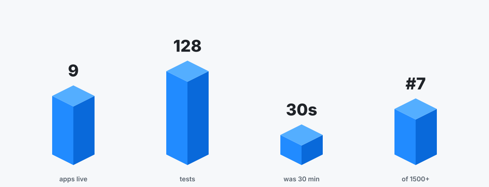

<!-- 3D: a power-transformer mesh as a spinning wireframe (light/dark) and as a real STL that GitHub renders in an interactive viewer. Built by scripts/gen_3d.py -->

<p align="center"><picture><source media="(prefers-color-scheme: dark)" srcset="./assets/3d/wireframe-dark.svg"/></picture></p>

### 🧊 Spin it yourself

Drag to rotate, scroll to zoom. A 600-triangle power transformer (tank, radiator fins, HV and LV bushings, conservator), generated in Python, because the person who wrote this tests real ones.

```stl
solid transformer
facet normal -1.00 0.00 0.00
outer loop
vertex -45.0 -25.0 0.0
vertex -45.0 -25.0 70.0
vertex -45.0 25.0 70.0
endloop
endfacet
facet normal -1.00 0.00 0.00
outer loop
vertex -45.0 -25.0 0.0
vertex -45.0 25.0 70.0
vertex -45.0 25.0 0.0
endloop
endfacet
facet normal 1.00 0.00 0.00
outer loop
vertex 45.0 -25.0 0.0
vertex 45.0 25.0 0.0
vertex 45.0 25.0 70.0
endloop
endfacet
facet normal 1.00 0.00 0.00
outer loop
vertex 45.0 -25.0 0.0
vertex 45.0 25.0 70.0
vertex 45.0 -25.0 70.0
endloop
endfacet
facet normal 0.00 -1.00 0.00
outer loop
vertex -45.0 -25.0 0.0
vertex 45.0 -25.0 0.0
vertex 45.0 -25.0 70.0
endloop
endfacet
facet normal 0.00 -1.00 0.00
outer loop
vertex -45.0 -25.0 0.0
vertex 45.0 -25.0 70.0
vertex -45.0 -25.0 70.0
endloop
endfacet
facet normal 0.00 1.00 0.00
outer loop
vertex -45.0 25.0 0.0
vertex -45.0 25.0 70.0
vertex 45.0 25.0 70.0
endloop
endfacet
facet normal 0.00 1.00 0.00
outer loop
vertex -45.0 25.0 0.0
vertex 45.0 25.0 70.0
vertex 45.0 25.0 0.0
endloop
endfacet
facet normal 0.00 0.00 -1.00
outer loop
vertex -45.0 -25.0 0.0
vertex -45.0 25.0 0.0
vertex 45.0 25.0 0.0
endloop
endfacet
facet normal 0.00 0.00 -1.00
outer loop
vertex -45.0 -25.0 0.0
vertex 45.0 25.0 0.0
vertex 45.0 -25.0 0.0
endloop
endfacet
facet normal 0.00 0.00 1.00
outer loop
vertex -45.0 -25.0 70.0
vertex 45.0 -25.0 70.0
vertex 45.0 25.0 70.0
endloop
endfacet
facet normal 0.00 0.00 1.00
outer loop
vertex -45.0 -25.0 70.0
vertex 45.0 25.0 70.0
vertex -45.0 25.0 70.0
endloop
endfacet
facet normal -1.00 0.00 0.00
outer loop
vertex -50.0 -30.0 -6.0
vertex -50.0 -30.0 0.0
vertex -50.0 30.0 0.0
endloop
endfacet
facet normal -1.00 0.00 0.00
outer loop
vertex -50.0 -30.0 -6.0
vertex -50.0 30.0 0.0
vertex -50.0 30.0 -6.0
endloop
endfacet
facet normal 1.00 0.00 0.00
outer loop
vertex 50.0 -30.0 -6.0
vertex 50.0 30.0 -6.0
vertex 50.0 30.0 0.0
endloop
endfacet
facet normal 1.00 0.00 0.00
outer loop
vertex 50.0 -30.0 -6.0
vertex 50.0 30.0 0.0
vertex 50.0 -30.0 0.0
endloop
endfacet
facet normal 0.00 -1.00 0.00
outer loop
vertex -50.0 -30.0 -6.0
vertex 50.0 -30.0 -6.0
vertex 50.0 -30.0 0.0
endloop
endfacet
facet normal 0.00 -1.00 0.00
outer loop
vertex -50.0 -30.0 -6.0
vertex 50.0 -30.0 0.0
vertex -50.0 -30.0 0.0
endloop
endfacet
facet normal 0.00 1.00 0.00
outer loop
vertex -50.0 30.0 -6.0
vertex -50.0 30.0 0.0
vertex 50.0 30.0 0.0
endloop
endfacet
facet normal 0.00 1.00 0.00
outer loop
vertex -50.0 30.0 -6.0
vertex 50.0 30.0 0.0
vertex 50.0 30.0 -6.0
endloop
endfacet
facet normal 0.00 0.00 -1.00
outer loop
vertex -50.0 -30.0 -6.0
vertex -50.0 30.0 -6.0
vertex 50.0 30.0 -6.0
endloop
endfacet
facet normal 0.00 0.00 -1.00
outer loop
vertex -50.0 -30.0 -6.0
vertex 50.0 30.0 -6.0
vertex 50.0 -30.0 -6.0
endloop
endfacet
facet normal 0.00 0.00 1.00
outer loop
vertex -50.0 -30.0 0.0
vertex 50.0 -30.0 0.0
vertex 50.0 30.0 0.0
endloop
endfacet
facet normal 0.00 0.00 1.00
outer loop
vertex -50.0 -30.0 0.0
vertex 50.0 30.0 0.0
vertex -50.0 30.0 0.0
endloop
endfacet
facet normal -1.00 0.00 0.00
outer loop
vertex -40.0 25.0 6.0
vertex -40.0 25.0 64.0
vertex -40.0 39.0 64.0
endloop
endfacet
facet normal -1.00 0.00 0.00
outer loop
vertex -40.0 25.0 6.0
vertex -40.0 39.0 64.0
vertex -40.0 39.0 6.0
endloop
endfacet
facet normal 1.00 0.00 0.00
outer loop
vertex -36.0 25.0 6.0
vertex -36.0 39.0 6.0
vertex -36.0 39.0 64.0
endloop
endfacet
facet normal 1.00 0.00 0.00
outer loop
vertex -36.0 25.0 6.0
vertex -36.0 39.0 64.0
vertex -36.0 25.0 64.0
endloop
endfacet
facet normal 0.00 -1.00 0.00
outer loop
vertex -40.0 25.0 6.0
vertex -36.0 25.0 6.0
vertex -36.0 25.0 64.0
endloop
endfacet
facet normal 0.00 -1.00 0.00
outer loop
vertex -40.0 25.0 6.0
vertex -36.0 25.0 64.0
vertex -40.0 25.0 64.0
endloop
endfacet
facet normal 0.00 1.00 0.00
outer loop
vertex -40.0 39.0 6.0
vertex -40.0 39.0 64.0
vertex -36.0 39.0 64.0
endloop
endfacet
facet normal 0.00 1.00 0.00
outer loop
vertex -40.0 39.0 6.0
vertex -36.0 39.0 64.0
vertex -36.0 39.0 6.0
endloop
endfacet
facet normal 0.00 0.00 -1.00
outer loop
vertex -40.0 25.0 6.0
vertex -40.0 39.0 6.0
vertex -36.0 39.0 6.0
endloop
endfacet
facet normal 0.00 0.00 -1.00
outer loop
vertex -40.0 25.0 6.0
vertex -36.0 39.0 6.0
vertex -36.0 25.0 6.0
endloop
endfacet
facet normal 0.00 0.00 1.00
outer loop
vertex -40.0 25.0 64.0
vertex -36.0 25.0 64.0
vertex -36.0 39.0 64.0
endloop
endfacet
facet normal 0.00 0.00 1.00
outer loop
vertex -40.0 25.0 64.0
vertex -36.0 39.0 64.0
vertex -40.0 39.0 64.0
endloop
endfacet
facet normal -1.00 0.00 0.00
outer loop
vertex -40.0 -39.0 6.0
vertex -40.0 -39.0 64.0
vertex -40.0 -25.0 64.0
endloop
endfacet
facet normal -1.00 0.00 0.00
outer loop
vertex -40.0 -39.0 6.0
vertex -40.0 -25.0 64.0
vertex -40.0 -25.0 6.0
endloop
endfacet
facet normal 1.00 0.00 0.00
outer loop
vertex -36.0 -39.0 6.0
vertex -36.0 -25.0 6.0
vertex -36.0 -25.0 64.0
endloop
endfacet
facet normal 1.00 0.00 0.00
outer loop
vertex -36.0 -39.0 6.0
vertex -36.0 -25.0 64.0
vertex -36.0 -39.0 64.0
endloop
endfacet
facet normal 0.00 -1.00 0.00
outer loop
vertex -40.0 -39.0 6.0
vertex -36.0 -39.0 6.0
vertex -36.0 -39.0 64.0
endloop
endfacet
facet normal 0.00 -1.00 0.00
outer loop
vertex -40.0 -39.0 6.0
vertex -36.0 -39.0 64.0
vertex -40.0 -39.0 64.0
endloop
endfacet
facet normal 0.00 1.00 0.00
outer loop
vertex -40.0 -25.0 6.0
vertex -40.0 -25.0 64.0
vertex -36.0 -25.0 64.0
endloop
endfacet
facet normal 0.00 1.00 0.00
outer loop
vertex -40.0 -25.0 6.0
vertex -36.0 -25.0 64.0
vertex -36.0 -25.0 6.0
endloop
endfacet
facet normal 0.00 0.00 -1.00
outer loop
vertex -40.0 -39.0 6.0
vertex -40.0 -25.0 6.0
vertex -36.0 -25.0 6.0
endloop
endfacet
facet normal 0.00 0.00 -1.00
outer loop
vertex -40.0 -39.0 6.0
vertex -36.0 -25.0 6.0
vertex -36.0 -39.0 6.0
endloop
endfacet
facet normal 0.00 0.00 1.00
outer loop
vertex -40.0 -39.0 64.0
vertex -36.0 -39.0 64.0
vertex -36.0 -25.0 64.0
endloop
endfacet
facet normal 0.00 0.00 1.00
outer loop
vertex -40.0 -39.0 64.0
vertex -36.0 -25.0 64.0
vertex -40.0 -25.0 64.0
endloop
endfacet
facet normal -1.00 0.00 0.00
outer loop
vertex -25.0 25.0 6.0
vertex -25.0 25.0 64.0
vertex -25.0 39.0 64.0
endloop
endfacet
facet normal -1.00 0.00 0.00
outer loop
vertex -25.0 25.0 6.0
vertex -25.0 39.0 64.0
vertex -25.0 39.0 6.0
endloop
endfacet
facet normal 1.00 0.00 0.00
outer loop
vertex -21.0 25.0 6.0
vertex -21.0 39.0 6.0
vertex -21.0 39.0 64.0
endloop
endfacet
facet normal 1.00 0.00 0.00
outer loop
vertex -21.0 25.0 6.0
vertex -21.0 39.0 64.0
vertex -21.0 25.0 64.0
endloop
endfacet
facet normal 0.00 -1.00 0.00
outer loop
vertex -25.0 25.0 6.0
vertex -21.0 25.0 6.0
vertex -21.0 25.0 64.0
endloop
endfacet
facet normal 0.00 -1.00 0.00
outer loop
vertex -25.0 25.0 6.0
vertex -21.0 25.0 64.0
vertex -25.0 25.0 64.0
endloop
endfacet
facet normal 0.00 1.00 0.00
outer loop
vertex -25.0 39.0 6.0
vertex -25.0 39.0 64.0
vertex -21.0 39.0 64.0
endloop
endfacet
facet normal 0.00 1.00 0.00
outer loop
vertex -25.0 39.0 6.0
vertex -21.0 39.0 64.0
vertex -21.0 39.0 6.0
endloop
endfacet
facet normal 0.00 0.00 -1.00
outer loop
vertex -25.0 25.0 6.0
vertex -25.0 39.0 6.0
vertex -21.0 39.0 6.0
endloop
endfacet
facet normal 0.00 0.00 -1.00
outer loop
vertex -25.0 25.0 6.0
vertex -21.0 39.0 6.0
vertex -21.0 25.0 6.0
endloop
endfacet
facet normal 0.00 0.00 1.00
outer loop
vertex -25.0 25.0 64.0
vertex -21.0 25.0 64.0
vertex -21.0 39.0 64.0
endloop
endfacet
facet normal 0.00 0.00 1.00
outer loop
vertex -25.0 25.0 64.0
vertex -21.0 39.0 64.0
vertex -25.0 39.0 64.0
endloop
endfacet
facet normal -1.00 0.00 0.00
outer loop
vertex -25.0 -39.0 6.0
vertex -25.0 -39.0 64.0
vertex -25.0 -25.0 64.0
endloop
endfacet
facet normal -1.00 0.00 0.00
outer loop
vertex -25.0 -39.0 6.0
vertex -25.0 -25.0 64.0
vertex -25.0 -25.0 6.0
endloop
endfacet
facet normal 1.00 0.00 0.00
outer loop
vertex -21.0 -39.0 6.0
vertex -21.0 -25.0 6.0
vertex -21.0 -25.0 64.0
endloop
endfacet
facet normal 1.00 0.00 0.00
outer loop
vertex -21.0 -39.0 6.0
vertex -21.0 -25.0 64.0
vertex -21.0 -39.0 64.0
endloop
endfacet
facet normal 0.00 -1.00 0.00
outer loop
vertex -25.0 -39.0 6.0
vertex -21.0 -39.0 6.0
vertex -21.0 -39.0 64.0
endloop
endfacet
facet normal 0.00 -1.00 0.00
outer loop
vertex -25.0 -39.0 6.0
vertex -21.0 -39.0 64.0
vertex -25.0 -39.0 64.0
endloop
endfacet
facet normal 0.00 1.00 0.00
outer loop
vertex -25.0 -25.0 6.0
vertex -25.0 -25.0 64.0
vertex -21.0 -25.0 64.0
endloop
endfacet
facet normal 0.00 1.00 0.00
outer loop
vertex -25.0 -25.0 6.0
vertex -21.0 -25.0 64.0
vertex -21.0 -25.0 6.0
endloop
endfacet
facet normal 0.00 0.00 -1.00
outer loop
vertex -25.0 -39.0 6.0
vertex -25.0 -25.0 6.0
vertex -21.0 -25.0 6.0
endloop
endfacet
facet normal 0.00 0.00 -1.00
outer loop
vertex -25.0 -39.0 6.0
vertex -21.0 -25.0 6.0
vertex -21.0 -39.0 6.0
endloop
endfacet
facet normal 0.00 0.00 1.00
outer loop
vertex -25.0 -39.0 64.0
vertex -21.0 -39.0 64.0
vertex -21.0 -25.0 64.0
endloop
endfacet
facet normal 0.00 0.00 1.00
outer loop
vertex -25.0 -39.0 64.0
vertex -21.0 -25.0 64.0
vertex -25.0 -25.0 64.0
endloop
endfacet
facet normal -1.00 0.00 0.00
outer loop
vertex -10.0 25.0 6.0
vertex -10.0 25.0 64.0
vertex -10.0 39.0 64.0
endloop
endfacet
facet normal -1.00 0.00 0.00
outer loop
vertex -10.0 25.0 6.0
vertex -10.0 39.0 64.0
vertex -10.0 39.0 6.0
endloop
endfacet
facet normal 1.00 0.00 0.00
outer loop
vertex -6.0 25.0 6.0
vertex -6.0 39.0 6.0
vertex -6.0 39.0 64.0
endloop
endfacet
facet normal 1.00 0.00 0.00
outer loop
vertex -6.0 25.0 6.0
vertex -6.0 39.0 64.0
vertex -6.0 25.0 64.0
endloop
endfacet
facet normal 0.00 -1.00 0.00
outer loop
vertex -10.0 25.0 6.0
vertex -6.0 25.0 6.0
vertex -6.0 25.0 64.0
endloop
endfacet
facet normal 0.00 -1.00 0.00
outer loop
vertex -10.0 25.0 6.0
vertex -6.0 25.0 64.0
vertex -10.0 25.0 64.0
endloop
endfacet
facet normal 0.00 1.00 0.00
outer loop
vertex -10.0 39.0 6.0
vertex -10.0 39.0 64.0
vertex -6.0 39.0 64.0
endloop
endfacet
facet normal 0.00 1.00 0.00
outer loop
vertex -10.0 39.0 6.0
vertex -6.0 39.0 64.0
vertex -6.0 39.0 6.0
endloop
endfacet
facet normal 0.00 0.00 -1.00
outer loop
vertex -10.0 25.0 6.0
vertex -10.0 39.0 6.0
vertex -6.0 39.0 6.0
endloop
endfacet
facet normal 0.00 0.00 -1.00
outer loop
vertex -10.0 25.0 6.0
vertex -6.0 39.0 6.0
vertex -6.0 25.0 6.0
endloop
endfacet
facet normal 0.00 0.00 1.00
outer loop
vertex -10.0 25.0 64.0
vertex -6.0 25.0 64.0
vertex -6.0 39.0 64.0
endloop
endfacet
facet normal 0.00 0.00 1.00
outer loop
vertex -10.0 25.0 64.0
vertex -6.0 39.0 64.0
vertex -10.0 39.0 64.0
endloop
endfacet
facet normal -1.00 0.00 0.00
outer loop
vertex -10.0 -39.0 6.0
vertex -10.0 -39.0 64.0
vertex -10.0 -25.0 64.0
endloop
endfacet
facet normal -1.00 0.00 0.00
outer loop
vertex -10.0 -39.0 6.0
vertex -10.0 -25.0 64.0
vertex -10.0 -25.0 6.0
endloop
endfacet
facet normal 1.00 0.00 0.00
outer loop
vertex -6.0 -39.0 6.0
vertex -6.0 -25.0 6.0
vertex -6.0 -25.0 64.0
endloop
endfacet
facet normal 1.00 0.00 0.00
outer loop
vertex -6.0 -39.0 6.0
vertex -6.0 -25.0 64.0
vertex -6.0 -39.0 64.0
endloop
endfacet
facet normal 0.00 -1.00 0.00
outer loop
vertex -10.0 -39.0 6.0
vertex -6.0 -39.0 6.0
vertex -6.0 -39.0 64.0
endloop
endfacet
facet normal 0.00 -1.00 0.00
outer loop
vertex -10.0 -39.0 6.0
vertex -6.0 -39.0 64.0
vertex -10.0 -39.0 64.0
endloop
endfacet
facet normal 0.00 1.00 0.00
outer loop
vertex -10.0 -25.0 6.0
vertex -10.0 -25.0 64.0
vertex -6.0 -25.0 64.0
endloop
endfacet
facet normal 0.00 1.00 0.00
outer loop
vertex -10.0 -25.0 6.0
vertex -6.0 -25.0 64.0
vertex -6.0 -25.0 6.0
endloop
endfacet
facet normal 0.00 0.00 -1.00
outer loop
vertex -10.0 -39.0 6.0
vertex -10.0 -25.0 6.0
vertex -6.0 -25.0 6.0
endloop
endfacet
facet normal 0.00 0.00 -1.00
outer loop
vertex -10.0 -39.0 6.0
vertex -6.0 -25.0 6.0
vertex -6.0 -39.0 6.0
endloop
endfacet
facet normal 0.00 0.00 1.00
outer loop
vertex -10.0 -39.0 64.0
vertex -6.0 -39.0 64.0
vertex -6.0 -25.0 64.0
endloop
endfacet
facet normal 0.00 0.00 1.00
outer loop
vertex -10.0 -39.0 64.0
vertex -6.0 -25.0 64.0
vertex -10.0 -25.0 64.0
endloop
endfacet
facet normal -1.00 0.00 0.00
outer loop
vertex 5.0 25.0 6.0
vertex 5.0 25.0 64.0
vertex 5.0 39.0 64.0
endloop
endfacet
facet normal -1.00 0.00 0.00
outer loop
vertex 5.0 25.0 6.0
vertex 5.0 39.0 64.0
vertex 5.0 39.0 6.0
endloop
endfacet
facet normal 1.00 0.00 0.00
outer loop
vertex 9.0 25.0 6.0
vertex 9.0 39.0 6.0
vertex 9.0 39.0 64.0
endloop
endfacet
facet normal 1.00 0.00 0.00
outer loop
vertex 9.0 25.0 6.0
vertex 9.0 39.0 64.0
vertex 9.0 25.0 64.0
endloop
endfacet
facet normal 0.00 -1.00 0.00
outer loop
vertex 5.0 25.0 6.0
vertex 9.0 25.0 6.0
vertex 9.0 25.0 64.0
endloop
endfacet
facet normal 0.00 -1.00 0.00
outer loop
vertex 5.0 25.0 6.0
vertex 9.0 25.0 64.0
vertex 5.0 25.0 64.0
endloop
endfacet
facet normal 0.00 1.00 0.00
outer loop
vertex 5.0 39.0 6.0
vertex 5.0 39.0 64.0
vertex 9.0 39.0 64.0
endloop
endfacet
facet normal 0.00 1.00 0.00
outer loop
vertex 5.0 39.0 6.0
vertex 9.0 39.0 64.0
vertex 9.0 39.0 6.0
endloop
endfacet
facet normal 0.00 0.00 -1.00
outer loop
vertex 5.0 25.0 6.0
vertex 5.0 39.0 6.0
vertex 9.0 39.0 6.0
endloop
endfacet
facet normal 0.00 0.00 -1.00
outer loop
vertex 5.0 25.0 6.0
vertex 9.0 39.0 6.0
vertex 9.0 25.0 6.0
endloop
endfacet
facet normal 0.00 0.00 1.00
outer loop
vertex 5.0 25.0 64.0
vertex 9.0 25.0 64.0
vertex 9.0 39.0 64.0
endloop
endfacet
facet normal 0.00 0.00 1.00
outer loop
vertex 5.0 25.0 64.0
vertex 9.0 39.0 64.0
vertex 5.0 39.0 64.0
endloop
endfacet
facet normal -1.00 0.00 0.00
outer loop
vertex 5.0 -39.0 6.0
vertex 5.0 -39.0 64.0
vertex 5.0 -25.0 64.0
endloop
endfacet
facet normal -1.00 0.00 0.00
outer loop
vertex 5.0 -39.0 6.0
vertex 5.0 -25.0 64.0
vertex 5.0 -25.0 6.0
endloop
endfacet
facet normal 1.00 0.00 0.00
outer loop
vertex 9.0 -39.0 6.0
vertex 9.0 -25.0 6.0
vertex 9.0 -25.0 64.0
endloop
endfacet
facet normal 1.00 0.00 0.00
outer loop
vertex 9.0 -39.0 6.0
vertex 9.0 -25.0 64.0
vertex 9.0 -39.0 64.0
endloop
endfacet
facet normal 0.00 -1.00 0.00
outer loop
vertex 5.0 -39.0 6.0
vertex 9.0 -39.0 6.0
vertex 9.0 -39.0 64.0
endloop
endfacet
facet normal 0.00 -1.00 0.00
outer loop
vertex 5.0 -39.0 6.0
vertex 9.0 -39.0 64.0
vertex 5.0 -39.0 64.0
endloop
endfacet
facet normal 0.00 1.00 0.00
outer loop
vertex 5.0 -25.0 6.0
vertex 5.0 -25.0 64.0
vertex 9.0 -25.0 64.0
endloop
endfacet
facet normal 0.00 1.00 0.00
outer loop
vertex 5.0 -25.0 6.0
vertex 9.0 -25.0 64.0
vertex 9.0 -25.0 6.0
endloop
endfacet
facet normal 0.00 0.00 -1.00
outer loop
vertex 5.0 -39.0 6.0
vertex 5.0 -25.0 6.0
vertex 9.0 -25.0 6.0
endloop
endfacet
facet normal 0.00 0.00 -1.00
outer loop
vertex 5.0 -39.0 6.0
vertex 9.0 -25.0 6.0
vertex 9.0 -39.0 6.0
endloop
endfacet
facet normal 0.00 0.00 1.00
outer loop
vertex 5.0 -39.0 64.0
vertex 9.0 -39.0 64.0
vertex 9.0 -25.0 64.0
endloop
endfacet
facet normal 0.00 0.00 1.00
outer loop
vertex 5.0 -39.0 64.0
vertex 9.0 -25.0 64.0
vertex 5.0 -25.0 64.0
endloop
endfacet
facet normal -1.00 0.00 0.00
outer loop
vertex 20.0 25.0 6.0
vertex 20.0 25.0 64.0
vertex 20.0 39.0 64.0
endloop
endfacet
facet normal -1.00 0.00 0.00
outer loop
vertex 20.0 25.0 6.0
vertex 20.0 39.0 64.0
vertex 20.0 39.0 6.0
endloop
endfacet
facet normal 1.00 0.00 0.00
outer loop
vertex 24.0 25.0 6.0
vertex 24.0 39.0 6.0
vertex 24.0 39.0 64.0
endloop
endfacet
facet normal 1.00 0.00 0.00
outer loop
vertex 24.0 25.0 6.0
vertex 24.0 39.0 64.0
vertex 24.0 25.0 64.0
endloop
endfacet
facet normal 0.00 -1.00 0.00
outer loop
vertex 20.0 25.0 6.0
vertex 24.0 25.0 6.0
vertex 24.0 25.0 64.0
endloop
endfacet
facet normal 0.00 -1.00 0.00
outer loop
vertex 20.0 25.0 6.0
vertex 24.0 25.0 64.0
vertex 20.0 25.0 64.0
endloop
endfacet
facet normal 0.00 1.00 0.00
outer loop
vertex 20.0 39.0 6.0
vertex 20.0 39.0 64.0
vertex 24.0 39.0 64.0
endloop
endfacet
facet normal 0.00 1.00 0.00
outer loop
vertex 20.0 39.0 6.0
vertex 24.0 39.0 64.0
vertex 24.0 39.0 6.0
endloop
endfacet
facet normal 0.00 0.00 -1.00
outer loop
vertex 20.0 25.0 6.0
vertex 20.0 39.0 6.0
vertex 24.0 39.0 6.0
endloop
endfacet
facet normal 0.00 0.00 -1.00
outer loop
vertex 20.0 25.0 6.0
vertex 24.0 39.0 6.0
vertex 24.0 25.0 6.0
endloop
endfacet
facet normal 0.00 0.00 1.00
outer loop
vertex 20.0 25.0 64.0
vertex 24.0 25.0 64.0
vertex 24.0 39.0 64.0
endloop
endfacet
facet normal 0.00 0.00 1.00
outer loop
vertex 20.0 25.0 64.0
vertex 24.0 39.0 64.0
vertex 20.0 39.0 64.0
endloop
endfacet
facet normal -1.00 0.00 0.00
outer loop
vertex 20.0 -39.0 6.0
vertex 20.0 -39.0 64.0
vertex 20.0 -25.0 64.0
endloop
endfacet
facet normal -1.00 0.00 0.00
outer loop
vertex 20.0 -39.0 6.0
vertex 20.0 -25.0 64.0
vertex 20.0 -25.0 6.0
endloop
endfacet
facet normal 1.00 0.00 0.00
outer loop
vertex 24.0 -39.0 6.0
vertex 24.0 -25.0 6.0
vertex 24.0 -25.0 64.0
endloop
endfacet
facet normal 1.00 0.00 0.00
outer loop
vertex 24.0 -39.0 6.0
vertex 24.0 -25.0 64.0
vertex 24.0 -39.0 64.0
endloop
endfacet
facet normal 0.00 -1.00 0.00
outer loop
vertex 20.0 -39.0 6.0
vertex 24.0 -39.0 6.0
vertex 24.0 -39.0 64.0
endloop
endfacet
facet normal 0.00 -1.00 0.00
outer loop
vertex 20.0 -39.0 6.0
vertex 24.0 -39.0 64.0
vertex 20.0 -39.0 64.0
endloop
endfacet
facet normal 0.00 1.00 0.00
outer loop
vertex 20.0 -25.0 6.0
vertex 20.0 -25.0 64.0
vertex 24.0 -25.0 64.0
endloop
endfacet
facet normal 0.00 1.00 0.00
outer loop
vertex 20.0 -25.0 6.0
vertex 24.0 -25.0 64.0
vertex 24.0 -25.0 6.0
endloop
endfacet
facet normal 0.00 0.00 -1.00
outer loop
vertex 20.0 -39.0 6.0
vertex 20.0 -25.0 6.0
vertex 24.0 -25.0 6.0
endloop
endfacet
facet normal 0.00 0.00 -1.00
outer loop
vertex 20.0 -39.0 6.0
vertex 24.0 -25.0 6.0
vertex 24.0 -39.0 6.0
endloop
endfacet
facet normal 0.00 0.00 1.00
outer loop
vertex 20.0 -39.0 64.0
vertex 24.0 -39.0 64.0
vertex 24.0 -25.0 64.0
endloop
endfacet
facet normal 0.00 0.00 1.00
outer loop
vertex 20.0 -39.0 64.0
vertex 24.0 -25.0 64.0
vertex 20.0 -25.0 64.0
endloop
endfacet
facet normal -1.00 0.00 0.00
outer loop
vertex 35.0 25.0 6.0
vertex 35.0 25.0 64.0
vertex 35.0 39.0 64.0
endloop
endfacet
facet normal -1.00 0.00 0.00
outer loop
vertex 35.0 25.0 6.0
vertex 35.0 39.0 64.0
vertex 35.0 39.0 6.0
endloop
endfacet
facet normal 1.00 0.00 0.00
outer loop
vertex 39.0 25.0 6.0
vertex 39.0 39.0 6.0
vertex 39.0 39.0 64.0
endloop
endfacet
facet normal 1.00 0.00 0.00
outer loop
vertex 39.0 25.0 6.0
vertex 39.0 39.0 64.0
vertex 39.0 25.0 64.0
endloop
endfacet
facet normal 0.00 -1.00 0.00
outer loop
vertex 35.0 25.0 6.0
vertex 39.0 25.0 6.0
vertex 39.0 25.0 64.0
endloop
endfacet
facet normal 0.00 -1.00 0.00
outer loop
vertex 35.0 25.0 6.0
vertex 39.0 25.0 64.0
vertex 35.0 25.0 64.0
endloop
endfacet
facet normal 0.00 1.00 0.00
outer loop
vertex 35.0 39.0 6.0
vertex 35.0 39.0 64.0
vertex 39.0 39.0 64.0
endloop
endfacet
facet normal 0.00 1.00 0.00
outer loop
vertex 35.0 39.0 6.0
vertex 39.0 39.0 64.0
vertex 39.0 39.0 6.0
endloop
endfacet
facet normal 0.00 0.00 -1.00
outer loop
vertex 35.0 25.0 6.0
vertex 35.0 39.0 6.0
vertex 39.0 39.0 6.0
endloop
endfacet
facet normal 0.00 0.00 -1.00
outer loop
vertex 35.0 25.0 6.0
vertex 39.0 39.0 6.0
vertex 39.0 25.0 6.0
endloop
endfacet
facet normal 0.00 0.00 1.00
outer loop
vertex 35.0 25.0 64.0
vertex 39.0 25.0 64.0
vertex 39.0 39.0 64.0
endloop
endfacet
facet normal 0.00 0.00 1.00
outer loop
vertex 35.0 25.0 64.0
vertex 39.0 39.0 64.0
vertex 35.0 39.0 64.0
endloop
endfacet
facet normal -1.00 0.00 0.00
outer loop
vertex 35.0 -39.0 6.0
vertex 35.0 -39.0 64.0
vertex 35.0 -25.0 64.0
endloop
endfacet
facet normal -1.00 0.00 0.00
outer loop
vertex 35.0 -39.0 6.0
vertex 35.0 -25.0 64.0
vertex 35.0 -25.0 6.0
endloop
endfacet
facet normal 1.00 0.00 0.00
outer loop
vertex 39.0 -39.0 6.0
vertex 39.0 -25.0 6.0
vertex 39.0 -25.0 64.0
endloop
endfacet
facet normal 1.00 0.00 0.00
outer loop
vertex 39.0 -39.0 6.0
vertex 39.0 -25.0 64.0
vertex 39.0 -39.0 64.0
endloop
endfacet
facet normal 0.00 -1.00 0.00
outer loop
vertex 35.0 -39.0 6.0
vertex 39.0 -39.0 6.0
vertex 39.0 -39.0 64.0
endloop
endfacet
facet normal 0.00 -1.00 0.00
outer loop
vertex 35.0 -39.0 6.0
vertex 39.0 -39.0 64.0
vertex 35.0 -39.0 64.0
endloop
endfacet
facet normal 0.00 1.00 0.00
outer loop
vertex 35.0 -25.0 6.0
vertex 35.0 -25.0 64.0
vertex 39.0 -25.0 64.0
endloop
endfacet
facet normal 0.00 1.00 0.00
outer loop
vertex 35.0 -25.0 6.0
vertex 39.0 -25.0 64.0
vertex 39.0 -25.0 6.0
endloop
endfacet
facet normal 0.00 0.00 -1.00
outer loop
vertex 35.0 -39.0 6.0
vertex 35.0 -25.0 6.0
vertex 39.0 -25.0 6.0
endloop
endfacet
facet normal 0.00 0.00 -1.00
outer loop
vertex 35.0 -39.0 6.0
vertex 39.0 -25.0 6.0
vertex 39.0 -39.0 6.0
endloop
endfacet
facet normal 0.00 0.00 1.00
outer loop
vertex 35.0 -39.0 64.0
vertex 39.0 -39.0 64.0
vertex 39.0 -25.0 64.0
endloop
endfacet
facet normal 0.00 0.00 1.00
outer loop
vertex 35.0 -39.0 64.0
vertex 39.0 -25.0 64.0
vertex 35.0 -25.0 64.0
endloop
endfacet
facet normal 0.95 0.31 0.00
outer loop
vertex -20.5 8.0 70.0
vertex -21.4 10.6 70.0
vertex -21.4 10.6 104.0
endloop
endfacet
facet normal 0.95 0.31 -0.00
outer loop
vertex -20.5 8.0 70.0
vertex -21.4 10.6 104.0
vertex -20.5 8.0 104.0
endloop
endfacet
facet normal 0.00 0.00 -1.00
outer loop
vertex -25.0 8.0 70.0
vertex -21.4 10.6 70.0
vertex -20.5 8.0 70.0
endloop
endfacet
facet normal 0.00 0.00 1.00
outer loop
vertex -25.0 8.0 104.0
vertex -20.5 8.0 104.0
vertex -21.4 10.6 104.0
endloop
endfacet
facet normal 0.59 0.81 0.00
outer loop
vertex -21.4 10.6 70.0
vertex -23.6 12.3 70.0
vertex -23.6 12.3 104.0
endloop
endfacet
facet normal 0.59 0.81 -0.00
outer loop
vertex -21.4 10.6 70.0
vertex -23.6 12.3 104.0
vertex -21.4 10.6 104.0
endloop
endfacet
facet normal 0.00 0.00 -1.00
outer loop
vertex -25.0 8.0 70.0
vertex -23.6 12.3 70.0
vertex -21.4 10.6 70.0
endloop
endfacet
facet normal 0.00 0.00 1.00
outer loop
vertex -25.0 8.0 104.0
vertex -21.4 10.6 104.0
vertex -23.6 12.3 104.0
endloop
endfacet
facet normal 0.00 1.00 0.00
outer loop
vertex -23.6 12.3 70.0
vertex -26.4 12.3 70.0
vertex -26.4 12.3 104.0
endloop
endfacet
facet normal 0.00 1.00 -0.00
outer loop
vertex -23.6 12.3 70.0
vertex -26.4 12.3 104.0
vertex -23.6 12.3 104.0
endloop
endfacet
facet normal 0.00 0.00 -1.00
outer loop
vertex -25.0 8.0 70.0
vertex -26.4 12.3 70.0
vertex -23.6 12.3 70.0
endloop
endfacet
facet normal 0.00 -0.00 1.00
outer loop
vertex -25.0 8.0 104.0
vertex -23.6 12.3 104.0
vertex -26.4 12.3 104.0
endloop
endfacet
facet normal -0.59 0.81 0.00
outer loop
vertex -26.4 12.3 70.0
vertex -28.6 10.6 70.0
vertex -28.6 10.6 104.0
endloop
endfacet
facet normal -0.59 0.81 0.00
outer loop
vertex -26.4 12.3 70.0
vertex -28.6 10.6 104.0
vertex -26.4 12.3 104.0
endloop
endfacet
facet normal 0.00 0.00 -1.00
outer loop
vertex -25.0 8.0 70.0
vertex -28.6 10.6 70.0
vertex -26.4 12.3 70.0
endloop
endfacet
facet normal 0.00 0.00 1.00
outer loop
vertex -25.0 8.0 104.0
vertex -26.4 12.3 104.0
vertex -28.6 10.6 104.0
endloop
endfacet
facet normal -0.95 0.31 0.00
outer loop
vertex -28.6 10.6 70.0
vertex -29.5 8.0 70.0
vertex -29.5 8.0 104.0
endloop
endfacet
facet normal -0.95 0.31 0.00
outer loop
vertex -28.6 10.6 70.0
vertex -29.5 8.0 104.0
vertex -28.6 10.6 104.0
endloop
endfacet
facet normal 0.00 0.00 -1.00
outer loop
vertex -25.0 8.0 70.0
vertex -29.5 8.0 70.0
vertex -28.6 10.6 70.0
endloop
endfacet
facet normal 0.00 0.00 1.00
outer loop
vertex -25.0 8.0 104.0
vertex -28.6 10.6 104.0
vertex -29.5 8.0 104.0
endloop
endfacet
facet normal -0.95 -0.31 0.00
outer loop
vertex -29.5 8.0 70.0
vertex -28.6 5.4 70.0
vertex -28.6 5.4 104.0
endloop
endfacet
facet normal -0.95 -0.31 0.00
outer loop
vertex -29.5 8.0 70.0
vertex -28.6 5.4 104.0
vertex -29.5 8.0 104.0
endloop
endfacet
facet normal -0.00 0.00 -1.00
outer loop
vertex -25.0 8.0 70.0
vertex -28.6 5.4 70.0
vertex -29.5 8.0 70.0
endloop
endfacet
facet normal 0.00 0.00 1.00
outer loop
vertex -25.0 8.0 104.0
vertex -29.5 8.0 104.0
vertex -28.6 5.4 104.0
endloop
endfacet
facet normal -0.59 -0.81 0.00
outer loop
vertex -28.6 5.4 70.0
vertex -26.4 3.7 70.0
vertex -26.4 3.7 104.0
endloop
endfacet
facet normal -0.59 -0.81 0.00
outer loop
vertex -28.6 5.4 70.0
vertex -26.4 3.7 104.0
vertex -28.6 5.4 104.0
endloop
endfacet
facet normal 0.00 0.00 -1.00
outer loop
vertex -25.0 8.0 70.0
vertex -26.4 3.7 70.0
vertex -28.6 5.4 70.0
endloop
endfacet
facet normal 0.00 0.00 1.00
outer loop
vertex -25.0 8.0 104.0
vertex -28.6 5.4 104.0
vertex -26.4 3.7 104.0
endloop
endfacet
facet normal -0.00 -1.00 0.00
outer loop
vertex -26.4 3.7 70.0
vertex -23.6 3.7 70.0
vertex -23.6 3.7 104.0
endloop
endfacet
facet normal -0.00 -1.00 0.00
outer loop
vertex -26.4 3.7 70.0
vertex -23.6 3.7 104.0
vertex -26.4 3.7 104.0
endloop
endfacet
facet normal 0.00 -0.00 -1.00
outer loop
vertex -25.0 8.0 70.0
vertex -23.6 3.7 70.0
vertex -26.4 3.7 70.0
endloop
endfacet
facet normal 0.00 0.00 1.00
outer loop
vertex -25.0 8.0 104.0
vertex -26.4 3.7 104.0
vertex -23.6 3.7 104.0
endloop
endfacet
facet normal 0.59 -0.81 0.00
outer loop
vertex -23.6 3.7 70.0
vertex -21.4 5.4 70.0
vertex -21.4 5.4 104.0
endloop
endfacet
facet normal 0.59 -0.81 0.00
outer loop
vertex -23.6 3.7 70.0
vertex -21.4 5.4 104.0
vertex -23.6 3.7 104.0
endloop
endfacet
facet normal 0.00 0.00 -1.00
outer loop
vertex -25.0 8.0 70.0
vertex -21.4 5.4 70.0
vertex -23.6 3.7 70.0
endloop
endfacet
facet normal 0.00 0.00 1.00
outer loop
vertex -25.0 8.0 104.0
vertex -23.6 3.7 104.0
vertex -21.4 5.4 104.0
endloop
endfacet
facet normal 0.95 -0.31 0.00
outer loop
vertex -21.4 5.4 70.0
vertex -20.5 8.0 70.0
vertex -20.5 8.0 104.0
endloop
endfacet
facet normal 0.95 -0.31 0.00
outer loop
vertex -21.4 5.4 70.0
vertex -20.5 8.0 104.0
vertex -21.4 5.4 104.0
endloop
endfacet
facet normal 0.00 0.00 -1.00
outer loop
vertex -25.0 8.0 70.0
vertex -20.5 8.0 70.0
vertex -21.4 5.4 70.0
endloop
endfacet
facet normal -0.00 0.00 1.00
outer loop
vertex -25.0 8.0 104.0
vertex -21.4 5.4 104.0
vertex -20.5 8.0 104.0
endloop
endfacet
facet normal 0.95 0.31 0.00
outer loop
vertex -18.0 8.0 104.0
vertex -19.3 12.1 104.0
vertex -19.3 12.1 108.0
endloop
endfacet
facet normal 0.95 0.31 -0.00
outer loop
vertex -18.0 8.0 104.0
vertex -19.3 12.1 108.0
vertex -18.0 8.0 108.0
endloop
endfacet
facet normal 0.00 0.00 -1.00
outer loop
vertex -25.0 8.0 104.0
vertex -19.3 12.1 104.0
vertex -18.0 8.0 104.0
endloop
endfacet
facet normal 0.00 0.00 1.00
outer loop
vertex -25.0 8.0 108.0
vertex -18.0 8.0 108.0
vertex -19.3 12.1 108.0
endloop
endfacet
facet normal 0.59 0.81 0.00
outer loop
vertex -19.3 12.1 104.0
vertex -22.8 14.7 104.0
vertex -22.8 14.7 108.0
endloop
endfacet
facet normal 0.59 0.81 -0.00
outer loop
vertex -19.3 12.1 104.0
vertex -22.8 14.7 108.0
vertex -19.3 12.1 108.0
endloop
endfacet
facet normal 0.00 0.00 -1.00
outer loop
vertex -25.0 8.0 104.0
vertex -22.8 14.7 104.0
vertex -19.3 12.1 104.0
endloop
endfacet
facet normal 0.00 0.00 1.00
outer loop
vertex -25.0 8.0 108.0
vertex -19.3 12.1 108.0
vertex -22.8 14.7 108.0
endloop
endfacet
facet normal 0.00 1.00 0.00
outer loop
vertex -22.8 14.7 104.0
vertex -27.2 14.7 104.0
vertex -27.2 14.7 108.0
endloop
endfacet
facet normal 0.00 1.00 -0.00
outer loop
vertex -22.8 14.7 104.0
vertex -27.2 14.7 108.0
vertex -22.8 14.7 108.0
endloop
endfacet
facet normal 0.00 0.00 -1.00
outer loop
vertex -25.0 8.0 104.0
vertex -27.2 14.7 104.0
vertex -22.8 14.7 104.0
endloop
endfacet
facet normal 0.00 -0.00 1.00
outer loop
vertex -25.0 8.0 108.0
vertex -22.8 14.7 108.0
vertex -27.2 14.7 108.0
endloop
endfacet
facet normal -0.59 0.81 0.00
outer loop
vertex -27.2 14.7 104.0
vertex -30.7 12.1 104.0
vertex -30.7 12.1 108.0
endloop
endfacet
facet normal -0.59 0.81 0.00
outer loop
vertex -27.2 14.7 104.0
vertex -30.7 12.1 108.0
vertex -27.2 14.7 108.0
endloop
endfacet
facet normal 0.00 0.00 -1.00
outer loop
vertex -25.0 8.0 104.0
vertex -30.7 12.1 104.0
vertex -27.2 14.7 104.0
endloop
endfacet
facet normal 0.00 0.00 1.00
outer loop
vertex -25.0 8.0 108.0
vertex -27.2 14.7 108.0
vertex -30.7 12.1 108.0
endloop
endfacet
facet normal -0.95 0.31 0.00
outer loop
vertex -30.7 12.1 104.0
vertex -32.0 8.0 104.0
vertex -32.0 8.0 108.0
endloop
endfacet
facet normal -0.95 0.31 0.00
outer loop
vertex -30.7 12.1 104.0
vertex -32.0 8.0 108.0
vertex -30.7 12.1 108.0
endloop
endfacet
facet normal 0.00 0.00 -1.00
outer loop
vertex -25.0 8.0 104.0
vertex -32.0 8.0 104.0
vertex -30.7 12.1 104.0
endloop
endfacet
facet normal 0.00 0.00 1.00
outer loop
vertex -25.0 8.0 108.0
vertex -30.7 12.1 108.0
vertex -32.0 8.0 108.0
endloop
endfacet
facet normal -0.95 -0.31 0.00
outer loop
vertex -32.0 8.0 104.0
vertex -30.7 3.9 104.0
vertex -30.7 3.9 108.0
endloop
endfacet
facet normal -0.95 -0.31 0.00
outer loop
vertex -32.0 8.0 104.0
vertex -30.7 3.9 108.0
vertex -32.0 8.0 108.0
endloop
endfacet
facet normal -0.00 0.00 -1.00
outer loop
vertex -25.0 8.0 104.0
vertex -30.7 3.9 104.0
vertex -32.0 8.0 104.0
endloop
endfacet
facet normal 0.00 0.00 1.00
outer loop
vertex -25.0 8.0 108.0
vertex -32.0 8.0 108.0
vertex -30.7 3.9 108.0
endloop
endfacet
facet normal -0.59 -0.81 0.00
outer loop
vertex -30.7 3.9 104.0
vertex -27.2 1.3 104.0
vertex -27.2 1.3 108.0
endloop
endfacet
facet normal -0.59 -0.81 0.00
outer loop
vertex -30.7 3.9 104.0
vertex -27.2 1.3 108.0
vertex -30.7 3.9 108.0
endloop
endfacet
facet normal 0.00 0.00 -1.00
outer loop
vertex -25.0 8.0 104.0
vertex -27.2 1.3 104.0
vertex -30.7 3.9 104.0
endloop
endfacet
facet normal 0.00 0.00 1.00
outer loop
vertex -25.0 8.0 108.0
vertex -30.7 3.9 108.0
vertex -27.2 1.3 108.0
endloop
endfacet
facet normal -0.00 -1.00 0.00
outer loop
vertex -27.2 1.3 104.0
vertex -22.8 1.3 104.0
vertex -22.8 1.3 108.0
endloop
endfacet
facet normal -0.00 -1.00 0.00
outer loop
vertex -27.2 1.3 104.0
vertex -22.8 1.3 108.0
vertex -27.2 1.3 108.0
endloop
endfacet
facet normal 0.00 -0.00 -1.00
outer loop
vertex -25.0 8.0 104.0
vertex -22.8 1.3 104.0
vertex -27.2 1.3 104.0
endloop
endfacet
facet normal 0.00 0.00 1.00
outer loop
vertex -25.0 8.0 108.0
vertex -27.2 1.3 108.0
vertex -22.8 1.3 108.0
endloop
endfacet
facet normal 0.59 -0.81 0.00
outer loop
vertex -22.8 1.3 104.0
vertex -19.3 3.9 104.0
vertex -19.3 3.9 108.0
endloop
endfacet
facet normal 0.59 -0.81 0.00
outer loop
vertex -22.8 1.3 104.0
vertex -19.3 3.9 108.0
vertex -22.8 1.3 108.0
endloop
endfacet
facet normal 0.00 0.00 -1.00
outer loop
vertex -25.0 8.0 104.0
vertex -19.3 3.9 104.0
vertex -22.8 1.3 104.0
endloop
endfacet
facet normal 0.00 0.00 1.00
outer loop
vertex -25.0 8.0 108.0
vertex -22.8 1.3 108.0
vertex -19.3 3.9 108.0
endloop
endfacet
facet normal 0.95 -0.31 0.00
outer loop
vertex -19.3 3.9 104.0
vertex -18.0 8.0 104.0
vertex -18.0 8.0 108.0
endloop
endfacet
facet normal 0.95 -0.31 0.00
outer loop
vertex -19.3 3.9 104.0
vertex -18.0 8.0 108.0
vertex -19.3 3.9 108.0
endloop
endfacet
facet normal 0.00 0.00 -1.00
outer loop
vertex -25.0 8.0 104.0
vertex -18.0 8.0 104.0
vertex -19.3 3.9 104.0
endloop
endfacet
facet normal -0.00 0.00 1.00
outer loop
vertex -25.0 8.0 108.0
vertex -19.3 3.9 108.0
vertex -18.0 8.0 108.0
endloop
endfacet
facet normal 0.95 0.31 0.00
outer loop
vertex -22.0 -12.0 70.0
vertex -22.6 -10.2 70.0
vertex -22.6 -10.2 86.0
endloop
endfacet
facet normal 0.95 0.31 -0.00
outer loop
vertex -22.0 -12.0 70.0
vertex -22.6 -10.2 86.0
vertex -22.0 -12.0 86.0
endloop
endfacet
facet normal 0.00 0.00 -1.00
outer loop
vertex -25.0 -12.0 70.0
vertex -22.6 -10.2 70.0
vertex -22.0 -12.0 70.0
endloop
endfacet
facet normal 0.00 0.00 1.00
outer loop
vertex -25.0 -12.0 86.0
vertex -22.0 -12.0 86.0
vertex -22.6 -10.2 86.0
endloop
endfacet
facet normal 0.59 0.81 0.00
outer loop
vertex -22.6 -10.2 70.0
vertex -24.1 -9.1 70.0
vertex -24.1 -9.1 86.0
endloop
endfacet
facet normal 0.59 0.81 -0.00
outer loop
vertex -22.6 -10.2 70.0
vertex -24.1 -9.1 86.0
vertex -22.6 -10.2 86.0
endloop
endfacet
facet normal 0.00 0.00 -1.00
outer loop
vertex -25.0 -12.0 70.0
vertex -24.1 -9.1 70.0
vertex -22.6 -10.2 70.0
endloop
endfacet
facet normal 0.00 0.00 1.00
outer loop
vertex -25.0 -12.0 86.0
vertex -22.6 -10.2 86.0
vertex -24.1 -9.1 86.0
endloop
endfacet
facet normal 0.00 1.00 0.00
outer loop
vertex -24.1 -9.1 70.0
vertex -25.9 -9.1 70.0
vertex -25.9 -9.1 86.0
endloop
endfacet
facet normal 0.00 1.00 -0.00
outer loop
vertex -24.1 -9.1 70.0
vertex -25.9 -9.1 86.0
vertex -24.1 -9.1 86.0
endloop
endfacet
facet normal 0.00 0.00 -1.00
outer loop
vertex -25.0 -12.0 70.0
vertex -25.9 -9.1 70.0
vertex -24.1 -9.1 70.0
endloop
endfacet
facet normal 0.00 -0.00 1.00
outer loop
vertex -25.0 -12.0 86.0
vertex -24.1 -9.1 86.0
vertex -25.9 -9.1 86.0
endloop
endfacet
facet normal -0.59 0.81 0.00
outer loop
vertex -25.9 -9.1 70.0
vertex -27.4 -10.2 70.0
vertex -27.4 -10.2 86.0
endloop
endfacet
facet normal -0.59 0.81 0.00
outer loop
vertex -25.9 -9.1 70.0
vertex -27.4 -10.2 86.0
vertex -25.9 -9.1 86.0
endloop
endfacet
facet normal 0.00 0.00 -1.00
outer loop
vertex -25.0 -12.0 70.0
vertex -27.4 -10.2 70.0
vertex -25.9 -9.1 70.0
endloop
endfacet
facet normal 0.00 0.00 1.00
outer loop
vertex -25.0 -12.0 86.0
vertex -25.9 -9.1 86.0
vertex -27.4 -10.2 86.0
endloop
endfacet
facet normal -0.95 0.31 0.00
outer loop
vertex -27.4 -10.2 70.0
vertex -28.0 -12.0 70.0
vertex -28.0 -12.0 86.0
endloop
endfacet
facet normal -0.95 0.31 0.00
outer loop
vertex -27.4 -10.2 70.0
vertex -28.0 -12.0 86.0
vertex -27.4 -10.2 86.0
endloop
endfacet
facet normal 0.00 0.00 -1.00
outer loop
vertex -25.0 -12.0 70.0
vertex -28.0 -12.0 70.0
vertex -27.4 -10.2 70.0
endloop
endfacet
facet normal 0.00 0.00 1.00
outer loop
vertex -25.0 -12.0 86.0
vertex -27.4 -10.2 86.0
vertex -28.0 -12.0 86.0
endloop
endfacet
facet normal -0.95 -0.31 0.00
outer loop
vertex -28.0 -12.0 70.0
vertex -27.4 -13.8 70.0
vertex -27.4 -13.8 86.0
endloop
endfacet
facet normal -0.95 -0.31 0.00
outer loop
vertex -28.0 -12.0 70.0
vertex -27.4 -13.8 86.0
vertex -28.0 -12.0 86.0
endloop
endfacet
facet normal -0.00 0.00 -1.00
outer loop
vertex -25.0 -12.0 70.0
vertex -27.4 -13.8 70.0
vertex -28.0 -12.0 70.0
endloop
endfacet
facet normal 0.00 0.00 1.00
outer loop
vertex -25.0 -12.0 86.0
vertex -28.0 -12.0 86.0
vertex -27.4 -13.8 86.0
endloop
endfacet
facet normal -0.59 -0.81 0.00
outer loop
vertex -27.4 -13.8 70.0
vertex -25.9 -14.9 70.0
vertex -25.9 -14.9 86.0
endloop
endfacet
facet normal -0.59 -0.81 0.00
outer loop
vertex -27.4 -13.8 70.0
vertex -25.9 -14.9 86.0
vertex -27.4 -13.8 86.0
endloop
endfacet
facet normal 0.00 0.00 -1.00
outer loop
vertex -25.0 -12.0 70.0
vertex -25.9 -14.9 70.0
vertex -27.4 -13.8 70.0
endloop
endfacet
facet normal 0.00 0.00 1.00
outer loop
vertex -25.0 -12.0 86.0
vertex -27.4 -13.8 86.0
vertex -25.9 -14.9 86.0
endloop
endfacet
facet normal 0.00 -1.00 0.00
outer loop
vertex -25.9 -14.9 70.0
vertex -24.1 -14.9 70.0
vertex -24.1 -14.9 86.0
endloop
endfacet
facet normal 0.00 -1.00 0.00
outer loop
vertex -25.9 -14.9 70.0
vertex -24.1 -14.9 86.0
vertex -25.9 -14.9 86.0
endloop
endfacet
facet normal 0.00 -0.00 -1.00
outer loop
vertex -25.0 -12.0 70.0
vertex -24.1 -14.9 70.0
vertex -25.9 -14.9 70.0
endloop
endfacet
facet normal 0.00 0.00 1.00
outer loop
vertex -25.0 -12.0 86.0
vertex -25.9 -14.9 86.0
vertex -24.1 -14.9 86.0
endloop
endfacet
facet normal 0.59 -0.81 0.00
outer loop
vertex -24.1 -14.9 70.0
vertex -22.6 -13.8 70.0
vertex -22.6 -13.8 86.0
endloop
endfacet
facet normal 0.59 -0.81 0.00
outer loop
vertex -24.1 -14.9 70.0
vertex -22.6 -13.8 86.0
vertex -24.1 -14.9 86.0
endloop
endfacet
facet normal 0.00 0.00 -1.00
outer loop
vertex -25.0 -12.0 70.0
vertex -22.6 -13.8 70.0
vertex -24.1 -14.9 70.0
endloop
endfacet
facet normal 0.00 0.00 1.00
outer loop
vertex -25.0 -12.0 86.0
vertex -24.1 -14.9 86.0
vertex -22.6 -13.8 86.0
endloop
endfacet
facet normal 0.95 -0.31 0.00
outer loop
vertex -22.6 -13.8 70.0
vertex -22.0 -12.0 70.0
vertex -22.0 -12.0 86.0
endloop
endfacet
facet normal 0.95 -0.31 0.00
outer loop
vertex -22.6 -13.8 70.0
vertex -22.0 -12.0 86.0
vertex -22.6 -13.8 86.0
endloop
endfacet
facet normal 0.00 0.00 -1.00
outer loop
vertex -25.0 -12.0 70.0
vertex -22.0 -12.0 70.0
vertex -22.6 -13.8 70.0
endloop
endfacet
facet normal -0.00 0.00 1.00
outer loop
vertex -25.0 -12.0 86.0
vertex -22.6 -13.8 86.0
vertex -22.0 -12.0 86.0
endloop
endfacet
facet normal 0.95 0.31 0.00
outer loop
vertex 4.5 8.0 70.0
vertex 3.6 10.6 70.0
vertex 3.6 10.6 104.0
endloop
endfacet
facet normal 0.95 0.31 -0.00
outer loop
vertex 4.5 8.0 70.0
vertex 3.6 10.6 104.0
vertex 4.5 8.0 104.0
endloop
endfacet
facet normal 0.00 0.00 -1.00
outer loop
vertex 0.0 8.0 70.0
vertex 3.6 10.6 70.0
vertex 4.5 8.0 70.0
endloop
endfacet
facet normal 0.00 0.00 1.00
outer loop
vertex 0.0 8.0 104.0
vertex 4.5 8.0 104.0
vertex 3.6 10.6 104.0
endloop
endfacet
facet normal 0.59 0.81 0.00
outer loop
vertex 3.6 10.6 70.0
vertex 1.4 12.3 70.0
vertex 1.4 12.3 104.0
endloop
endfacet
facet normal 0.59 0.81 -0.00
outer loop
vertex 3.6 10.6 70.0
vertex 1.4 12.3 104.0
vertex 3.6 10.6 104.0
endloop
endfacet
facet normal 0.00 0.00 -1.00
outer loop
vertex 0.0 8.0 70.0
vertex 1.4 12.3 70.0
vertex 3.6 10.6 70.0
endloop
endfacet
facet normal 0.00 0.00 1.00
outer loop
vertex 0.0 8.0 104.0
vertex 3.6 10.6 104.0
vertex 1.4 12.3 104.0
endloop
endfacet
facet normal 0.00 1.00 0.00
outer loop
vertex 1.4 12.3 70.0
vertex -1.4 12.3 70.0
vertex -1.4 12.3 104.0
endloop
endfacet
facet normal 0.00 1.00 -0.00
outer loop
vertex 1.4 12.3 70.0
vertex -1.4 12.3 104.0
vertex 1.4 12.3 104.0
endloop
endfacet
facet normal 0.00 0.00 -1.00
outer loop
vertex 0.0 8.0 70.0
vertex -1.4 12.3 70.0
vertex 1.4 12.3 70.0
endloop
endfacet
facet normal 0.00 -0.00 1.00
outer loop
vertex 0.0 8.0 104.0
vertex 1.4 12.3 104.0
vertex -1.4 12.3 104.0
endloop
endfacet
facet normal -0.59 0.81 0.00
outer loop
vertex -1.4 12.3 70.0
vertex -3.6 10.6 70.0
vertex -3.6 10.6 104.0
endloop
endfacet
facet normal -0.59 0.81 0.00
outer loop
vertex -1.4 12.3 70.0
vertex -3.6 10.6 104.0
vertex -1.4 12.3 104.0
endloop
endfacet
facet normal 0.00 0.00 -1.00
outer loop
vertex 0.0 8.0 70.0
vertex -3.6 10.6 70.0
vertex -1.4 12.3 70.0
endloop
endfacet
facet normal 0.00 0.00 1.00
outer loop
vertex 0.0 8.0 104.0
vertex -1.4 12.3 104.0
vertex -3.6 10.6 104.0
endloop
endfacet
facet normal -0.95 0.31 0.00
outer loop
vertex -3.6 10.6 70.0
vertex -4.5 8.0 70.0
vertex -4.5 8.0 104.0
endloop
endfacet
facet normal -0.95 0.31 0.00
outer loop
vertex -3.6 10.6 70.0
vertex -4.5 8.0 104.0
vertex -3.6 10.6 104.0
endloop
endfacet
facet normal 0.00 0.00 -1.00
outer loop
vertex 0.0 8.0 70.0
vertex -4.5 8.0 70.0
vertex -3.6 10.6 70.0
endloop
endfacet
facet normal 0.00 0.00 1.00
outer loop
vertex 0.0 8.0 104.0
vertex -3.6 10.6 104.0
vertex -4.5 8.0 104.0
endloop
endfacet
facet normal -0.95 -0.31 0.00
outer loop
vertex -4.5 8.0 70.0
vertex -3.6 5.4 70.0
vertex -3.6 5.4 104.0
endloop
endfacet
facet normal -0.95 -0.31 0.00
outer loop
vertex -4.5 8.0 70.0
vertex -3.6 5.4 104.0
vertex -4.5 8.0 104.0
endloop
endfacet
facet normal -0.00 0.00 -1.00
outer loop
vertex 0.0 8.0 70.0
vertex -3.6 5.4 70.0
vertex -4.5 8.0 70.0
endloop
endfacet
facet normal 0.00 0.00 1.00
outer loop
vertex 0.0 8.0 104.0
vertex -4.5 8.0 104.0
vertex -3.6 5.4 104.0
endloop
endfacet
facet normal -0.59 -0.81 0.00
outer loop
vertex -3.6 5.4 70.0
vertex -1.4 3.7 70.0
vertex -1.4 3.7 104.0
endloop
endfacet
facet normal -0.59 -0.81 0.00
outer loop
vertex -3.6 5.4 70.0
vertex -1.4 3.7 104.0
vertex -3.6 5.4 104.0
endloop
endfacet
facet normal 0.00 0.00 -1.00
outer loop
vertex 0.0 8.0 70.0
vertex -1.4 3.7 70.0
vertex -3.6 5.4 70.0
endloop
endfacet
facet normal 0.00 0.00 1.00
outer loop
vertex 0.0 8.0 104.0
vertex -3.6 5.4 104.0
vertex -1.4 3.7 104.0
endloop
endfacet
facet normal -0.00 -1.00 0.00
outer loop
vertex -1.4 3.7 70.0
vertex 1.4 3.7 70.0
vertex 1.4 3.7 104.0
endloop
endfacet
facet normal -0.00 -1.00 0.00
outer loop
vertex -1.4 3.7 70.0
vertex 1.4 3.7 104.0
vertex -1.4 3.7 104.0
endloop
endfacet
facet normal 0.00 -0.00 -1.00
outer loop
vertex 0.0 8.0 70.0
vertex 1.4 3.7 70.0
vertex -1.4 3.7 70.0
endloop
endfacet
facet normal 0.00 0.00 1.00
outer loop
vertex 0.0 8.0 104.0
vertex -1.4 3.7 104.0
vertex 1.4 3.7 104.0
endloop
endfacet
facet normal 0.59 -0.81 0.00
outer loop
vertex 1.4 3.7 70.0
vertex 3.6 5.4 70.0
vertex 3.6 5.4 104.0
endloop
endfacet
facet normal 0.59 -0.81 0.00
outer loop
vertex 1.4 3.7 70.0
vertex 3.6 5.4 104.0
vertex 1.4 3.7 104.0
endloop
endfacet
facet normal 0.00 0.00 -1.00
outer loop
vertex 0.0 8.0 70.0
vertex 3.6 5.4 70.0
vertex 1.4 3.7 70.0
endloop
endfacet
facet normal 0.00 0.00 1.00
outer loop
vertex 0.0 8.0 104.0
vertex 1.4 3.7 104.0
vertex 3.6 5.4 104.0
endloop
endfacet
facet normal 0.95 -0.31 0.00
outer loop
vertex 3.6 5.4 70.0
vertex 4.5 8.0 70.0
vertex 4.5 8.0 104.0
endloop
endfacet
facet normal 0.95 -0.31 0.00
outer loop
vertex 3.6 5.4 70.0
vertex 4.5 8.0 104.0
vertex 3.6 5.4 104.0
endloop
endfacet
facet normal 0.00 0.00 -1.00
outer loop
vertex 0.0 8.0 70.0
vertex 4.5 8.0 70.0
vertex 3.6 5.4 70.0
endloop
endfacet
facet normal -0.00 0.00 1.00
outer loop
vertex 0.0 8.0 104.0
vertex 3.6 5.4 104.0
vertex 4.5 8.0 104.0
endloop
endfacet
facet normal 0.95 0.31 0.00
outer loop
vertex 7.0 8.0 104.0
vertex 5.7 12.1 104.0
vertex 5.7 12.1 108.0
endloop
endfacet
facet normal 0.95 0.31 -0.00
outer loop
vertex 7.0 8.0 104.0
vertex 5.7 12.1 108.0
vertex 7.0 8.0 108.0
endloop
endfacet
facet normal 0.00 0.00 -1.00
outer loop
vertex 0.0 8.0 104.0
vertex 5.7 12.1 104.0
vertex 7.0 8.0 104.0
endloop
endfacet
facet normal 0.00 0.00 1.00
outer loop
vertex 0.0 8.0 108.0
vertex 7.0 8.0 108.0
vertex 5.7 12.1 108.0
endloop
endfacet
facet normal 0.59 0.81 0.00
outer loop
vertex 5.7 12.1 104.0
vertex 2.2 14.7 104.0
vertex 2.2 14.7 108.0
endloop
endfacet
facet normal 0.59 0.81 -0.00
outer loop
vertex 5.7 12.1 104.0
vertex 2.2 14.7 108.0
vertex 5.7 12.1 108.0
endloop
endfacet
facet normal 0.00 0.00 -1.00
outer loop
vertex 0.0 8.0 104.0
vertex 2.2 14.7 104.0
vertex 5.7 12.1 104.0
endloop
endfacet
facet normal 0.00 0.00 1.00
outer loop
vertex 0.0 8.0 108.0
vertex 5.7 12.1 108.0
vertex 2.2 14.7 108.0
endloop
endfacet
facet normal 0.00 1.00 0.00
outer loop
vertex 2.2 14.7 104.0
vertex -2.2 14.7 104.0
vertex -2.2 14.7 108.0
endloop
endfacet
facet normal 0.00 1.00 -0.00
outer loop
vertex 2.2 14.7 104.0
vertex -2.2 14.7 108.0
vertex 2.2 14.7 108.0
endloop
endfacet
facet normal 0.00 0.00 -1.00
outer loop
vertex 0.0 8.0 104.0
vertex -2.2 14.7 104.0
vertex 2.2 14.7 104.0
endloop
endfacet
facet normal 0.00 -0.00 1.00
outer loop
vertex 0.0 8.0 108.0
vertex 2.2 14.7 108.0
vertex -2.2 14.7 108.0
endloop
endfacet
facet normal -0.59 0.81 0.00
outer loop
vertex -2.2 14.7 104.0
vertex -5.7 12.1 104.0
vertex -5.7 12.1 108.0
endloop
endfacet
facet normal -0.59 0.81 0.00
outer loop
vertex -2.2 14.7 104.0
vertex -5.7 12.1 108.0
vertex -2.2 14.7 108.0
endloop
endfacet
facet normal 0.00 0.00 -1.00
outer loop
vertex 0.0 8.0 104.0
vertex -5.7 12.1 104.0
vertex -2.2 14.7 104.0
endloop
endfacet
facet normal 0.00 0.00 1.00
outer loop
vertex 0.0 8.0 108.0
vertex -2.2 14.7 108.0
vertex -5.7 12.1 108.0
endloop
endfacet
facet normal -0.95 0.31 0.00
outer loop
vertex -5.7 12.1 104.0
vertex -7.0 8.0 104.0
vertex -7.0 8.0 108.0
endloop
endfacet
facet normal -0.95 0.31 0.00
outer loop
vertex -5.7 12.1 104.0
vertex -7.0 8.0 108.0
vertex -5.7 12.1 108.0
endloop
endfacet
facet normal 0.00 0.00 -1.00
outer loop
vertex 0.0 8.0 104.0
vertex -7.0 8.0 104.0
vertex -5.7 12.1 104.0
endloop
endfacet
facet normal 0.00 0.00 1.00
outer loop
vertex 0.0 8.0 108.0
vertex -5.7 12.1 108.0
vertex -7.0 8.0 108.0
endloop
endfacet
facet normal -0.95 -0.31 0.00
outer loop
vertex -7.0 8.0 104.0
vertex -5.7 3.9 104.0
vertex -5.7 3.9 108.0
endloop
endfacet
facet normal -0.95 -0.31 0.00
outer loop
vertex -7.0 8.0 104.0
vertex -5.7 3.9 108.0
vertex -7.0 8.0 108.0
endloop
endfacet
facet normal -0.00 0.00 -1.00
outer loop
vertex 0.0 8.0 104.0
vertex -5.7 3.9 104.0
vertex -7.0 8.0 104.0
endloop
endfacet
facet normal 0.00 0.00 1.00
outer loop
vertex 0.0 8.0 108.0
vertex -7.0 8.0 108.0
vertex -5.7 3.9 108.0
endloop
endfacet
facet normal -0.59 -0.81 0.00
outer loop
vertex -5.7 3.9 104.0
vertex -2.2 1.3 104.0
vertex -2.2 1.3 108.0
endloop
endfacet
facet normal -0.59 -0.81 0.00
outer loop
vertex -5.7 3.9 104.0
vertex -2.2 1.3 108.0
vertex -5.7 3.9 108.0
endloop
endfacet
facet normal 0.00 0.00 -1.00
outer loop
vertex 0.0 8.0 104.0
vertex -2.2 1.3 104.0
vertex -5.7 3.9 104.0
endloop
endfacet
facet normal 0.00 0.00 1.00
outer loop
vertex 0.0 8.0 108.0
vertex -5.7 3.9 108.0
vertex -2.2 1.3 108.0
endloop
endfacet
facet normal -0.00 -1.00 0.00
outer loop
vertex -2.2 1.3 104.0
vertex 2.2 1.3 104.0
vertex 2.2 1.3 108.0
endloop
endfacet
facet normal -0.00 -1.00 0.00
outer loop
vertex -2.2 1.3 104.0
vertex 2.2 1.3 108.0
vertex -2.2 1.3 108.0
endloop
endfacet
facet normal 0.00 -0.00 -1.00
outer loop
vertex 0.0 8.0 104.0
vertex 2.2 1.3 104.0
vertex -2.2 1.3 104.0
endloop
endfacet
facet normal 0.00 0.00 1.00
outer loop
vertex 0.0 8.0 108.0
vertex -2.2 1.3 108.0
vertex 2.2 1.3 108.0
endloop
endfacet
facet normal 0.59 -0.81 0.00
outer loop
vertex 2.2 1.3 104.0
vertex 5.7 3.9 104.0
vertex 5.7 3.9 108.0
endloop
endfacet
facet normal 0.59 -0.81 0.00
outer loop
vertex 2.2 1.3 104.0
vertex 5.7 3.9 108.0
vertex 2.2 1.3 108.0
endloop
endfacet
facet normal 0.00 0.00 -1.00
outer loop
vertex 0.0 8.0 104.0
vertex 5.7 3.9 104.0
vertex 2.2 1.3 104.0
endloop
endfacet
facet normal 0.00 0.00 1.00
outer loop
vertex 0.0 8.0 108.0
vertex 2.2 1.3 108.0
vertex 5.7 3.9 108.0
endloop
endfacet
facet normal 0.95 -0.31 0.00
outer loop
vertex 5.7 3.9 104.0
vertex 7.0 8.0 104.0
vertex 7.0 8.0 108.0
endloop
endfacet
facet normal 0.95 -0.31 0.00
outer loop
vertex 5.7 3.9 104.0
vertex 7.0 8.0 108.0
vertex 5.7 3.9 108.0
endloop
endfacet
facet normal 0.00 0.00 -1.00
outer loop
vertex 0.0 8.0 104.0
vertex 7.0 8.0 104.0
vertex 5.7 3.9 104.0
endloop
endfacet
facet normal -0.00 0.00 1.00
outer loop
vertex 0.0 8.0 108.0
vertex 5.7 3.9 108.0
vertex 7.0 8.0 108.0
endloop
endfacet
facet normal 0.95 0.31 0.00
outer loop
vertex 3.0 -12.0 70.0
vertex 2.4 -10.2 70.0
vertex 2.4 -10.2 86.0
endloop
endfacet
facet normal 0.95 0.31 -0.00
outer loop
vertex 3.0 -12.0 70.0
vertex 2.4 -10.2 86.0
vertex 3.0 -12.0 86.0
endloop
endfacet
facet normal 0.00 0.00 -1.00
outer loop
vertex 0.0 -12.0 70.0
vertex 2.4 -10.2 70.0
vertex 3.0 -12.0 70.0
endloop
endfacet
facet normal 0.00 0.00 1.00
outer loop
vertex 0.0 -12.0 86.0
vertex 3.0 -12.0 86.0
vertex 2.4 -10.2 86.0
endloop
endfacet
facet normal 0.59 0.81 0.00
outer loop
vertex 2.4 -10.2 70.0
vertex 0.9 -9.1 70.0
vertex 0.9 -9.1 86.0
endloop
endfacet
facet normal 0.59 0.81 -0.00
outer loop
vertex 2.4 -10.2 70.0
vertex 0.9 -9.1 86.0
vertex 2.4 -10.2 86.0
endloop
endfacet
facet normal 0.00 0.00 -1.00
outer loop
vertex 0.0 -12.0 70.0
vertex 0.9 -9.1 70.0
vertex 2.4 -10.2 70.0
endloop
endfacet
facet normal 0.00 0.00 1.00
outer loop
vertex 0.0 -12.0 86.0
vertex 2.4 -10.2 86.0
vertex 0.9 -9.1 86.0
endloop
endfacet
facet normal 0.00 1.00 0.00
outer loop
vertex 0.9 -9.1 70.0
vertex -0.9 -9.1 70.0
vertex -0.9 -9.1 86.0
endloop
endfacet
facet normal 0.00 1.00 -0.00
outer loop
vertex 0.9 -9.1 70.0
vertex -0.9 -9.1 86.0
vertex 0.9 -9.1 86.0
endloop
endfacet
facet normal 0.00 0.00 -1.00
outer loop
vertex 0.0 -12.0 70.0
vertex -0.9 -9.1 70.0
vertex 0.9 -9.1 70.0
endloop
endfacet
facet normal 0.00 -0.00 1.00
outer loop
vertex 0.0 -12.0 86.0
vertex 0.9 -9.1 86.0
vertex -0.9 -9.1 86.0
endloop
endfacet
facet normal -0.59 0.81 0.00
outer loop
vertex -0.9 -9.1 70.0
vertex -2.4 -10.2 70.0
vertex -2.4 -10.2 86.0
endloop
endfacet
facet normal -0.59 0.81 0.00
outer loop
vertex -0.9 -9.1 70.0
vertex -2.4 -10.2 86.0
vertex -0.9 -9.1 86.0
endloop
endfacet
facet normal 0.00 0.00 -1.00
outer loop
vertex 0.0 -12.0 70.0
vertex -2.4 -10.2 70.0
vertex -0.9 -9.1 70.0
endloop
endfacet
facet normal 0.00 0.00 1.00
outer loop
vertex 0.0 -12.0 86.0
vertex -0.9 -9.1 86.0
vertex -2.4 -10.2 86.0
endloop
endfacet
facet normal -0.95 0.31 0.00
outer loop
vertex -2.4 -10.2 70.0
vertex -3.0 -12.0 70.0
vertex -3.0 -12.0 86.0
endloop
endfacet
facet normal -0.95 0.31 0.00
outer loop
vertex -2.4 -10.2 70.0
vertex -3.0 -12.0 86.0
vertex -2.4 -10.2 86.0
endloop
endfacet
facet normal 0.00 0.00 -1.00
outer loop
vertex 0.0 -12.0 70.0
vertex -3.0 -12.0 70.0
vertex -2.4 -10.2 70.0
endloop
endfacet
facet normal 0.00 0.00 1.00
outer loop
vertex 0.0 -12.0 86.0
vertex -2.4 -10.2 86.0
vertex -3.0 -12.0 86.0
endloop
endfacet
facet normal -0.95 -0.31 0.00
outer loop
vertex -3.0 -12.0 70.0
vertex -2.4 -13.8 70.0
vertex -2.4 -13.8 86.0
endloop
endfacet
facet normal -0.95 -0.31 0.00
outer loop
vertex -3.0 -12.0 70.0
vertex -2.4 -13.8 86.0
vertex -3.0 -12.0 86.0
endloop
endfacet
facet normal -0.00 0.00 -1.00
outer loop
vertex 0.0 -12.0 70.0
vertex -2.4 -13.8 70.0
vertex -3.0 -12.0 70.0
endloop
endfacet
facet normal 0.00 0.00 1.00
outer loop
vertex 0.0 -12.0 86.0
vertex -3.0 -12.0 86.0
vertex -2.4 -13.8 86.0
endloop
endfacet
facet normal -0.59 -0.81 0.00
outer loop
vertex -2.4 -13.8 70.0
vertex -0.9 -14.9 70.0
vertex -0.9 -14.9 86.0
endloop
endfacet
facet normal -0.59 -0.81 0.00
outer loop
vertex -2.4 -13.8 70.0
vertex -0.9 -14.9 86.0
vertex -2.4 -13.8 86.0
endloop
endfacet
facet normal 0.00 0.00 -1.00
outer loop
vertex 0.0 -12.0 70.0
vertex -0.9 -14.9 70.0
vertex -2.4 -13.8 70.0
endloop
endfacet
facet normal 0.00 0.00 1.00
outer loop
vertex 0.0 -12.0 86.0
vertex -2.4 -13.8 86.0
vertex -0.9 -14.9 86.0
endloop
endfacet
facet normal 0.00 -1.00 0.00
outer loop
vertex -0.9 -14.9 70.0
vertex 0.9 -14.9 70.0
vertex 0.9 -14.9 86.0
endloop
endfacet
facet normal 0.00 -1.00 0.00
outer loop
vertex -0.9 -14.9 70.0
vertex 0.9 -14.9 86.0
vertex -0.9 -14.9 86.0
endloop
endfacet
facet normal 0.00 -0.00 -1.00
outer loop
vertex 0.0 -12.0 70.0
vertex 0.9 -14.9 70.0
vertex -0.9 -14.9 70.0
endloop
endfacet
facet normal 0.00 0.00 1.00
outer loop
vertex 0.0 -12.0 86.0
vertex -0.9 -14.9 86.0
vertex 0.9 -14.9 86.0
endloop
endfacet
facet normal 0.59 -0.81 0.00
outer loop
vertex 0.9 -14.9 70.0
vertex 2.4 -13.8 70.0
vertex 2.4 -13.8 86.0
endloop
endfacet
facet normal 0.59 -0.81 0.00
outer loop
vertex 0.9 -14.9 70.0
vertex 2.4 -13.8 86.0
vertex 0.9 -14.9 86.0
endloop
endfacet
facet normal 0.00 0.00 -1.00
outer loop
vertex 0.0 -12.0 70.0
vertex 2.4 -13.8 70.0
vertex 0.9 -14.9 70.0
endloop
endfacet
facet normal 0.00 0.00 1.00
outer loop
vertex 0.0 -12.0 86.0
vertex 0.9 -14.9 86.0
vertex 2.4 -13.8 86.0
endloop
endfacet
facet normal 0.95 -0.31 0.00
outer loop
vertex 2.4 -13.8 70.0
vertex 3.0 -12.0 70.0
vertex 3.0 -12.0 86.0
endloop
endfacet
facet normal 0.95 -0.31 0.00
outer loop
vertex 2.4 -13.8 70.0
vertex 3.0 -12.0 86.0
vertex 2.4 -13.8 86.0
endloop
endfacet
facet normal 0.00 0.00 -1.00
outer loop
vertex 0.0 -12.0 70.0
vertex 3.0 -12.0 70.0
vertex 2.4 -13.8 70.0
endloop
endfacet
facet normal -0.00 0.00 1.00
outer loop
vertex 0.0 -12.0 86.0
vertex 2.4 -13.8 86.0
vertex 3.0 -12.0 86.0
endloop
endfacet
facet normal 0.95 0.31 0.00
outer loop
vertex 29.5 8.0 70.0
vertex 28.6 10.6 70.0
vertex 28.6 10.6 104.0
endloop
endfacet
facet normal 0.95 0.31 -0.00
outer loop
vertex 29.5 8.0 70.0
vertex 28.6 10.6 104.0
vertex 29.5 8.0 104.0
endloop
endfacet
facet normal 0.00 0.00 -1.00
outer loop
vertex 25.0 8.0 70.0
vertex 28.6 10.6 70.0
vertex 29.5 8.0 70.0
endloop
endfacet
facet normal 0.00 0.00 1.00
outer loop
vertex 25.0 8.0 104.0
vertex 29.5 8.0 104.0
vertex 28.6 10.6 104.0
endloop
endfacet
facet normal 0.59 0.81 0.00
outer loop
vertex 28.6 10.6 70.0
vertex 26.4 12.3 70.0
vertex 26.4 12.3 104.0
endloop
endfacet
facet normal 0.59 0.81 -0.00
outer loop
vertex 28.6 10.6 70.0
vertex 26.4 12.3 104.0
vertex 28.6 10.6 104.0
endloop
endfacet
facet normal 0.00 0.00 -1.00
outer loop
vertex 25.0 8.0 70.0
vertex 26.4 12.3 70.0
vertex 28.6 10.6 70.0
endloop
endfacet
facet normal 0.00 0.00 1.00
outer loop
vertex 25.0 8.0 104.0
vertex 28.6 10.6 104.0
vertex 26.4 12.3 104.0
endloop
endfacet
facet normal 0.00 1.00 0.00
outer loop
vertex 26.4 12.3 70.0
vertex 23.6 12.3 70.0
vertex 23.6 12.3 104.0
endloop
endfacet
facet normal 0.00 1.00 -0.00
outer loop
vertex 26.4 12.3 70.0
vertex 23.6 12.3 104.0
vertex 26.4 12.3 104.0
endloop
endfacet
facet normal 0.00 0.00 -1.00
outer loop
vertex 25.0 8.0 70.0
vertex 23.6 12.3 70.0
vertex 26.4 12.3 70.0
endloop
endfacet
facet normal 0.00 -0.00 1.00
outer loop
vertex 25.0 8.0 104.0
vertex 26.4 12.3 104.0
vertex 23.6 12.3 104.0
endloop
endfacet
facet normal -0.59 0.81 0.00
outer loop
vertex 23.6 12.3 70.0
vertex 21.4 10.6 70.0
vertex 21.4 10.6 104.0
endloop
endfacet
facet normal -0.59 0.81 0.00
outer loop
vertex 23.6 12.3 70.0
vertex 21.4 10.6 104.0
vertex 23.6 12.3 104.0
endloop
endfacet
facet normal 0.00 0.00 -1.00
outer loop
vertex 25.0 8.0 70.0
vertex 21.4 10.6 70.0
vertex 23.6 12.3 70.0
endloop
endfacet
facet normal 0.00 0.00 1.00
outer loop
vertex 25.0 8.0 104.0
vertex 23.6 12.3 104.0
vertex 21.4 10.6 104.0
endloop
endfacet
facet normal -0.95 0.31 0.00
outer loop
vertex 21.4 10.6 70.0
vertex 20.5 8.0 70.0
vertex 20.5 8.0 104.0
endloop
endfacet
facet normal -0.95 0.31 0.00
outer loop
vertex 21.4 10.6 70.0
vertex 20.5 8.0 104.0
vertex 21.4 10.6 104.0
endloop
endfacet
facet normal 0.00 0.00 -1.00
outer loop
vertex 25.0 8.0 70.0
vertex 20.5 8.0 70.0
vertex 21.4 10.6 70.0
endloop
endfacet
facet normal 0.00 0.00 1.00
outer loop
vertex 25.0 8.0 104.0
vertex 21.4 10.6 104.0
vertex 20.5 8.0 104.0
endloop
endfacet
facet normal -0.95 -0.31 0.00
outer loop
vertex 20.5 8.0 70.0
vertex 21.4 5.4 70.0
vertex 21.4 5.4 104.0
endloop
endfacet
facet normal -0.95 -0.31 0.00
outer loop
vertex 20.5 8.0 70.0
vertex 21.4 5.4 104.0
vertex 20.5 8.0 104.0
endloop
endfacet
facet normal -0.00 0.00 -1.00
outer loop
vertex 25.0 8.0 70.0
vertex 21.4 5.4 70.0
vertex 20.5 8.0 70.0
endloop
endfacet
facet normal 0.00 0.00 1.00
outer loop
vertex 25.0 8.0 104.0
vertex 20.5 8.0 104.0
vertex 21.4 5.4 104.0
endloop
endfacet
facet normal -0.59 -0.81 0.00
outer loop
vertex 21.4 5.4 70.0
vertex 23.6 3.7 70.0
vertex 23.6 3.7 104.0
endloop
endfacet
facet normal -0.59 -0.81 0.00
outer loop
vertex 21.4 5.4 70.0
vertex 23.6 3.7 104.0
vertex 21.4 5.4 104.0
endloop
endfacet
facet normal 0.00 0.00 -1.00
outer loop
vertex 25.0 8.0 70.0
vertex 23.6 3.7 70.0
vertex 21.4 5.4 70.0
endloop
endfacet
facet normal 0.00 0.00 1.00
outer loop
vertex 25.0 8.0 104.0
vertex 21.4 5.4 104.0
vertex 23.6 3.7 104.0
endloop
endfacet
facet normal -0.00 -1.00 0.00
outer loop
vertex 23.6 3.7 70.0
vertex 26.4 3.7 70.0
vertex 26.4 3.7 104.0
endloop
endfacet
facet normal -0.00 -1.00 0.00
outer loop
vertex 23.6 3.7 70.0
vertex 26.4 3.7 104.0
vertex 23.6 3.7 104.0
endloop
endfacet
facet normal 0.00 -0.00 -1.00
outer loop
vertex 25.0 8.0 70.0
vertex 26.4 3.7 70.0
vertex 23.6 3.7 70.0
endloop
endfacet
facet normal 0.00 0.00 1.00
outer loop
vertex 25.0 8.0 104.0
vertex 23.6 3.7 104.0
vertex 26.4 3.7 104.0
endloop
endfacet
facet normal 0.59 -0.81 0.00
outer loop
vertex 26.4 3.7 70.0
vertex 28.6 5.4 70.0
vertex 28.6 5.4 104.0
endloop
endfacet
facet normal 0.59 -0.81 0.00
outer loop
vertex 26.4 3.7 70.0
vertex 28.6 5.4 104.0
vertex 26.4 3.7 104.0
endloop
endfacet
facet normal 0.00 0.00 -1.00
outer loop
vertex 25.0 8.0 70.0
vertex 28.6 5.4 70.0
vertex 26.4 3.7 70.0
endloop
endfacet
facet normal 0.00 0.00 1.00
outer loop
vertex 25.0 8.0 104.0
vertex 26.4 3.7 104.0
vertex 28.6 5.4 104.0
endloop
endfacet
facet normal 0.95 -0.31 0.00
outer loop
vertex 28.6 5.4 70.0
vertex 29.5 8.0 70.0
vertex 29.5 8.0 104.0
endloop
endfacet
facet normal 0.95 -0.31 0.00
outer loop
vertex 28.6 5.4 70.0
vertex 29.5 8.0 104.0
vertex 28.6 5.4 104.0
endloop
endfacet
facet normal 0.00 0.00 -1.00
outer loop
vertex 25.0 8.0 70.0
vertex 29.5 8.0 70.0
vertex 28.6 5.4 70.0
endloop
endfacet
facet normal -0.00 0.00 1.00
outer loop
vertex 25.0 8.0 104.0
vertex 28.6 5.4 104.0
vertex 29.5 8.0 104.0
endloop
endfacet
facet normal 0.95 0.31 0.00
outer loop
vertex 32.0 8.0 104.0
vertex 30.7 12.1 104.0
vertex 30.7 12.1 108.0
endloop
endfacet
facet normal 0.95 0.31 -0.00
outer loop
vertex 32.0 8.0 104.0
vertex 30.7 12.1 108.0
vertex 32.0 8.0 108.0
endloop
endfacet
facet normal 0.00 0.00 -1.00
outer loop
vertex 25.0 8.0 104.0
vertex 30.7 12.1 104.0
vertex 32.0 8.0 104.0
endloop
endfacet
facet normal 0.00 0.00 1.00
outer loop
vertex 25.0 8.0 108.0
vertex 32.0 8.0 108.0
vertex 30.7 12.1 108.0
endloop
endfacet
facet normal 0.59 0.81 0.00
outer loop
vertex 30.7 12.1 104.0
vertex 27.2 14.7 104.0
vertex 27.2 14.7 108.0
endloop
endfacet
facet normal 0.59 0.81 -0.00
outer loop
vertex 30.7 12.1 104.0
vertex 27.2 14.7 108.0
vertex 30.7 12.1 108.0
endloop
endfacet
facet normal 0.00 0.00 -1.00
outer loop
vertex 25.0 8.0 104.0
vertex 27.2 14.7 104.0
vertex 30.7 12.1 104.0
endloop
endfacet
facet normal 0.00 0.00 1.00
outer loop
vertex 25.0 8.0 108.0
vertex 30.7 12.1 108.0
vertex 27.2 14.7 108.0
endloop
endfacet
facet normal 0.00 1.00 0.00
outer loop
vertex 27.2 14.7 104.0
vertex 22.8 14.7 104.0
vertex 22.8 14.7 108.0
endloop
endfacet
facet normal 0.00 1.00 -0.00
outer loop
vertex 27.2 14.7 104.0
vertex 22.8 14.7 108.0
vertex 27.2 14.7 108.0
endloop
endfacet
facet normal 0.00 0.00 -1.00
outer loop
vertex 25.0 8.0 104.0
vertex 22.8 14.7 104.0
vertex 27.2 14.7 104.0
endloop
endfacet
facet normal 0.00 -0.00 1.00
outer loop
vertex 25.0 8.0 108.0
vertex 27.2 14.7 108.0
vertex 22.8 14.7 108.0
endloop
endfacet
facet normal -0.59 0.81 0.00
outer loop
vertex 22.8 14.7 104.0
vertex 19.3 12.1 104.0
vertex 19.3 12.1 108.0
endloop
endfacet
facet normal -0.59 0.81 0.00
outer loop
vertex 22.8 14.7 104.0
vertex 19.3 12.1 108.0
vertex 22.8 14.7 108.0
endloop
endfacet
facet normal 0.00 0.00 -1.00
outer loop
vertex 25.0 8.0 104.0
vertex 19.3 12.1 104.0
vertex 22.8 14.7 104.0
endloop
endfacet
facet normal 0.00 0.00 1.00
outer loop
vertex 25.0 8.0 108.0
vertex 22.8 14.7 108.0
vertex 19.3 12.1 108.0
endloop
endfacet
facet normal -0.95 0.31 0.00
outer loop
vertex 19.3 12.1 104.0
vertex 18.0 8.0 104.0
vertex 18.0 8.0 108.0
endloop
endfacet
facet normal -0.95 0.31 0.00
outer loop
vertex 19.3 12.1 104.0
vertex 18.0 8.0 108.0
vertex 19.3 12.1 108.0
endloop
endfacet
facet normal 0.00 0.00 -1.00
outer loop
vertex 25.0 8.0 104.0
vertex 18.0 8.0 104.0
vertex 19.3 12.1 104.0
endloop
endfacet
facet normal 0.00 0.00 1.00
outer loop
vertex 25.0 8.0 108.0
vertex 19.3 12.1 108.0
vertex 18.0 8.0 108.0
endloop
endfacet
facet normal -0.95 -0.31 0.00
outer loop
vertex 18.0 8.0 104.0
vertex 19.3 3.9 104.0
vertex 19.3 3.9 108.0
endloop
endfacet
facet normal -0.95 -0.31 0.00
outer loop
vertex 18.0 8.0 104.0
vertex 19.3 3.9 108.0
vertex 18.0 8.0 108.0
endloop
endfacet
facet normal -0.00 0.00 -1.00
outer loop
vertex 25.0 8.0 104.0
vertex 19.3 3.9 104.0
vertex 18.0 8.0 104.0
endloop
endfacet
facet normal 0.00 0.00 1.00
outer loop
vertex 25.0 8.0 108.0
vertex 18.0 8.0 108.0
vertex 19.3 3.9 108.0
endloop
endfacet
facet normal -0.59 -0.81 0.00
outer loop
vertex 19.3 3.9 104.0
vertex 22.8 1.3 104.0
vertex 22.8 1.3 108.0
endloop
endfacet
facet normal -0.59 -0.81 0.00
outer loop
vertex 19.3 3.9 104.0
vertex 22.8 1.3 108.0
vertex 19.3 3.9 108.0
endloop
endfacet
facet normal 0.00 0.00 -1.00
outer loop
vertex 25.0 8.0 104.0
vertex 22.8 1.3 104.0
vertex 19.3 3.9 104.0
endloop
endfacet
facet normal 0.00 0.00 1.00
outer loop
vertex 25.0 8.0 108.0
vertex 19.3 3.9 108.0
vertex 22.8 1.3 108.0
endloop
endfacet
facet normal -0.00 -1.00 0.00
outer loop
vertex 22.8 1.3 104.0
vertex 27.2 1.3 104.0
vertex 27.2 1.3 108.0
endloop
endfacet
facet normal -0.00 -1.00 0.00
outer loop
vertex 22.8 1.3 104.0
vertex 27.2 1.3 108.0
vertex 22.8 1.3 108.0
endloop
endfacet
facet normal 0.00 -0.00 -1.00
outer loop
vertex 25.0 8.0 104.0
vertex 27.2 1.3 104.0
vertex 22.8 1.3 104.0
endloop
endfacet
facet normal 0.00 0.00 1.00
outer loop
vertex 25.0 8.0 108.0
vertex 22.8 1.3 108.0
vertex 27.2 1.3 108.0
endloop
endfacet
facet normal 0.59 -0.81 0.00
outer loop
vertex 27.2 1.3 104.0
vertex 30.7 3.9 104.0
vertex 30.7 3.9 108.0
endloop
endfacet
facet normal 0.59 -0.81 0.00
outer loop
vertex 27.2 1.3 104.0
vertex 30.7 3.9 108.0
vertex 27.2 1.3 108.0
endloop
endfacet
facet normal 0.00 0.00 -1.00
outer loop
vertex 25.0 8.0 104.0
vertex 30.7 3.9 104.0
vertex 27.2 1.3 104.0
endloop
endfacet
facet normal 0.00 0.00 1.00
outer loop
vertex 25.0 8.0 108.0
vertex 27.2 1.3 108.0
vertex 30.7 3.9 108.0
endloop
endfacet
facet normal 0.95 -0.31 0.00
outer loop
vertex 30.7 3.9 104.0
vertex 32.0 8.0 104.0
vertex 32.0 8.0 108.0
endloop
endfacet
facet normal 0.95 -0.31 0.00
outer loop
vertex 30.7 3.9 104.0
vertex 32.0 8.0 108.0
vertex 30.7 3.9 108.0
endloop
endfacet
facet normal 0.00 0.00 -1.00
outer loop
vertex 25.0 8.0 104.0
vertex 32.0 8.0 104.0
vertex 30.7 3.9 104.0
endloop
endfacet
facet normal -0.00 0.00 1.00
outer loop
vertex 25.0 8.0 108.0
vertex 30.7 3.9 108.0
vertex 32.0 8.0 108.0
endloop
endfacet
facet normal 0.95 0.31 0.00
outer loop
vertex 28.0 -12.0 70.0
vertex 27.4 -10.2 70.0
vertex 27.4 -10.2 86.0
endloop
endfacet
facet normal 0.95 0.31 -0.00
outer loop
vertex 28.0 -12.0 70.0
vertex 27.4 -10.2 86.0
vertex 28.0 -12.0 86.0
endloop
endfacet
facet normal 0.00 0.00 -1.00
outer loop
vertex 25.0 -12.0 70.0
vertex 27.4 -10.2 70.0
vertex 28.0 -12.0 70.0
endloop
endfacet
facet normal 0.00 0.00 1.00
outer loop
vertex 25.0 -12.0 86.0
vertex 28.0 -12.0 86.0
vertex 27.4 -10.2 86.0
endloop
endfacet
facet normal 0.59 0.81 0.00
outer loop
vertex 27.4 -10.2 70.0
vertex 25.9 -9.1 70.0
vertex 25.9 -9.1 86.0
endloop
endfacet
facet normal 0.59 0.81 -0.00
outer loop
vertex 27.4 -10.2 70.0
vertex 25.9 -9.1 86.0
vertex 27.4 -10.2 86.0
endloop
endfacet
facet normal 0.00 0.00 -1.00
outer loop
vertex 25.0 -12.0 70.0
vertex 25.9 -9.1 70.0
vertex 27.4 -10.2 70.0
endloop
endfacet
facet normal 0.00 0.00 1.00
outer loop
vertex 25.0 -12.0 86.0
vertex 27.4 -10.2 86.0
vertex 25.9 -9.1 86.0
endloop
endfacet
facet normal 0.00 1.00 0.00
outer loop
vertex 25.9 -9.1 70.0
vertex 24.1 -9.1 70.0
vertex 24.1 -9.1 86.0
endloop
endfacet
facet normal 0.00 1.00 -0.00
outer loop
vertex 25.9 -9.1 70.0
vertex 24.1 -9.1 86.0
vertex 25.9 -9.1 86.0
endloop
endfacet
facet normal 0.00 0.00 -1.00
outer loop
vertex 25.0 -12.0 70.0
vertex 24.1 -9.1 70.0
vertex 25.9 -9.1 70.0
endloop
endfacet
facet normal 0.00 -0.00 1.00
outer loop
vertex 25.0 -12.0 86.0
vertex 25.9 -9.1 86.0
vertex 24.1 -9.1 86.0
endloop
endfacet
facet normal -0.59 0.81 0.00
outer loop
vertex 24.1 -9.1 70.0
vertex 22.6 -10.2 70.0
vertex 22.6 -10.2 86.0
endloop
endfacet
facet normal -0.59 0.81 0.00
outer loop
vertex 24.1 -9.1 70.0
vertex 22.6 -10.2 86.0
vertex 24.1 -9.1 86.0
endloop
endfacet
facet normal 0.00 0.00 -1.00
outer loop
vertex 25.0 -12.0 70.0
vertex 22.6 -10.2 70.0
vertex 24.1 -9.1 70.0
endloop
endfacet
facet normal 0.00 0.00 1.00
outer loop
vertex 25.0 -12.0 86.0
vertex 24.1 -9.1 86.0
vertex 22.6 -10.2 86.0
endloop
endfacet
facet normal -0.95 0.31 0.00
outer loop
vertex 22.6 -10.2 70.0
vertex 22.0 -12.0 70.0
vertex 22.0 -12.0 86.0
endloop
endfacet
facet normal -0.95 0.31 0.00
outer loop
vertex 22.6 -10.2 70.0
vertex 22.0 -12.0 86.0
vertex 22.6 -10.2 86.0
endloop
endfacet
facet normal 0.00 0.00 -1.00
outer loop
vertex 25.0 -12.0 70.0
vertex 22.0 -12.0 70.0
vertex 22.6 -10.2 70.0
endloop
endfacet
facet normal 0.00 0.00 1.00
outer loop
vertex 25.0 -12.0 86.0
vertex 22.6 -10.2 86.0
vertex 22.0 -12.0 86.0
endloop
endfacet
facet normal -0.95 -0.31 0.00
outer loop
vertex 22.0 -12.0 70.0
vertex 22.6 -13.8 70.0
vertex 22.6 -13.8 86.0
endloop
endfacet
facet normal -0.95 -0.31 0.00
outer loop
vertex 22.0 -12.0 70.0
vertex 22.6 -13.8 86.0
vertex 22.0 -12.0 86.0
endloop
endfacet
facet normal -0.00 0.00 -1.00
outer loop
vertex 25.0 -12.0 70.0
vertex 22.6 -13.8 70.0
vertex 22.0 -12.0 70.0
endloop
endfacet
facet normal 0.00 0.00 1.00
outer loop
vertex 25.0 -12.0 86.0
vertex 22.0 -12.0 86.0
vertex 22.6 -13.8 86.0
endloop
endfacet
facet normal -0.59 -0.81 0.00
outer loop
vertex 22.6 -13.8 70.0
vertex 24.1 -14.9 70.0
vertex 24.1 -14.9 86.0
endloop
endfacet
facet normal -0.59 -0.81 0.00
outer loop
vertex 22.6 -13.8 70.0
vertex 24.1 -14.9 86.0
vertex 22.6 -13.8 86.0
endloop
endfacet
facet normal 0.00 0.00 -1.00
outer loop
vertex 25.0 -12.0 70.0
vertex 24.1 -14.9 70.0
vertex 22.6 -13.8 70.0
endloop
endfacet
facet normal 0.00 0.00 1.00
outer loop
vertex 25.0 -12.0 86.0
vertex 22.6 -13.8 86.0
vertex 24.1 -14.9 86.0
endloop
endfacet
facet normal 0.00 -1.00 0.00
outer loop
vertex 24.1 -14.9 70.0
vertex 25.9 -14.9 70.0
vertex 25.9 -14.9 86.0
endloop
endfacet
facet normal 0.00 -1.00 0.00
outer loop
vertex 24.1 -14.9 70.0
vertex 25.9 -14.9 86.0
vertex 24.1 -14.9 86.0
endloop
endfacet
facet normal 0.00 -0.00 -1.00
outer loop
vertex 25.0 -12.0 70.0
vertex 25.9 -14.9 70.0
vertex 24.1 -14.9 70.0
endloop
endfacet
facet normal 0.00 0.00 1.00
outer loop
vertex 25.0 -12.0 86.0
vertex 24.1 -14.9 86.0
vertex 25.9 -14.9 86.0
endloop
endfacet
facet normal 0.59 -0.81 0.00
outer loop
vertex 25.9 -14.9 70.0
vertex 27.4 -13.8 70.0
vertex 27.4 -13.8 86.0
endloop
endfacet
facet normal 0.59 -0.81 0.00
outer loop
vertex 25.9 -14.9 70.0
vertex 27.4 -13.8 86.0
vertex 25.9 -14.9 86.0
endloop
endfacet
facet normal 0.00 0.00 -1.00
outer loop
vertex 25.0 -12.0 70.0
vertex 27.4 -13.8 70.0
vertex 25.9 -14.9 70.0
endloop
endfacet
facet normal 0.00 0.00 1.00
outer loop
vertex 25.0 -12.0 86.0
vertex 25.9 -14.9 86.0
vertex 27.4 -13.8 86.0
endloop
endfacet
facet normal 0.95 -0.31 0.00
outer loop
vertex 27.4 -13.8 70.0
vertex 28.0 -12.0 70.0
vertex 28.0 -12.0 86.0
endloop
endfacet
facet normal 0.95 -0.31 0.00
outer loop
vertex 27.4 -13.8 70.0
vertex 28.0 -12.0 86.0
vertex 27.4 -13.8 86.0
endloop
endfacet
facet normal 0.00 0.00 -1.00
outer loop
vertex 25.0 -12.0 70.0
vertex 28.0 -12.0 70.0
vertex 27.4 -13.8 70.0
endloop
endfacet
facet normal -0.00 0.00 1.00
outer loop
vertex 25.0 -12.0 86.0
vertex 27.4 -13.8 86.0
vertex 28.0 -12.0 86.0
endloop
endfacet
facet normal -1.00 0.00 0.00
outer loop
vertex -36.0 18.0 70.0
vertex -36.0 18.0 110.0
vertex -36.0 22.0 110.0
endloop
endfacet
facet normal -1.00 0.00 0.00
outer loop
vertex -36.0 18.0 70.0
vertex -36.0 22.0 110.0
vertex -36.0 22.0 70.0
endloop
endfacet
facet normal 1.00 0.00 0.00
outer loop
vertex -32.0 18.0 70.0
vertex -32.0 22.0 70.0
vertex -32.0 22.0 110.0
endloop
endfacet
facet normal 1.00 0.00 0.00
outer loop
vertex -32.0 18.0 70.0
vertex -32.0 22.0 110.0
vertex -32.0 18.0 110.0
endloop
endfacet
facet normal 0.00 -1.00 0.00
outer loop
vertex -36.0 18.0 70.0
vertex -32.0 18.0 70.0
vertex -32.0 18.0 110.0
endloop
endfacet
facet normal 0.00 -1.00 0.00
outer loop
vertex -36.0 18.0 70.0
vertex -32.0 18.0 110.0
vertex -36.0 18.0 110.0
endloop
endfacet
facet normal 0.00 1.00 0.00
outer loop
vertex -36.0 22.0 70.0
vertex -36.0 22.0 110.0
vertex -32.0 22.0 110.0
endloop
endfacet
facet normal 0.00 1.00 0.00
outer loop
vertex -36.0 22.0 70.0
vertex -32.0 22.0 110.0
vertex -32.0 22.0 70.0
endloop
endfacet
facet normal 0.00 0.00 -1.00
outer loop
vertex -36.0 18.0 70.0
vertex -36.0 22.0 70.0
vertex -32.0 22.0 70.0
endloop
endfacet
facet normal 0.00 0.00 -1.00
outer loop
vertex -36.0 18.0 70.0
vertex -32.0 22.0 70.0
vertex -32.0 18.0 70.0
endloop
endfacet
facet normal 0.00 0.00 1.00
outer loop
vertex -36.0 18.0 110.0
vertex -32.0 18.0 110.0
vertex -32.0 22.0 110.0
endloop
endfacet
facet normal 0.00 0.00 1.00
outer loop
vertex -36.0 18.0 110.0
vertex -32.0 22.0 110.0
vertex -36.0 22.0 110.0
endloop
endfacet
facet normal -1.00 0.00 0.00
outer loop
vertex 32.0 18.0 70.0
vertex 32.0 18.0 110.0
vertex 32.0 22.0 110.0
endloop
endfacet
facet normal -1.00 0.00 0.00
outer loop
vertex 32.0 18.0 70.0
vertex 32.0 22.0 110.0
vertex 32.0 22.0 70.0
endloop
endfacet
facet normal 1.00 0.00 0.00
outer loop
vertex 36.0 18.0 70.0
vertex 36.0 22.0 70.0
vertex 36.0 22.0 110.0
endloop
endfacet
facet normal 1.00 0.00 0.00
outer loop
vertex 36.0 18.0 70.0
vertex 36.0 22.0 110.0
vertex 36.0 18.0 110.0
endloop
endfacet
facet normal 0.00 -1.00 0.00
outer loop
vertex 32.0 18.0 70.0
vertex 36.0 18.0 70.0
vertex 36.0 18.0 110.0
endloop
endfacet
facet normal 0.00 -1.00 0.00
outer loop
vertex 32.0 18.0 70.0
vertex 36.0 18.0 110.0
vertex 32.0 18.0 110.0
endloop
endfacet
facet normal 0.00 1.00 0.00
outer loop
vertex 32.0 22.0 70.0
vertex 32.0 22.0 110.0
vertex 36.0 22.0 110.0
endloop
endfacet
facet normal 0.00 1.00 0.00
outer loop
vertex 32.0 22.0 70.0
vertex 36.0 22.0 110.0
vertex 36.0 22.0 70.0
endloop
endfacet
facet normal 0.00 0.00 -1.00
outer loop
vertex 32.0 18.0 70.0
vertex 32.0 22.0 70.0
vertex 36.0 22.0 70.0
endloop
endfacet
facet normal 0.00 0.00 -1.00
outer loop
vertex 32.0 18.0 70.0
vertex 36.0 22.0 70.0
vertex 36.0 18.0 70.0
endloop
endfacet
facet normal 0.00 0.00 1.00
outer loop
vertex 32.0 18.0 110.0
vertex 36.0 18.0 110.0
vertex 36.0 22.0 110.0
endloop
endfacet
facet normal 0.00 0.00 1.00
outer loop
vertex 32.0 18.0 110.0
vertex 36.0 22.0 110.0
vertex 32.0 22.0 110.0
endloop
endfacet
facet normal 0.00 0.97 0.26
outer loop
vertex -45.0 30.0 118.0
vertex -45.0 28.7 123.0
vertex 45.0 28.7 123.0
endloop
endfacet
facet normal -0.00 0.97 0.26
outer loop
vertex -45.0 30.0 118.0
vertex 45.0 28.7 123.0
vertex 45.0 30.0 118.0
endloop
endfacet
facet normal -1.00 0.00 0.00
outer loop
vertex -45.0 20.0 118.0
vertex -45.0 28.7 123.0
vertex -45.0 30.0 118.0
endloop
endfacet
facet normal 1.00 0.00 0.00
outer loop
vertex 45.0 20.0 118.0
vertex 45.0 30.0 118.0
vertex 45.0 28.7 123.0
endloop
endfacet
facet normal 0.00 0.71 0.71
outer loop
vertex -45.0 28.7 123.0
vertex -45.0 25.0 126.7
vertex 45.0 25.0 126.7
endloop
endfacet
facet normal -0.00 0.71 0.71
outer loop
vertex -45.0 28.7 123.0
vertex 45.0 25.0 126.7
vertex 45.0 28.7 123.0
endloop
endfacet
facet normal -1.00 0.00 0.00
outer loop
vertex -45.0 20.0 118.0
vertex -45.0 25.0 126.7
vertex -45.0 28.7 123.0
endloop
endfacet
facet normal 1.00 0.00 0.00
outer loop
vertex 45.0 20.0 118.0
vertex 45.0 28.7 123.0
vertex 45.0 25.0 126.7
endloop
endfacet
facet normal 0.00 0.26 0.97
outer loop
vertex -45.0 25.0 126.7
vertex -45.0 20.0 128.0
vertex 45.0 20.0 128.0
endloop
endfacet
facet normal -0.00 0.26 0.97
outer loop
vertex -45.0 25.0 126.7
vertex 45.0 20.0 128.0
vertex 45.0 25.0 126.7
endloop
endfacet
facet normal -1.00 0.00 0.00
outer loop
vertex -45.0 20.0 118.0
vertex -45.0 20.0 128.0
vertex -45.0 25.0 126.7
endloop
endfacet
facet normal 1.00 0.00 0.00
outer loop
vertex 45.0 20.0 118.0
vertex 45.0 25.0 126.7
vertex 45.0 20.0 128.0
endloop
endfacet
facet normal 0.00 -0.26 0.97
outer loop
vertex -45.0 20.0 128.0
vertex -45.0 15.0 126.7
vertex 45.0 15.0 126.7
endloop
endfacet
facet normal 0.00 -0.26 0.97
outer loop
vertex -45.0 20.0 128.0
vertex 45.0 15.0 126.7
vertex 45.0 20.0 128.0
endloop
endfacet
facet normal -1.00 0.00 0.00
outer loop
vertex -45.0 20.0 118.0
vertex -45.0 15.0 126.7
vertex -45.0 20.0 128.0
endloop
endfacet
facet normal 1.00 0.00 -0.00
outer loop
vertex 45.0 20.0 118.0
vertex 45.0 20.0 128.0
vertex 45.0 15.0 126.7
endloop
endfacet
facet normal 0.00 -0.71 0.71
outer loop
vertex -45.0 15.0 126.7
vertex -45.0 11.3 123.0
vertex 45.0 11.3 123.0
endloop
endfacet
facet normal 0.00 -0.71 0.71
outer loop
vertex -45.0 15.0 126.7
vertex 45.0 11.3 123.0
vertex 45.0 15.0 126.7
endloop
endfacet
facet normal -1.00 0.00 0.00
outer loop
vertex -45.0 20.0 118.0
vertex -45.0 11.3 123.0
vertex -45.0 15.0 126.7
endloop
endfacet
facet normal 1.00 0.00 0.00
outer loop
vertex 45.0 20.0 118.0
vertex 45.0 15.0 126.7
vertex 45.0 11.3 123.0
endloop
endfacet
facet normal 0.00 -0.97 0.26
outer loop
vertex -45.0 11.3 123.0
vertex -45.0 10.0 118.0
vertex 45.0 10.0 118.0
endloop
endfacet
facet normal 0.00 -0.97 0.26
outer loop
vertex -45.0 11.3 123.0
vertex 45.0 10.0 118.0
vertex 45.0 11.3 123.0
endloop
endfacet
facet normal -1.00 0.00 0.00
outer loop
vertex -45.0 20.0 118.0
vertex -45.0 10.0 118.0
vertex -45.0 11.3 123.0
endloop
endfacet
facet normal 1.00 0.00 0.00
outer loop
vertex 45.0 20.0 118.0
vertex 45.0 11.3 123.0
vertex 45.0 10.0 118.0
endloop
endfacet
facet normal 0.00 -0.97 -0.26
outer loop
vertex -45.0 10.0 118.0
vertex -45.0 11.3 113.0
vertex 45.0 11.3 113.0
endloop
endfacet
facet normal 0.00 -0.97 -0.26
outer loop
vertex -45.0 10.0 118.0
vertex 45.0 11.3 113.0
vertex 45.0 10.0 118.0
endloop
endfacet
facet normal -1.00 -0.00 0.00
outer loop
vertex -45.0 20.0 118.0
vertex -45.0 11.3 113.0
vertex -45.0 10.0 118.0
endloop
endfacet
facet normal 1.00 0.00 0.00
outer loop
vertex 45.0 20.0 118.0
vertex 45.0 10.0 118.0
vertex 45.0 11.3 113.0
endloop
endfacet
facet normal 0.00 -0.71 -0.71
outer loop
vertex -45.0 11.3 113.0
vertex -45.0 15.0 109.3
vertex 45.0 15.0 109.3
endloop
endfacet
facet normal 0.00 -0.71 -0.71
outer loop
vertex -45.0 11.3 113.0
vertex 45.0 15.0 109.3
vertex 45.0 11.3 113.0
endloop
endfacet
facet normal -1.00 0.00 0.00
outer loop
vertex -45.0 20.0 118.0
vertex -45.0 15.0 109.3
vertex -45.0 11.3 113.0
endloop
endfacet
facet normal 1.00 0.00 0.00
outer loop
vertex 45.0 20.0 118.0
vertex 45.0 11.3 113.0
vertex 45.0 15.0 109.3
endloop
endfacet
facet normal 0.00 -0.26 -0.97
outer loop
vertex -45.0 15.0 109.3
vertex -45.0 20.0 108.0
vertex 45.0 20.0 108.0
endloop
endfacet
facet normal 0.00 -0.26 -0.97
outer loop
vertex -45.0 15.0 109.3
vertex 45.0 20.0 108.0
vertex 45.0 15.0 109.3
endloop
endfacet
facet normal -1.00 0.00 0.00
outer loop
vertex -45.0 20.0 118.0
vertex -45.0 20.0 108.0
vertex -45.0 15.0 109.3
endloop
endfacet
facet normal 1.00 0.00 0.00
outer loop
vertex 45.0 20.0 118.0
vertex 45.0 15.0 109.3
vertex 45.0 20.0 108.0
endloop
endfacet
facet normal 0.00 0.26 -0.97
outer loop
vertex -45.0 20.0 108.0
vertex -45.0 25.0 109.3
vertex 45.0 25.0 109.3
endloop
endfacet
facet normal 0.00 0.26 -0.97
outer loop
vertex -45.0 20.0 108.0
vertex 45.0 25.0 109.3
vertex 45.0 20.0 108.0
endloop
endfacet
facet normal -1.00 0.00 -0.00
outer loop
vertex -45.0 20.0 118.0
vertex -45.0 25.0 109.3
vertex -45.0 20.0 108.0
endloop
endfacet
facet normal 1.00 0.00 0.00
outer loop
vertex 45.0 20.0 118.0
vertex 45.0 20.0 108.0
vertex 45.0 25.0 109.3
endloop
endfacet
facet normal 0.00 0.71 -0.71
outer loop
vertex -45.0 25.0 109.3
vertex -45.0 28.7 113.0
vertex 45.0 28.7 113.0
endloop
endfacet
facet normal 0.00 0.71 -0.71
outer loop
vertex -45.0 25.0 109.3
vertex 45.0 28.7 113.0
vertex 45.0 25.0 109.3
endloop
endfacet
facet normal -1.00 0.00 0.00
outer loop
vertex -45.0 20.0 118.0
vertex -45.0 28.7 113.0
vertex -45.0 25.0 109.3
endloop
endfacet
facet normal 1.00 0.00 0.00
outer loop
vertex 45.0 20.0 118.0
vertex 45.0 25.0 109.3
vertex 45.0 28.7 113.0
endloop
endfacet
facet normal 0.00 0.97 -0.26
outer loop
vertex -45.0 28.7 113.0
vertex -45.0 30.0 118.0
vertex 45.0 30.0 118.0
endloop
endfacet
facet normal 0.00 0.97 -0.26
outer loop
vertex -45.0 28.7 113.0
vertex 45.0 30.0 118.0
vertex 45.0 28.7 113.0
endloop
endfacet
facet normal -1.00 0.00 0.00
outer loop
vertex -45.0 20.0 118.0
vertex -45.0 30.0 118.0
vertex -45.0 28.7 113.0
endloop
endfacet
facet normal 1.00 -0.00 0.00
outer loop
vertex 45.0 20.0 118.0
vertex 45.0 28.7 113.0
vertex 45.0 30.0 118.0
endloop
endfacet
endsolid transformer
```

<p align="center"><picture><source media="(prefers-color-scheme: dark)" srcset="./assets/3d/blocks-dark.svg"/></picture></p>

<p align="center">[Dispatch](https://github.com/KRISH-exe-29/Dispatch-ITTL) · [Job Lens](https://krishna-ittl.github.io/Candidate-Screener/) · [Test Planner](https://transformer-test-planner.vercel.app) · [Hardware Platform](https://github.com/KRISH-exe-29/Fasteners-Project) · [RTCC Tracker](https://github.com/KRISH-exe-29/Pannel-Box-Transformers-) · [Industrial Data](https://github.com/KRISH-exe-29/indotech-transformers)</p>
<p align="center"><sub><a href="mailto:krishnarajus2004@gmail.com">krishnarajus2004@gmail.com</a> · <a href="https://linkedin.com/in/krishnarajus2004">linkedin</a></sub></p>
