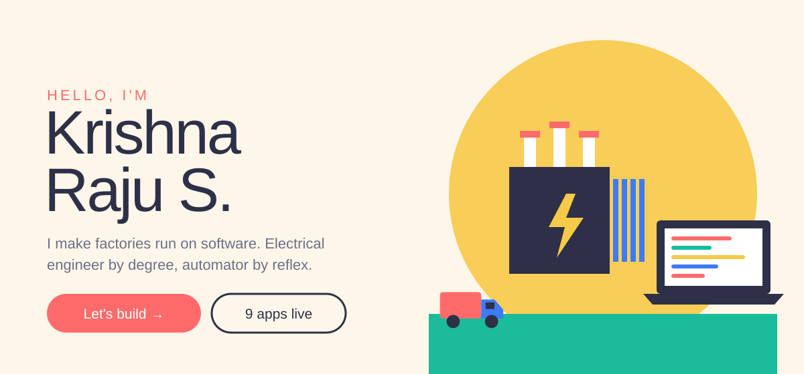
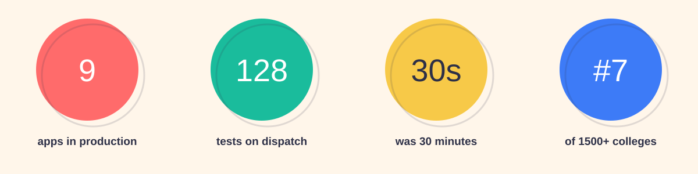
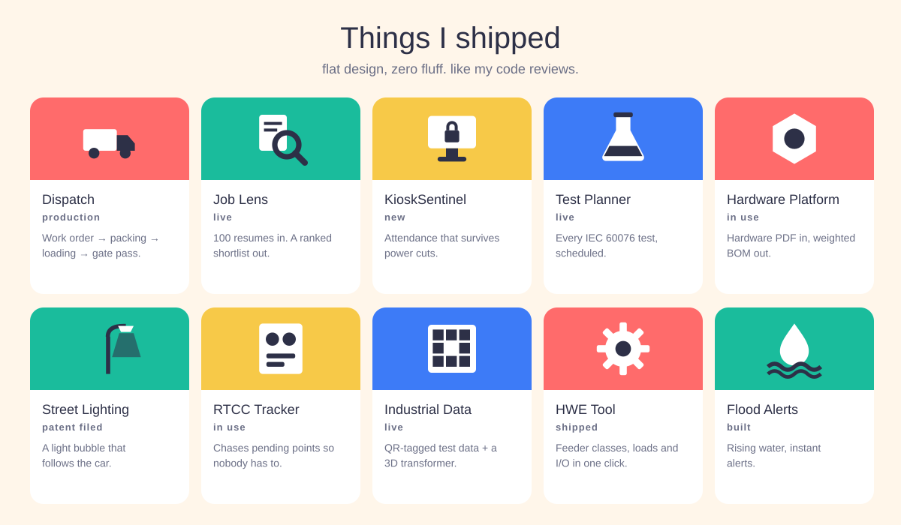
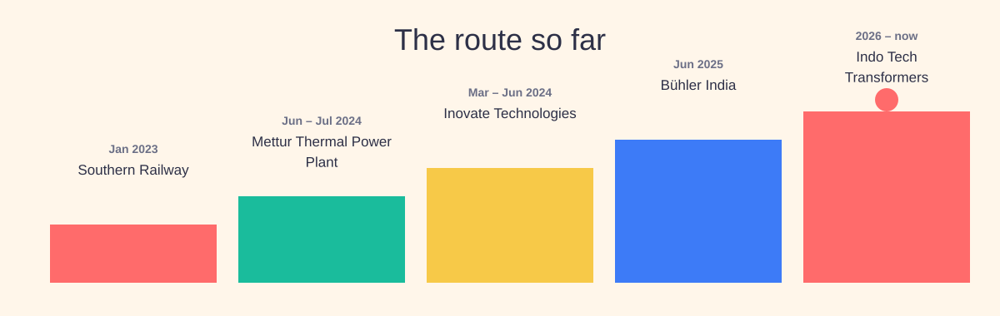

<!-- Flat design: solid colours, simple shapes, no gradients. Light and dark versions follow your GitHub theme. Built by scripts/gen_flat.py -->

<picture><source media="(prefers-color-scheme: dark)" srcset="./assets/flat/hero-dark.svg"/></picture>

  
  
  

<picture><source media="(prefers-color-scheme: dark)" srcset="./assets/flat/stats-dark.svg"/></picture>

<picture><source media="(prefers-color-scheme: dark)" srcset="./assets/flat/projects-dark.svg"/></picture>

open: [Dispatch Management](https://github.com/KRISH-exe-29/Dispatch-ITTL) · [Job Lens](https://krishna-ittl.github.io/Candidate-Screener/) · [Test Planner](https://transformer-test-planner.vercel.app) · [Hardware Platform v1.3](https://github.com/KRISH-exe-29/Fasteners-Project) · [RTCC & M.Box Tracker](https://github.com/KRISH-exe-29/Pannel-Box-Transformers-) · [Industrial Data System](https://github.com/KRISH-exe-29/indotech-transformers)

<picture><source media="(prefers-color-scheme: dark)" srcset="./assets/flat/route-dark.svg"/></picture>

<picture><source media="(prefers-color-scheme: dark)" srcset="./assets/flat/footer-dark.svg"/></picture>

