<!-- Futuristic holographic HUD: deep-space dark mode, clean-lab light mode. Built by scripts/gen_future.py -->

<picture><source media="(prefers-color-scheme: dark)" srcset="./assets/future/hud-dark.svg"/></picture>

<picture><source media="(prefers-color-scheme: dark)" srcset="./assets/future/radar-dark.svg"/></picture>

LOCK ON: [DISPATCH](https://github.com/KRISH-exe-29/Dispatch-ITTL) · [JOB LENS](https://krishna-ittl.github.io/Candidate-Screener/) · [TEST PLANNER](https://transformer-test-planner.vercel.app) · [HARDWARE PLATFORM](https://github.com/KRISH-exe-29/Fasteners-Project) · [RTCC TRACKER](https://github.com/KRISH-exe-29/Pannel-Box-Transformers-) · [INDUSTRIAL DATA](https://github.com/KRISH-exe-29/indotech-transformers)

OPEN CHANNEL → <a href="mailto:krishnarajus2004@gmail.com">krishnarajus2004@gmail.com</a> · <a href="https://linkedin.com/in/krishnarajus2004">LINKEDIN</a>

