<!-- Aesthetic / art-driven: a museum exhibition of the work. Daylight gallery and after-hours spotlights follow your GitHub theme. Built by scripts/gen_gallery.py -->

<picture><source media="(prefers-color-scheme: dark)" srcset="./assets/gallery/hall-dark.svg"/></picture>

<picture><source media="(prefers-color-scheme: dark)" srcset="./assets/gallery/salon-dark.svg"/></picture>

> *"Every composition here was generated from the name of a project. The shapes are art. The software underneath is not: it runs on a factory floor every shift."*
> — exhibition notes

[*Dispatch*](https://github.com/KRISH-exe-29/Dispatch-ITTL) · [*Job Lens*](https://krishna-ittl.github.io/Candidate-Screener/) · [*Test Planner*](https://transformer-test-planner.vercel.app) · [*Hardware Platform*](https://github.com/KRISH-exe-29/Fasteners-Project) · [*RTCC Tracker*](https://github.com/KRISH-exe-29/Pannel-Box-Transformers-) · [*Industrial Data*](https://github.com/KRISH-exe-29/indotech-transformers)

Private viewings: <a href="mailto:krishnarajus2004@gmail.com">krishnarajus2004@gmail.com</a> · <a href="https://linkedin.com/in/krishnarajus2004">linkedin</a>

