<!-- Clay theme. Panels live in assets/clay and are built by scripts/gen_clay.py; each carries its own backdrop, so light and dark mode look the same. -->

  

  
  
  
  

  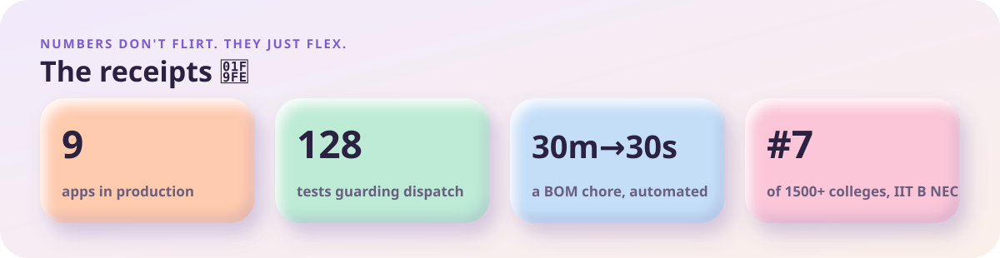

  <a href="https://github.com/KRISH-exe-29/Dispatch-ITTL">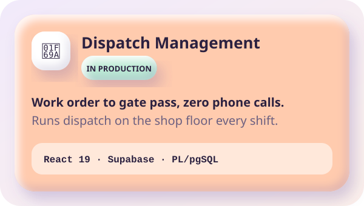</a>
  <a href="https://krishna-ittl.github.io/Candidate-Screener/">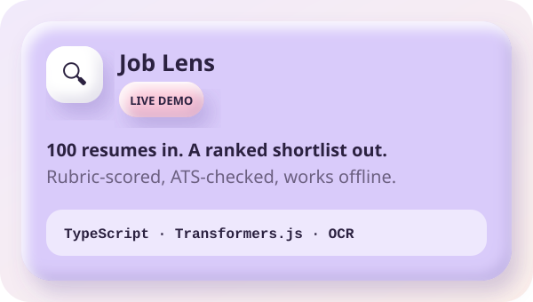</a>
  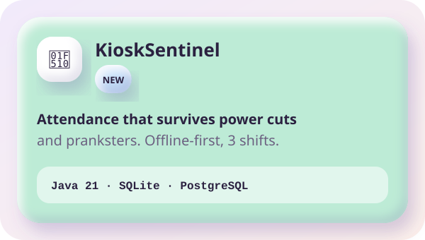
  <a href="https://transformer-test-planner.vercel.app">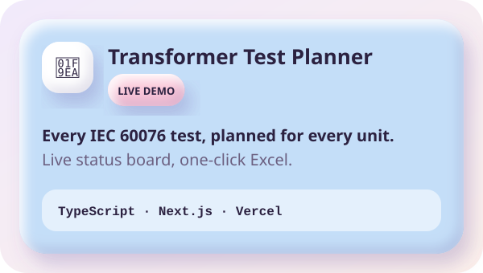</a>
  <a href="https://github.com/KRISH-exe-29/Pannel-Box-Transformers-">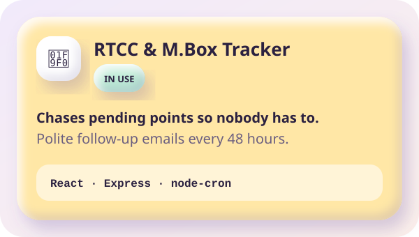</a>
  <a href="https://github.com/KRISH-exe-29/Fasteners-Project">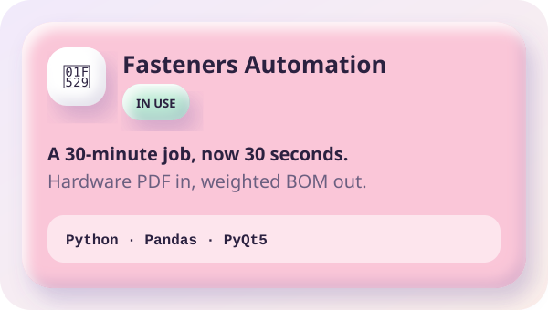</a>

  <a href="https://github.com/KRISH-exe-29/PMS">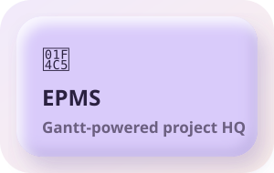</a>
  <a href="https://github.com/KRISH-exe-29/indotech-transformers">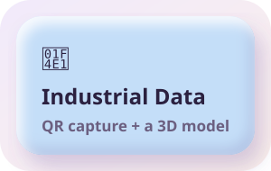</a>
  
  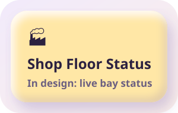

  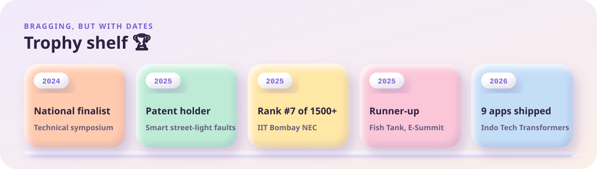

  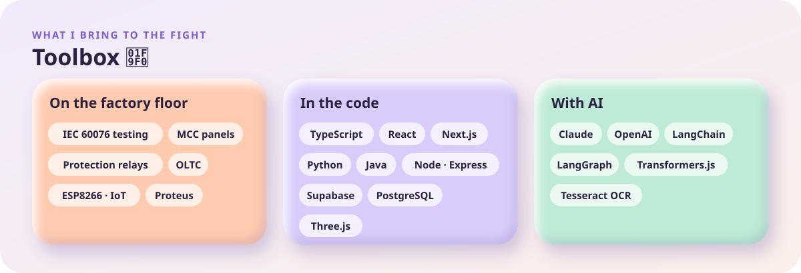

  

  

  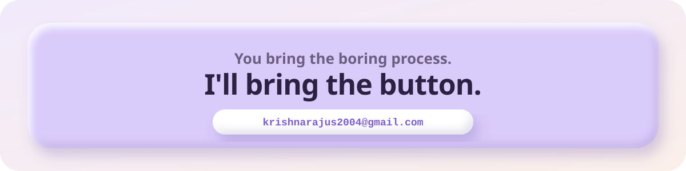

