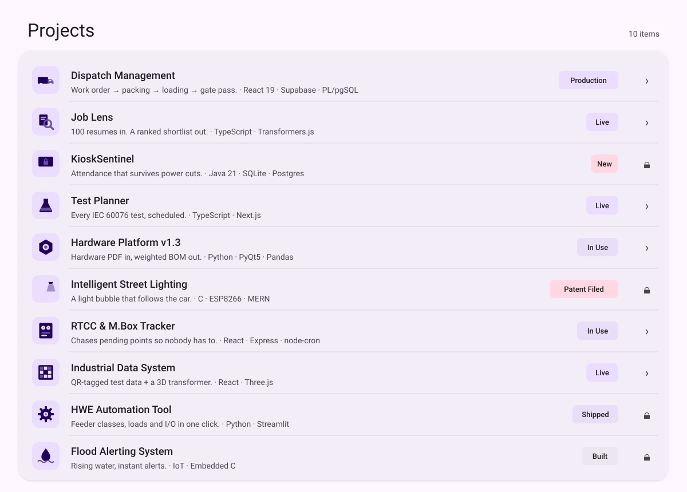
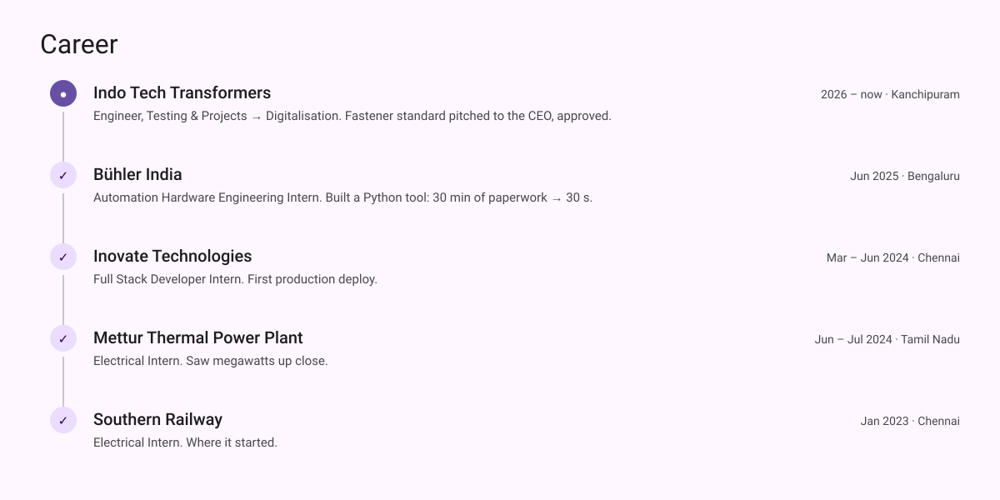

<!-- Material Design 3: tonal surfaces, elevation and motion. Light and dark tonal schemes follow your GitHub theme. Built by scripts/gen_material.py -->

<picture><source media="(prefers-color-scheme: dark)" srcset="./assets/material/hero-dark.svg"/></picture>

  
  
  

<picture><source media="(prefers-color-scheme: dark)" srcset="./assets/material/projects-dark.svg"/></picture>

tap to open: [Dispatch](https://github.com/KRISH-exe-29/Dispatch-ITTL) · [Job Lens](https://krishna-ittl.github.io/Candidate-Screener/) · [Test Planner](https://transformer-test-planner.vercel.app) · [Hardware Platform](https://github.com/KRISH-exe-29/Fasteners-Project) · [RTCC Tracker](https://github.com/KRISH-exe-29/Pannel-Box-Transformers-) · [Industrial Data](https://github.com/KRISH-exe-29/indotech-transformers)

<picture><source media="(prefers-color-scheme: dark)" srcset="./assets/material/career-dark.svg"/></picture>

<picture><source media="(prefers-color-scheme: dark)" srcset="./assets/material/navbar-dark.svg"/></picture>

