<!-- Experimental: the profile as a git commit graph. Light and dark follow your GitHub theme. Built by scripts/gen_gitgraph.py -->

<p align="center"><picture><source media="(prefers-color-scheme: dark)" srcset="./assets/gitgraph/graph-dark.svg"/></picture></p>

```console
$ git branch --list 'feature/*'
  * feature/dispatch           Work order → packing → loading → gate pass.
  * feature/job-lens           100 resumes in. A ranked shortlist out.
    feature/kiosk-sentinel     Attendance that survives power cuts.
  * feature/test-planner       Every IEC 60076 test, scheduled.
    feature/hardware           Hardware PDF in, weighted BOM out.
    feature/street-light       A light bubble that follows the car.
    feature/rtcc               Chases pending points so nobody has to.
  * feature/industrial-data    QR-tagged test data + a 3D transformer.
    feature/hwe-tool           Feeder classes, loads and I/O in one click.
    feature/flood              Rising water, instant alerts.
```

```console
$ git log --oneline --decorate
* HEAD000 (tag: hire-me) HEAD → main · next: your project?
* m2026it (tag: v2026) merge branch 'indotech' (9 apps in production)
| | | | | * it2026d feat(kiosk-sentinel): survive power cuts
| | | | | * it2026c feat(job-lens): rank 100 resumes offline
| | | | | * it2026b feat(dispatch): 5 roles, 128 tests, live
| | | | | * it2026a indotech: IEC 60076 testing, then software
* pt2025s (tag: v2025.08) feat: patent filed, street lights that follow the car
* m2025au merge branch 'automation'
| | | | * b2025fx perf: 30 minutes of paperwork → 30 seconds
| | | | * b2025hw automation: MCC feeder classification tool at Bühler
* n2025rk (tag: v2025.02) feat: rank #7 of 1500+ at NEC, IIT Bombay
* m2024wb merge branch 'web'
* m2024pp merge branch 'power-plant'
| | * p2024ok power-plant: big machines, small clipboards
| | | * w2024ph web: ship Project Phantom (first production deploy)
| | * p2024mt power-plant: megawatts up close at Mettur
* m2023rr merge branch 'railway'
| * 5r2023b railway: notice how much is still on paper
| * 5r2023a railway: electrical documentation + inspection
* e3e2022 feat: start B.E. Electrical & Electronics
* a1b2004 (tag: v2004) init: born in Chennai
```

```console
$ git checkout -b your-project
fatal: needs one more contributor. try: krishnarajus2004@gmail.com
```

**Checkout a feature:** [`feature/dispatch`](https://github.com/KRISH-exe-29/Dispatch-ITTL) · [`feature/job-lens`](https://krishna-ittl.github.io/Candidate-Screener/) · [`feature/test-planner`](https://transformer-test-planner.vercel.app) · [`feature/hardware`](https://github.com/KRISH-exe-29/Fasteners-Project) · [`feature/rtcc`](https://github.com/KRISH-exe-29/Pannel-Box-Transformers-) · [`feature/industrial-data`](https://github.com/KRISH-exe-29/indotech-transformers)

<sub>[linkedin](https://linkedin.com/in/krishnarajus2004) · no history was rewritten in the making of this README</sub>
