<!-- Immersive / visual storytelling: six animated chapters and an interactive journey map (GeoJSON). Night and day follow your GitHub theme. Built by scripts/gen_story.py -->

<h1 align="center">The engineer who counted minutes</h1>
<p align="center"><i>a true story in six chapters · by Krishna Raju S</i></p>

<p align="center"><picture><source media="(prefers-color-scheme: dark)" srcset="./assets/story/ch1-dark.svg"/></picture></p>

<p align="center"><picture><source media="(prefers-color-scheme: dark)" srcset="./assets/story/ch2-dark.svg"/></picture></p>

<p align="center"><picture><source media="(prefers-color-scheme: dark)" srcset="./assets/story/ch3-dark.svg"/></picture></p>

<p align="center"><picture><source media="(prefers-color-scheme: dark)" srcset="./assets/story/ch4-dark.svg"/></picture></p>

<p align="center"><picture><source media="(prefers-color-scheme: dark)" srcset="./assets/story/ch5-dark.svg"/></picture></p>

<p align="center"><picture><source media="(prefers-color-scheme: dark)" srcset="./assets/story/ch6-dark.svg"/></picture></p>

### 🗺️ Follow the route

Pan and zoom: every pin is a chapter.

```geojson
{
 "type": "FeatureCollection",
 "features": [
  {
   "type": "Feature",
   "properties": {
    "name": "The journey",
    "stroke": "#D9480F",
    "stroke-width": 3
   },
   "geometry": {
    "type": "LineString",
    "coordinates": [
     [
      80.2707,
      13.0827
     ],
     [
      77.8,
      11.7863
     ],
     [
      80.2209,
      13.0569
     ],
     [
      72.9133,
      19.1334
     ],
     [
      77.5946,
      12.9716
     ],
     [
      79.7036,
      12.8342
     ]
    ]
   }
  },
  {
   "type": "Feature",
   "properties": {
    "name": "Southern Railway",
    "city": "Chennai",
    "chapter": "2023 · where it started",
    "marker-color": "#D9480F"
   },
   "geometry": {
    "type": "Point",
    "coordinates": [
     80.2707,
     13.0827
    ]
   }
  },
  {
   "type": "Feature",
   "properties": {
    "name": "Mettur Thermal Power Plant",
    "city": "Mettur",
    "chapter": "2024 · megawatts up close",
    "marker-color": "#D9480F"
   },
   "geometry": {
    "type": "Point",
    "coordinates": [
     77.8,
     11.7863
    ]
   }
  },
  {
   "type": "Feature",
   "properties": {
    "name": "Inovate Technologies",
    "city": "Chennai",
    "chapter": "2024 · first production deploy",
    "marker-color": "#D9480F"
   },
   "geometry": {
    "type": "Point",
    "coordinates": [
     80.2209,
     13.0569
    ]
   }
  },
  {
   "type": "Feature",
   "properties": {
    "name": "IIT Bombay · NEC & E-Summit",
    "city": "Mumbai",
    "chapter": "Feb 2025 · rank #7, runner-up",
    "marker-color": "#D9480F"
   },
   "geometry": {
    "type": "Point",
    "coordinates": [
     72.9133,
     19.1334
    ]
   }
  },
  {
   "type": "Feature",
   "properties": {
    "name": "Bühler India",
    "city": "Bengaluru",
    "chapter": "Jun 2025 · 30 min → 30 s",
    "marker-color": "#D9480F"
   },
   "geometry": {
    "type": "Point",
    "coordinates": [
     77.5946,
     12.9716
    ]
   }
  },
  {
   "type": "Feature",
   "properties": {
    "name": "Indo Tech Transformers",
    "city": "Kanchipuram",
    "chapter": "2026 · the plant runs on it",
    "marker-color": "#D9480F"
   },
   "geometry": {
    "type": "Point",
    "coordinates": [
     79.7036,
     12.8342
    ]
   }
  }
 ]
}
```

### Epilogue

The apps in chapter VI, for the curious: [Dispatch](https://github.com/KRISH-exe-29/Dispatch-ITTL) · [Job Lens](https://krishna-ittl.github.io/Candidate-Screener/) · [Test Planner](https://transformer-test-planner.vercel.app) · [Hardware Platform](https://github.com/KRISH-exe-29/Fasteners-Project) · [RTCC Tracker](https://github.com/KRISH-exe-29/Pannel-Box-Transformers-) · [Industrial Data](https://github.com/KRISH-exe-29/indotech-transformers)

<p align="center"><b>Chapter VII is unwritten.</b> Maybe you're in it: <a href="mailto:krishnarajus2004@gmail.com">krishnarajus2004@gmail.com</a> · <a href="https://linkedin.com/in/krishnarajus2004">LinkedIn</a></p>
