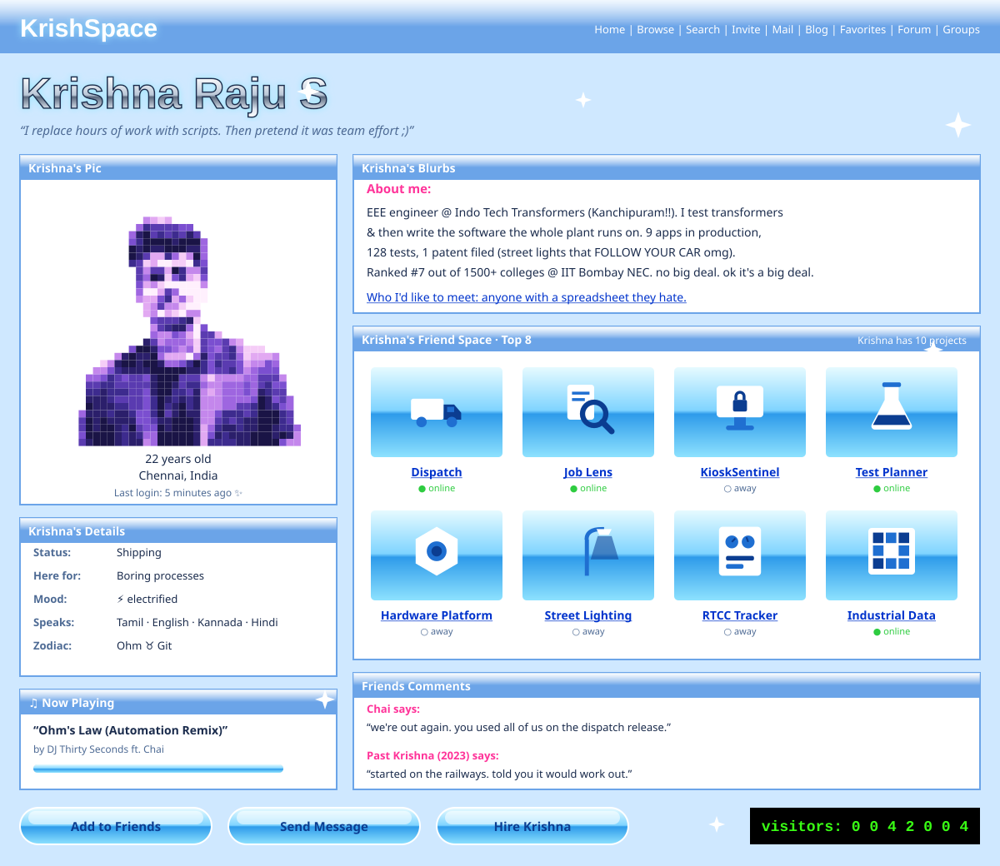

<!-- Y2K: a 2006 social profile, glossy aqua and chrome. Light (sky) and dark (midnight) follow your GitHub theme. Built by scripts/gen_y2k.py -->

<picture><source media="(prefers-color-scheme: dark)" srcset="./assets/y2k/page-dark.svg"/></picture>

  
  
  

<b>~*~ Top 8, clickable ~*~</b> [Dispatch](https://github.com/KRISH-exe-29/Dispatch-ITTL) · [Job Lens](https://krishna-ittl.github.io/Candidate-Screener/) · [Test Planner](https://transformer-test-planner.vercel.app) · [Hardware Platform](https://github.com/KRISH-exe-29/Fasteners-Project) · [RTCC Tracker](https://github.com/KRISH-exe-29/Pannel-Box-Transformers-) · [Industrial Data](https://github.com/KRISH-exe-29/indotech-transformers)

best viewed in any browser at 1024×768 ✨ sign my guestbook: krishnarajus2004@gmail.com

