<!-- Cyberpunk HUD: midnight neon in dark mode, the yellow menu look in light mode. Built by scripts/gen_cyber.py -->

<picture><source media="(prefers-color-scheme: dark)" srcset="./assets/cyber/id-dark.svg"/></picture>

<picture><source media="(prefers-color-scheme: dark)" srcset="./assets/cyber/breach-dark.svg"/></picture>

<code>[DISPATCH](https://github.com/KRISH-exe-29/Dispatch-ITTL) · [JOB LENS](https://krishna-ittl.github.io/Candidate-Screener/) · [TEST PLANNER](https://transformer-test-planner.vercel.app) · [HARDWARE PLATFORM](https://github.com/KRISH-exe-29/Fasteners-Project) · [RTCC TRACKER](https://github.com/KRISH-exe-29/Pannel-Box-Transformers-) · [INDUSTRIAL DATA](https://github.com/KRISH-exe-29/indotech-transformers)</code>

<a href="mailto:krishnarajus2004@gmail.com"><picture><source media="(prefers-color-scheme: dark)" srcset="./assets/cyber/jackin-dark.svg"/></picture></a>

<a href="https://linkedin.com/in/krishnarajus2004">LINKEDIN // UPLINK</a>

