<!-- The SVGs in assets/ are self-hosted, so the animations keep working even when a free stats API goes down. -->


  
  
  
  
  

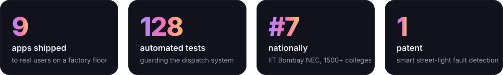

 

I'm an <b>Electrical &amp; Electronics engineer</b> on the Digitalisation team at <b>Indo Tech Transformers</b>. 
I spot the job someone does by hand every shift (the copy-pasted spreadsheet, the chased email, the paper gate pass) 
and quietly replace it with an app. Dispatch, testing, hiring and attendance across the plant now run on software I wrote.

<h2 align="center">Things I've shipped</h2>

Click a card to open it. Most of these run on a real factory floor, not a demo stage.

  <a href="https://github.com/KRISH-exe-29/Dispatch-ITTL"></a>
  <a href="https://krishna-ittl.github.io/Candidate-Screener/"></a>
  
  <a href="https://transformer-test-planner.vercel.app"></a>
  <a href="https://github.com/KRISH-exe-29/Pannel-Box-Transformers-"></a>
  <a href="https://github.com/KRISH-exe-29/indotech-transformers"></a>
  <a href="https://github.com/KRISH-exe-29/PMS"></a>
  <a href="https://github.com/KRISH-exe-29/Fasteners-Project"></a>
  <a href="https://krishna-ittl.github.io/dmat-practice/"></a>
  

<table align="center">
<tr>
<td valign="top" width="50%">

### 🛠️ On the bench right now

- **Shop Floor Job Status**: turning cycle-time norms and worker efficiency into a live status board for every bay
- **EHS safety film**: an 11-scene workplace-safety video made with AI video generation, cast from our own team
- **KioskSentinel**: tamper-proof attendance kiosks that keep counting through power cuts

</td>
<td valign="top" width="50%">

### 🧪 In the AI lab

- [**PDF chat agent**](https://github.com/KRISH-exe-29/AI-PDF-Chatbot-Agent-Powered-by-LangChain-and-LangGraph): RAG over long PDFs with LangChain + LangGraph
- [**Memory agent**](https://github.com/KRISH-exe-29/Langchain-Memory-): a ReAct agent that remembers you across chats
- [**AI PR reviewer**](https://github.com/KRISH-exe-29/GPT-based-PR-reviewer-): a GitHub Action that summarises and reviews pull requests
- [**Gmail cleanup agent**](https://github.com/KRISH-exe-29/Gmail-cleanup-agent): an inbox that tidies itself

</td>
</tr>
</table>

<h2 align="center">Milestones</h2>

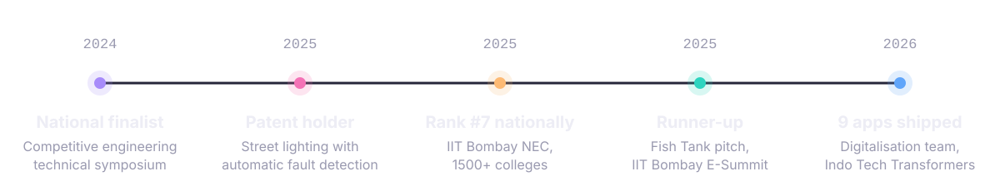

<h2 align="center">Toolbox</h2>

<b>On the factory floor</b>  
  
  
  
  
  
  

<b>In the code</b>  
   
   
  

<b>AI I build with</b>  
  
  
  
  
  
  

<h2 align="center">Commit trail</h2>

  

<picture>
  <source media="(prefers-color-scheme: dark)" srcset="https://raw.githubusercontent.com/KRISH-exe-29/KRISH-exe-29/output/snake-dark.svg"/>
  
</picture>

<b>🚀 Bonus round: my commits as an alien fleet</b>

 
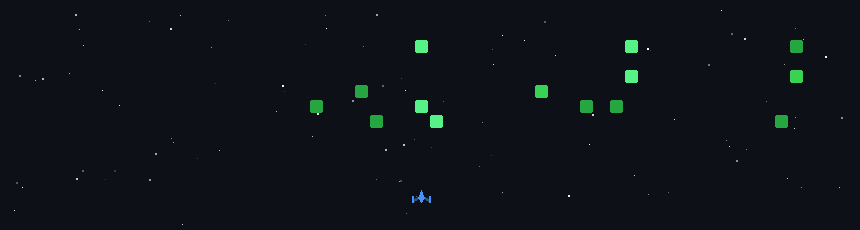

 

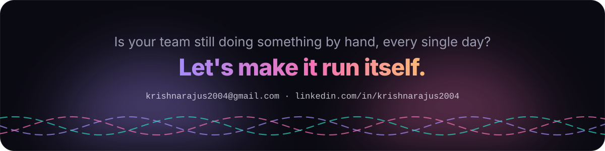
