<!-- Dark-mode UI as a code editor (Dark Modern), with a Light Modern twin for light mode. Built by scripts/gen_ide.py -->

<p align="center"><picture><source media="(prefers-color-scheme: dark)" srcset="./assets/ide/editor-dark.svg"/></picture></p>

```bash
$ git clone https://github.com/KRISH-exe-29 && cd krishna
$ npm run hire   # → krishnarajus2004@gmail.com
```

**Open a project:** [`dispatch`](https://github.com/KRISH-exe-29/Dispatch-ITTL) · [`job-lens`](https://krishna-ittl.github.io/Candidate-Screener/) · [`test-planner`](https://transformer-test-planner.vercel.app) · [`hardware`](https://github.com/KRISH-exe-29/Fasteners-Project) · [`rtcc`](https://github.com/KRISH-exe-29/Pannel-Box-Transformers-) · [`industrial-data`](https://github.com/KRISH-exe-29/indotech-transformers)

<sub>⑂ main · ✓ 0 problems · [linkedin](https://linkedin.com/in/krishnarajus2004) · [email](mailto:krishnarajus2004@gmail.com)</sub>
