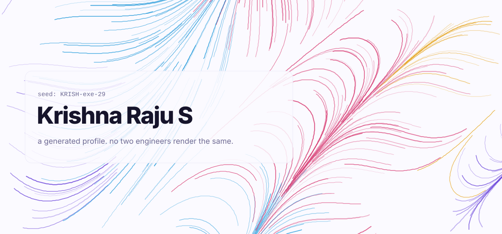
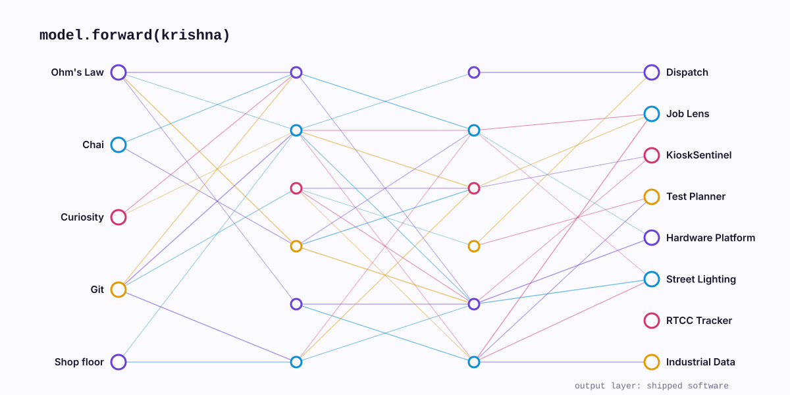

<!-- AI / generative: art seeded from the username, a firing neural net, a latent-space map and a self-typing prompt. Light and dark follow your GitHub theme. Built by scripts/gen_generative.py -->

<p align="center"><picture><source media="(prefers-color-scheme: dark)" srcset="./assets/generative/field-dark.svg"/></picture></p>
<p align="center"><picture><source media="(prefers-color-scheme: dark)" srcset="./assets/generative/network-dark.svg"/></picture></p>
<p align="center"><picture><source media="(prefers-color-scheme: dark)" srcset="./assets/generative/latent-dark.svg"/></picture></p>

```text
> sampling 10 projects at temperature 0 (deterministic, like the tests)
```

<p align="center">[Dispatch](https://github.com/KRISH-exe-29/Dispatch-ITTL) · [Job Lens](https://krishna-ittl.github.io/Candidate-Screener/) · [Test Planner](https://transformer-test-planner.vercel.app) · [Hardware Platform](https://github.com/KRISH-exe-29/Fasteners-Project) · [RTCC Tracker](https://github.com/KRISH-exe-29/Pannel-Box-Transformers-) · [Industrial Data](https://github.com/KRISH-exe-29/indotech-transformers)</p>
<p align="center"><sub>seed = sha256("KRISH-exe-29") · <a href="mailto:krishnarajus2004@gmail.com">krishnarajus2004@gmail.com</a> · <a href="https://linkedin.com/in/krishnarajus2004">linkedin</a></sub></p>
