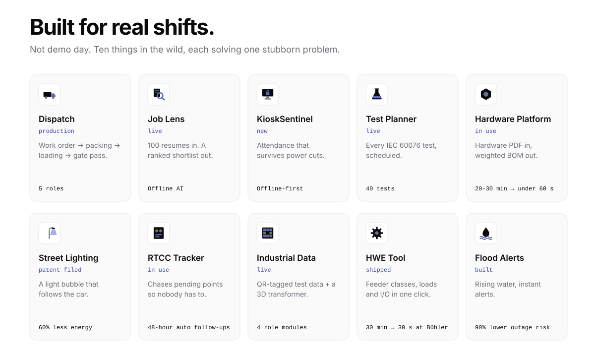
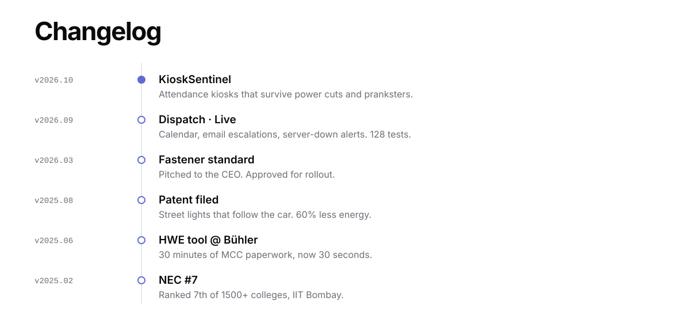

<!-- Modern / contemporary launch page. Light and dark follow your GitHub theme. Built by scripts/gen_modern.py -->

<picture><source media="(prefers-color-scheme: dark)" srcset="./assets/modern/hero-dark.svg"/></picture>

  
  
  

<picture><source media="(prefers-color-scheme: dark)" srcset="./assets/modern/features-dark.svg"/></picture>

[Dispatch](https://github.com/KRISH-exe-29/Dispatch-ITTL) · [Job Lens](https://krishna-ittl.github.io/Candidate-Screener/) · [Test Planner](https://transformer-test-planner.vercel.app) · [Hardware Platform](https://github.com/KRISH-exe-29/Fasteners-Project) · [RTCC Tracker](https://github.com/KRISH-exe-29/Pannel-Box-Transformers-) · [Industrial Data](https://github.com/KRISH-exe-29/indotech-transformers)

<picture><source media="(prefers-color-scheme: dark)" srcset="./assets/modern/changelog-dark.svg"/></picture>

Electrical by degree · software by choice · krishnarajus2004@gmail.com

