<!-- Card-based design as a trading-card set. Each card is self-coloured, so it reads on light and dark GitHub themes. Built by scripts/gen_cards.py -->

<h1 align="center">KRISH · the trading card game</h1>

<i>11 cards. 1 legendary. 0 spreadsheets in the deck.</i>


  
  

### The set

  <a href="https://github.com/KRISH-exe-29/Dispatch-ITTL"></a>
  <a href="https://krishna-ittl.github.io/Candidate-Screener/"></a>
  

  <a href="https://transformer-test-planner.vercel.app"></a>
  <a href="https://github.com/KRISH-exe-29/Fasteners-Project"></a>
  

  <a href="https://github.com/KRISH-exe-29/Pannel-Box-Transformers-"></a>
  <a href="https://github.com/KRISH-exe-29/indotech-transformers"></a>
  

  

<b>📖 How to play</b>

1. Pick a card. Holo cards (✦ shimmer) are in production or live right now.
2. Click it. Cards with a link open the real project; locked ones are company-internal or hardware.
3. Every attack is a real feature. Every HP is a real number from the project, give or take some game balance.
4. The legendary card cannot be collected. It can only be hired: **krishnarajus2004@gmail.com**

