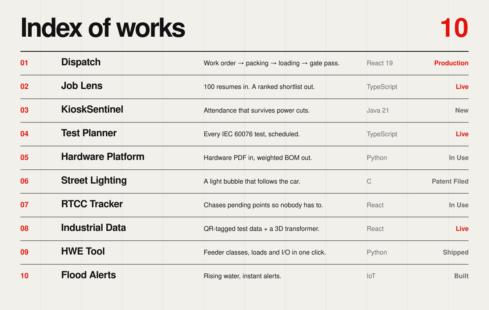
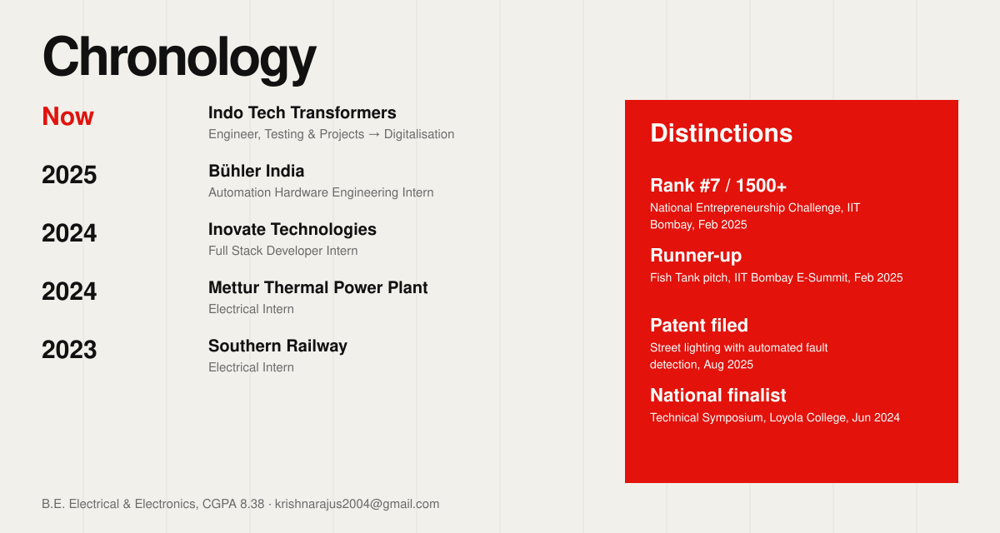

<!-- Swiss / International Typographic Style. Light and dark follow your GitHub theme. Built by scripts/gen_swiss.py -->

<picture><source media="(prefers-color-scheme: dark)" srcset="./assets/swiss/poster-dark.svg"/></picture>

**01** [Email](mailto:krishnarajus2004@gmail.com) — **02** [LinkedIn](https://linkedin.com/in/krishnarajus2004) — **03** [Job Lens, live](https://krishna-ittl.github.io/Candidate-Screener/)

<picture><source media="(prefers-color-scheme: dark)" srcset="./assets/swiss/index-dark.svg"/></picture>

[Dispatch](https://github.com/KRISH-exe-29/Dispatch-ITTL) — [Job Lens](https://krishna-ittl.github.io/Candidate-Screener/) — [Test Planner](https://transformer-test-planner.vercel.app) — [Hardware Platform](https://github.com/KRISH-exe-29/Fasteners-Project) — [RTCC Tracker](https://github.com/KRISH-exe-29/Pannel-Box-Transformers-) — [Industrial Data](https://github.com/KRISH-exe-29/indotech-transformers)

<picture><source media="(prefers-color-scheme: dark)" srcset="./assets/swiss/chronology-dark.svg"/></picture>
