<!-- Raw brutalism: default fonts, default blue links, hard rules, no polish. Built by scripts/gen_raw.py -->

<picture><source media="(prefers-color-scheme: dark)" srcset="./assets/raw/banner-dark.svg"/></picture>

# KRISHNA RAJU S

**ELECTRICAL ENGINEER.** WRITES SOFTWARE. SHIPS IT. GOES HOME.

~~beautiful landing page~~ → working software on a factory floor.

***

## WHAT I MADE

| # | THING | STATE | WHAT IT DOES | MADE OF |
|---|---|---|---|---|
| 01 | [Dispatch Management](https://github.com/KRISH-exe-29/Dispatch-ITTL) | PRODUCTION | Work order → packing → loading → gate pass. | `React 19 · Supabase · PL/pgSQL` |
| 02 | [Job Lens](https://krishna-ittl.github.io/Candidate-Screener/) | LIVE | 100 resumes in. A ranked shortlist out. | `TypeScript · Transformers.js` |
| 03 | KioskSentinel | NEW | Attendance that survives power cuts. | `Java 21 · SQLite · Postgres` |
| 04 | [Test Planner](https://transformer-test-planner.vercel.app) | LIVE | Every IEC 60076 test, scheduled. | `TypeScript · Next.js` |
| 05 | [Hardware Platform v1.3](https://github.com/KRISH-exe-29/Fasteners-Project) | IN USE | Hardware PDF in, weighted BOM out. | `Python · PyQt5 · Pandas` |
| 06 | Intelligent Street Lighting | PATENT FILED | A light bubble that follows the car. | `C · ESP8266 · MERN` |
| 07 | [RTCC & M.Box Tracker](https://github.com/KRISH-exe-29/Pannel-Box-Transformers-) | IN USE | Chases pending points so nobody has to. | `React · Express · node-cron` |
| 08 | [Industrial Data System](https://github.com/KRISH-exe-29/indotech-transformers) | LIVE | QR-tagged test data + a 3D transformer. | `React · Three.js` |
| 09 | HWE Automation Tool | SHIPPED | Feeder classes, loads and I/O in one click. | `Python · Streamlit` |
| 10 | Flood Alerting System | BUILT | Rising water, instant alerts. | `IoT · Embedded C` |

***

## WHERE I WORKED

```
2026 – now       INDO TECH TRANSFORMERS       Engineer, Testing & Projects → Digitalisation
Jun 2025         BÜHLER INDIA                 Automation Hardware Engineering Intern
Mar – Jun 2024   INOVATE TECHNOLOGIES         Full Stack Developer Intern
Jun – Jul 2024   METTUR THERMAL POWER PLANT   Electrical Intern
Jan 2023         SOUTHERN RAILWAY             Electrical Intern
```

***

## PROOF

- **RANK #7 / 1500+**: National Entrepreneurship Challenge, IIT Bombay (Feb 2025)
- **RUNNER-UP**: Fish Tank pitch, IIT Bombay E-Summit (Feb 2025)
- **PATENT FILED**: Street lighting with automated fault detection (Aug 2025)
- **NATIONAL FINALIST**: Technical Symposium, Loyola College (Jun 2024)
- **DEGREE**: B.E. ELECTRICAL & ELECTRONICS, ST. JOSEPH'S COLLEGE OF ENGINEERING, CGPA 8.38
- **CERTS**: Arduino & C · UC Irvine / Raspberry Pi & Python · UC Irvine / Intro to IoT · NPTEL / Digital Circuits · NPTEL / Supply Chain Mgmt · CII

***

## RULES I WORK BY

1. IF A HUMAN DOES IT TWICE A DAY, A SCRIPT DOES IT FROM NOW ON.
2. SHIP IT. THEN IMPROVE IT.
3. TESTS OR IT DIDN'T HAPPEN. (DISPATCH HAS 128.)
4. FLUENT IN OHM'S LAW AND GIT. NO OTHER LANGUAGE REQUIRED.

***

<kbd>EMAIL</kbd> krishnarajus2004@gmail.com &nbsp; <kbd>LINKEDIN</kbd> [linkedin.com/in/krishnarajus2004](https://linkedin.com/in/krishnarajus2004)

<sub>NO TEMPLATES. NO GRADIENTS. NO REGRETS. LAST UPDATED: WHEN SOMETHING SHIPPED.</sub>
