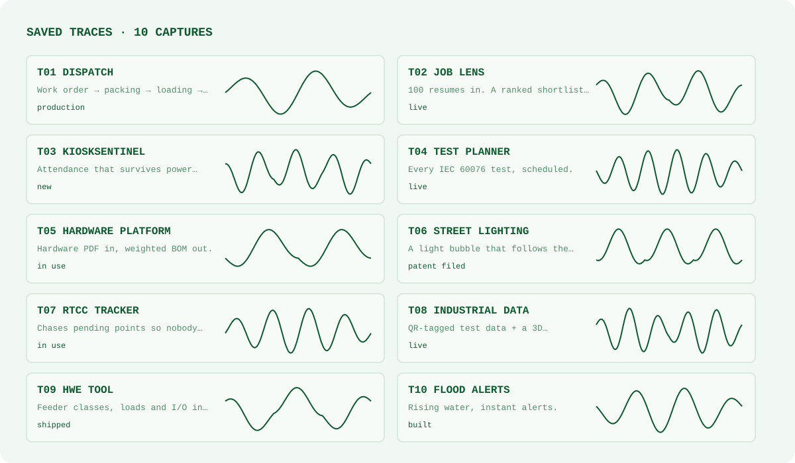

<!-- Monochromatic: one hue. Phosphor oscilloscope in dark mode, chart-recorder printout in light mode. Built by scripts/gen_scope.py -->

<picture><source media="(prefers-color-scheme: dark)" srcset="./assets/scope/scope-dark.svg"/></picture>

<picture><source media="(prefers-color-scheme: dark)" srcset="./assets/scope/traces-dark.svg"/></picture>

<code>[dispatch](https://github.com/KRISH-exe-29/Dispatch-ITTL) · [job lens](https://krishna-ittl.github.io/Candidate-Screener/) · [test planner](https://transformer-test-planner.vercel.app) · [hardware platform](https://github.com/KRISH-exe-29/Fasteners-Project) · [rtcc tracker](https://github.com/KRISH-exe-29/Pannel-Box-Transformers-) · [industrial data](https://github.com/KRISH-exe-29/indotech-transformers)</code>

<picture><source media="(prefers-color-scheme: dark)" srcset="./assets/scope/lissajous-dark.svg"/></picture>

<a href="mailto:krishnarajus2004@gmail.com">krishnarajus2004@gmail.com</a> · <a href="https://linkedin.com/in/krishnarajus2004">linkedin</a>

