<!-- Editorial / newspaper. The morning edition (light) and night edition (dark) swap with your GitHub theme. Built by scripts/gen_press.py. -->

<picture><source media="(prefers-color-scheme: dark)" srcset="./assets/press/front-dark.svg"/></picture>

  
  
  

<picture><source media="(prefers-color-scheme: dark)" srcset="./assets/press/business-dark.svg"/>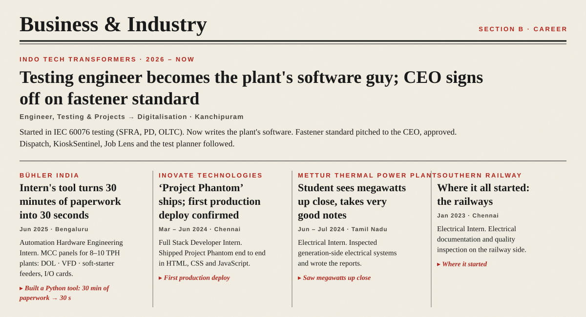</picture>

<h3 align="center">📰 Today's clippings</h3>

Every story links to the source.

  <a href="https://github.com/KRISH-exe-29/Dispatch-ITTL"><picture><source media="(prefers-color-scheme: dark)" srcset="./assets/press/card-dispatch-dark.svg"/>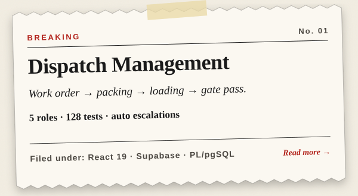</picture></a>
  <a href="https://krishna-ittl.github.io/Candidate-Screener/"><picture><source media="(prefers-color-scheme: dark)" srcset="./assets/press/card-job-lens-dark.svg"/>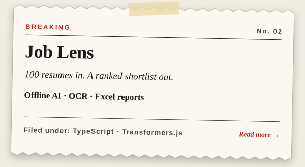</picture></a>
  <picture><source media="(prefers-color-scheme: dark)" srcset="./assets/press/card-kiosk-sentinel-dark.svg"/>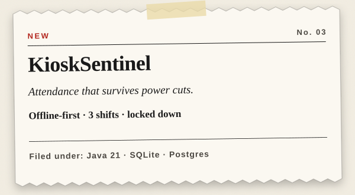</picture>
  <a href="https://transformer-test-planner.vercel.app"><picture><source media="(prefers-color-scheme: dark)" srcset="./assets/press/card-test-planner-dark.svg"/>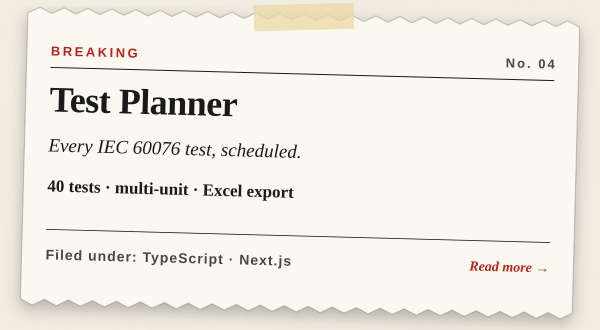</picture></a>
  <a href="https://github.com/KRISH-exe-29/Fasteners-Project"><picture><source media="(prefers-color-scheme: dark)" srcset="./assets/press/card-hardware-dark.svg"/>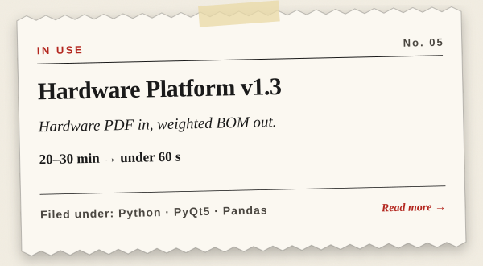</picture></a>
  <picture><source media="(prefers-color-scheme: dark)" srcset="./assets/press/card-street-light-dark.svg"/>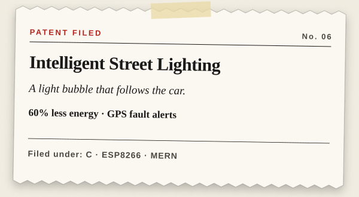</picture>
  <a href="https://github.com/KRISH-exe-29/Pannel-Box-Transformers-"><picture><source media="(prefers-color-scheme: dark)" srcset="./assets/press/card-rtcc-dark.svg"/>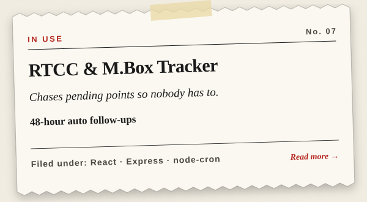</picture></a>
  <a href="https://github.com/KRISH-exe-29/indotech-transformers"><picture><source media="(prefers-color-scheme: dark)" srcset="./assets/press/card-industrial-data-dark.svg"/>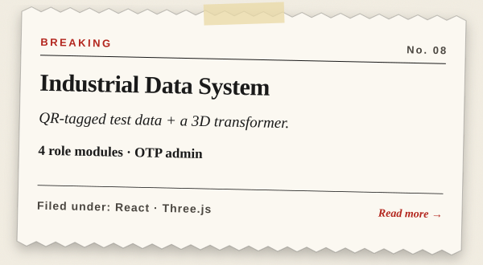</picture></a>
  <picture><source media="(prefers-color-scheme: dark)" srcset="./assets/press/card-hwe-tool-dark.svg"/>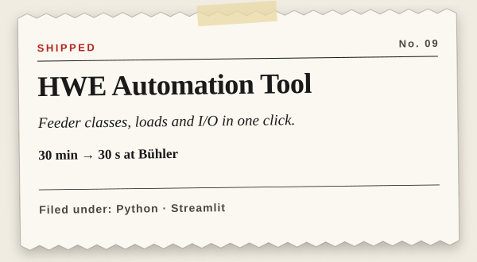</picture>
  <picture><source media="(prefers-color-scheme: dark)" srcset="./assets/press/card-flood-dark.svg"/>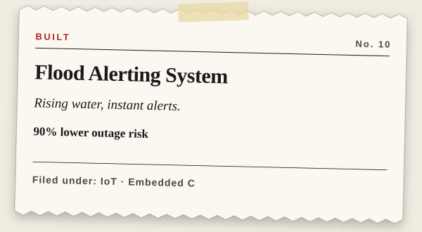</picture>

<picture><source media="(prefers-color-scheme: dark)" srcset="./assets/press/scores-dark.svg"/></picture>

<picture><source media="(prefers-color-scheme: dark)" srcset="./assets/press/classifieds-dark.svg"/>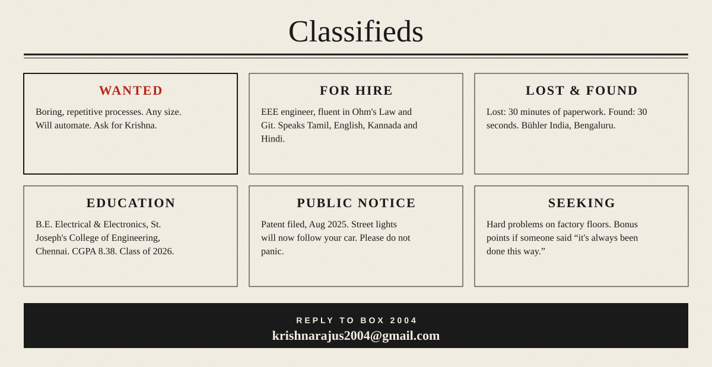</picture>

