<!-- Liquid-glass theme: every image has a light and a dark variant (assets/glass), picked by GitHub's theme. Built by scripts/gen_glass.py. -->

<picture><source media="(prefers-color-scheme: dark)" srcset="./assets/glass/hero-dark.svg"/></picture>

  
  
  
  

<picture><source media="(prefers-color-scheme: dark)" srcset="./assets/glass/stats-dark.svg"/></picture>

<h3 align="center">Nine apps. One factory. Zero spreadsheets left behind.</h3>

Tap a card. Most of these run on a real shop floor, every shift.

  <a href="https://github.com/KRISH-exe-29/Dispatch-ITTL"><picture><source media="(prefers-color-scheme: dark)" srcset="./assets/glass/card-dispatch-dark.svg"/></picture></a>
  <a href="https://krishna-ittl.github.io/Candidate-Screener/"><picture><source media="(prefers-color-scheme: dark)" srcset="./assets/glass/card-job-lens-dark.svg"/></picture></a>
  <picture><source media="(prefers-color-scheme: dark)" srcset="./assets/glass/card-kiosk-sentinel-dark.svg"/></picture>
  <a href="https://transformer-test-planner.vercel.app"><picture><source media="(prefers-color-scheme: dark)" srcset="./assets/glass/card-test-planner-dark.svg"/></picture></a>
  <a href="https://github.com/KRISH-exe-29/Pannel-Box-Transformers-"><picture><source media="(prefers-color-scheme: dark)" srcset="./assets/glass/card-rtcc-dark.svg"/></picture></a>
  <a href="https://github.com/KRISH-exe-29/Fasteners-Project"><picture><source media="(prefers-color-scheme: dark)" srcset="./assets/glass/card-fasteners-dark.svg"/></picture></a>

  <a href="https://github.com/KRISH-exe-29/PMS"><picture><source media="(prefers-color-scheme: dark)" srcset="./assets/glass/card-epms-dark.svg"/></picture></a>
  <a href="https://github.com/KRISH-exe-29/indotech-transformers"><picture><source media="(prefers-color-scheme: dark)" srcset="./assets/glass/card-industrial-data-dark.svg"/></picture></a>
  <a href="https://krishna-ittl.github.io/dmat-practice/"><picture><source media="(prefers-color-scheme: dark)" srcset="./assets/glass/card-dmat-dark.svg"/></picture></a>
  <picture><source media="(prefers-color-scheme: dark)" srcset="./assets/glass/card-shop-floor-dark.svg"/></picture>

<h3 align="center">The highlight reel.</h3>

<picture><source media="(prefers-color-scheme: dark)" srcset="./assets/glass/milestones-dark.svg"/></picture>

<h3 align="center">Tools of the trade.</h3>

<picture><source media="(prefers-color-scheme: dark)" srcset="./assets/glass/dock-dark.svg"/></picture>

<h3 align="center">Always shipping.</h3>

<picture><source media="(prefers-color-scheme: dark)" srcset="https://streak-stats.demolab.com?user=KRISH-exe-29&hide_border=true&border_radius=24&background=0B1020&ring=8FA5FF&fire=D946EF&currStreakLabel=8FA5FF&currStreakNum=F5F7FF&sideNums=F5F7FF&sideLabels=C9D0E4&dates=C9D0E4"/></picture>

<picture><source media="(prefers-color-scheme: dark)" srcset="https://raw.githubusercontent.com/KRISH-exe-29/KRISH-exe-29/output/snake-dark.svg"/></picture>

<picture><source media="(prefers-color-scheme: dark)" srcset="./assets/glass/footer-dark.svg"/></picture>

