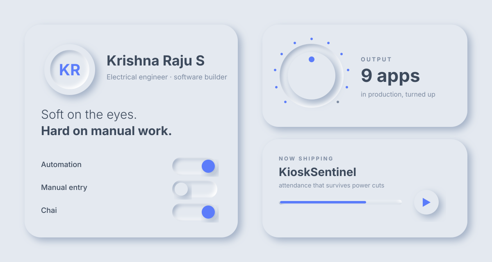
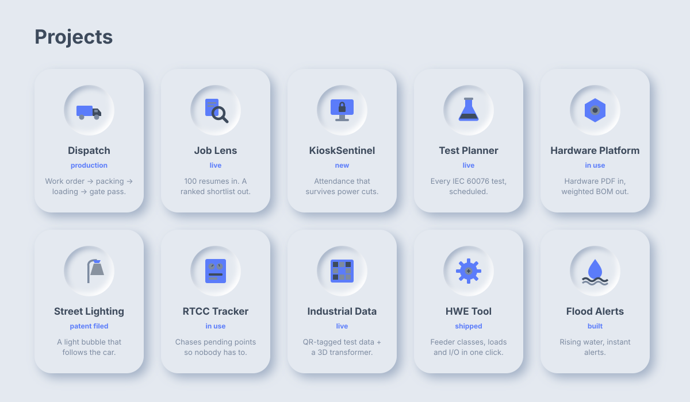
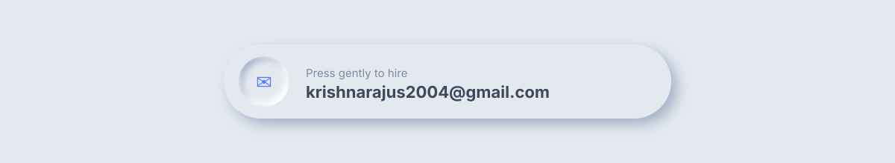

<!-- Neumorphism / soft UI: one surface, raised and pressed. Cloud-grey and graphite versions follow your GitHub theme. Built by scripts/gen_soft.py -->

<picture><source media="(prefers-color-scheme: dark)" srcset="./assets/soft/panel-dark.svg"/></picture>

<picture><source media="(prefers-color-scheme: dark)" srcset="./assets/soft/projects-dark.svg"/></picture>

[Dispatch](https://github.com/KRISH-exe-29/Dispatch-ITTL) · [Job Lens](https://krishna-ittl.github.io/Candidate-Screener/) · [Test Planner](https://transformer-test-planner.vercel.app) · [Hardware Platform](https://github.com/KRISH-exe-29/Fasteners-Project) · [RTCC Tracker](https://github.com/KRISH-exe-29/Pannel-Box-Transformers-) · [Industrial Data](https://github.com/KRISH-exe-29/indotech-transformers)

<a href="mailto:krishnarajus2004@gmail.com"><picture><source media="(prefers-color-scheme: dark)" srcset="./assets/soft/contact-dark.svg"/></picture></a>

<a href="https://linkedin.com/in/krishnarajus2004">linkedin</a>

