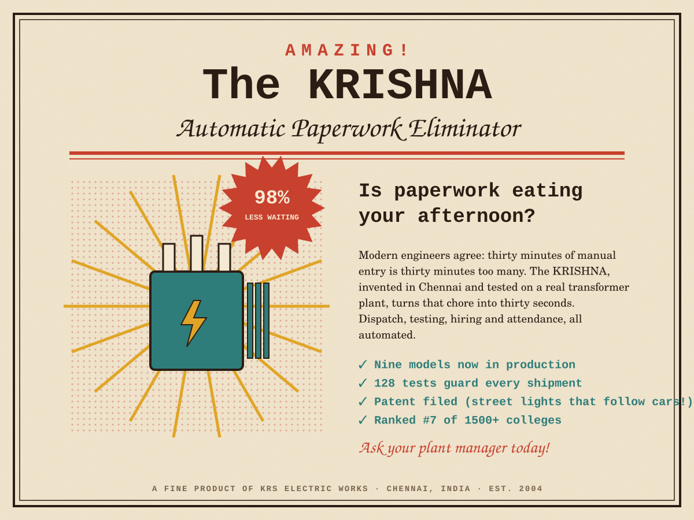
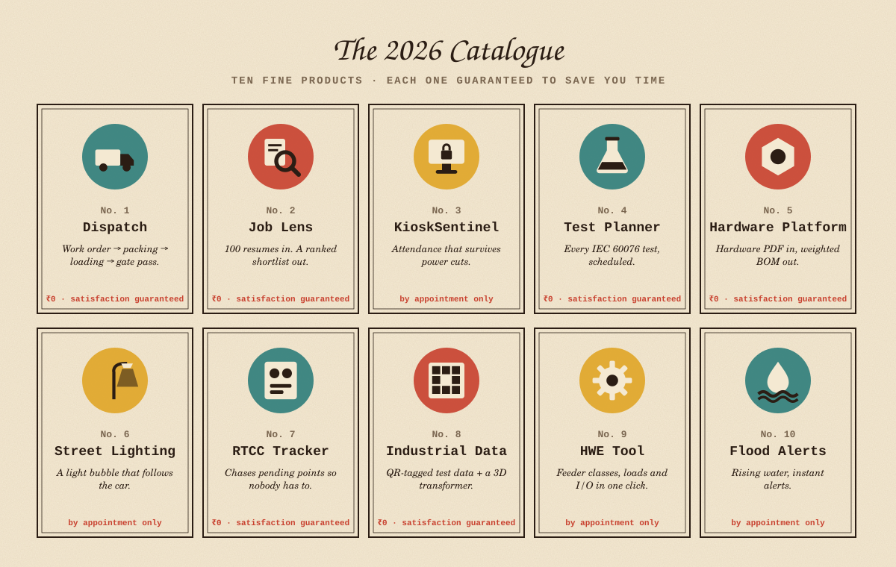
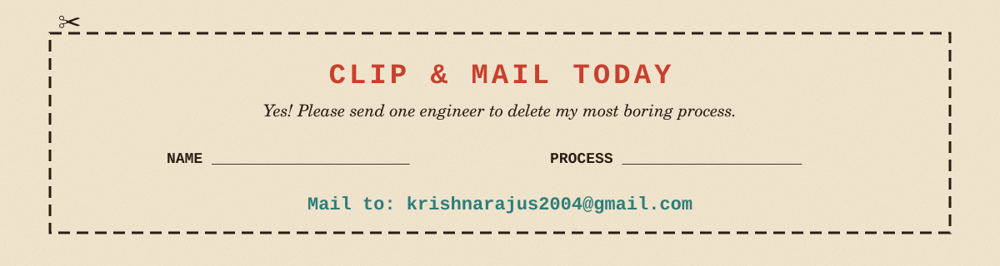

<!-- Retro / vintage: a 1950s magazine ad on aged paper. Daylight print and an after-dark edition follow your GitHub theme. Built by scripts/gen_vintage.py -->

<picture><source media="(prefers-color-scheme: dark)" srcset="./assets/vintage/ad-dark.svg"/></picture>

<picture><source media="(prefers-color-scheme: dark)" srcset="./assets/vintage/catalogue-dark.svg"/></picture>

[No. 1 Dispatch](https://github.com/KRISH-exe-29/Dispatch-ITTL) · [No. 2 Job Lens](https://krishna-ittl.github.io/Candidate-Screener/) · [No. 4 Test Planner](https://transformer-test-planner.vercel.app) · [No. 5 Hardware Platform](https://github.com/KRISH-exe-29/Fasteners-Project) · [No. 7 RTCC Tracker](https://github.com/KRISH-exe-29/Pannel-Box-Transformers-) · [No. 8 Industrial Data](https://github.com/KRISH-exe-29/indotech-transformers)

<a href="mailto:krishnarajus2004@gmail.com"><picture><source media="(prefers-color-scheme: dark)" srcset="./assets/vintage/coupon-dark.svg"/></picture></a>

<a href="https://linkedin.com/in/krishnarajus2004">also available by telegram (LinkedIn)</a>

