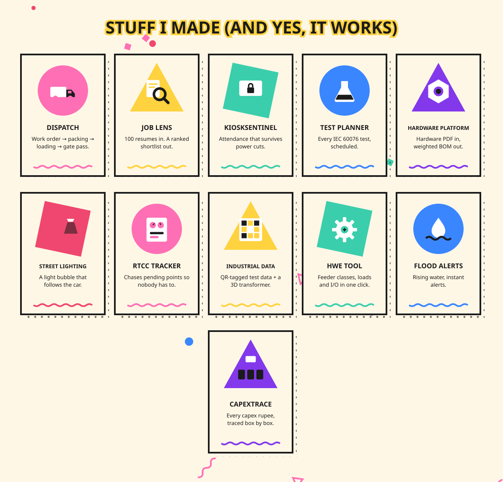

<!-- Memphis design: squiggles, confetti and loud geometry. Cream daytime and grape-night versions follow your GitHub theme. Built by scripts/gen_memphis.py -->

<picture><source media="(prefers-color-scheme: dark)" srcset="./assets/memphis/hero-dark.svg"/></picture>

<picture><source media="(prefers-color-scheme: dark)" srcset="./assets/memphis/projects-dark.svg"/></picture>

<b>[Dispatch](https://github.com/KRISH-exe-29/Dispatch-ITTL) ~ [Job Lens](https://krishna-ittl.github.io/Candidate-Screener/) ~ [Test Planner](https://transformer-test-planner.vercel.app) ~ [Hardware Platform](https://github.com/KRISH-exe-29/Fasteners-Project) ~ [RTCC Tracker](https://github.com/KRISH-exe-29/Pannel-Box-Transformers-) ~ [Industrial Data](https://github.com/KRISH-exe-29/indotech-transformers)</b>

<a href="mailto:krishnarajus2004@gmail.com"><picture><source media="(prefers-color-scheme: dark)" srcset="./assets/memphis/sayhi-dark.svg"/></picture></a>

〰 <a href="https://linkedin.com/in/krishnarajus2004">linkedin</a> 〰

<h3 align="center">🖥️ New: two portfolio sites</h3>

  
  

  <b>Krish.exe</b>: 161,000 volts. One engineer. Zero spreadsheets. 
  <b>Sweep</b>: a whole career read as one frequency sweep, 20 Hz to 2 MHz. 
  <a href="https://krish-exe-29.github.io/KRISH_Portfolio/">Read the portfolio</a> · twelve designs live on their own branches in <a href="https://github.com/KRISH-exe-29/KRISH_Portfolio">KRISH_Portfolio</a>.

