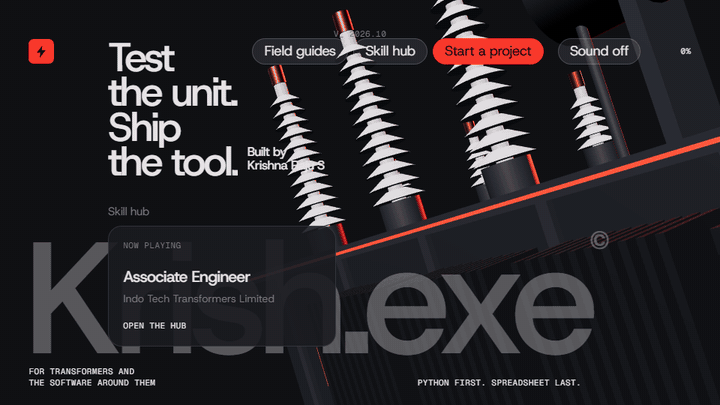
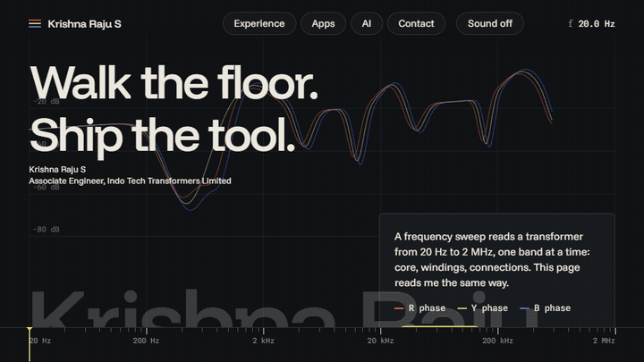

<!-- Art Deco: gold on black (dark) and gold on ivory (light), following your GitHub theme. Built by scripts/gen_deco.py -->

<picture><source media="(prefers-color-scheme: dark)" srcset="./assets/deco/marquee-dark.svg"/></picture>

<picture><source media="(prefers-color-scheme: dark)" srcset="./assets/deco/exhibits-dark.svg"/></picture>

✦ [Dispatch](https://github.com/KRISH-exe-29/Dispatch-ITTL) · [Job Lens](https://krishna-ittl.github.io/Candidate-Screener/) · [Test Planner](https://transformer-test-planner.vercel.app) · [Hardware Platform](https://github.com/KRISH-exe-29/Fasteners-Project) · [RTCC Tracker](https://github.com/KRISH-exe-29/Pannel-Box-Transformers-) · [Industrial Data](https://github.com/KRISH-exe-29/indotech-transformers) ✦

<picture><source media="(prefers-color-scheme: dark)" srcset="./assets/deco/honours-dark.svg"/></picture>

<a href="mailto:krishnarajus2004@gmail.com">correspondence</a> · <a href="https://linkedin.com/in/krishnarajus2004">calling card</a>

<h3 align="center">🖥️ New: two portfolio sites</h3>

  
  

  <b>Krish.exe</b>: 161,000 volts. One engineer. Zero spreadsheets. 
  <b>Sweep</b>: a whole career read as one frequency sweep, 20 Hz to 2 MHz. 
  <a href="https://krish-exe-29.github.io/KRISH_Portfolio/">Read the portfolio</a> · twelve designs live on their own branches in <a href="https://github.com/KRISH-exe-29/KRISH_Portfolio">KRISH_Portfolio</a>.

