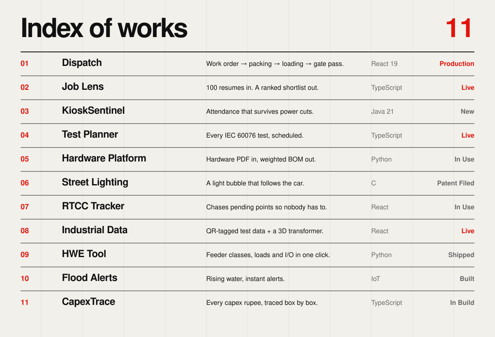
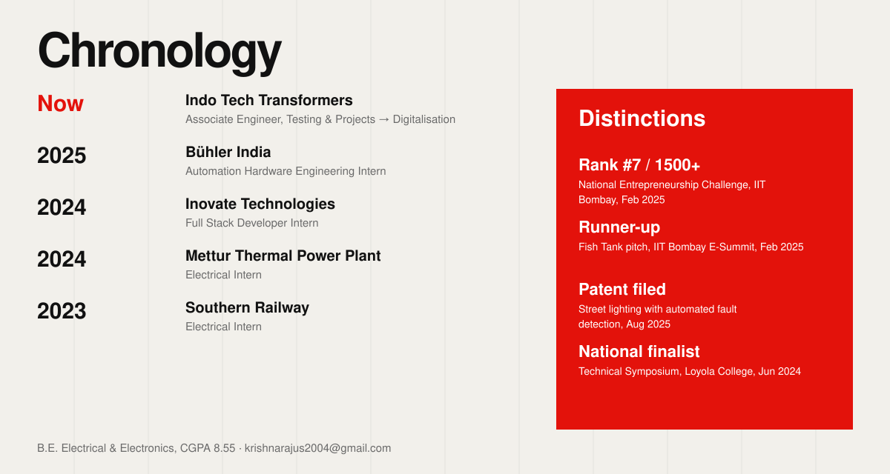

<!-- Swiss / International Typographic Style. Light and dark follow your GitHub theme. Built by scripts/gen_swiss.py -->

<picture><source media="(prefers-color-scheme: dark)" srcset="./assets/swiss/poster-dark.svg"/></picture>

**01** [Email](mailto:krishnarajus2004@gmail.com) — **02** [LinkedIn](https://linkedin.com/in/krishnarajus2004) — **03** [Job Lens, live](https://krishna-ittl.github.io/Candidate-Screener/)

<picture><source media="(prefers-color-scheme: dark)" srcset="./assets/swiss/index-dark.svg"/></picture>

[Dispatch](https://github.com/KRISH-exe-29/Dispatch-ITTL) — [Job Lens](https://krishna-ittl.github.io/Candidate-Screener/) — [Test Planner](https://transformer-test-planner.vercel.app) — [Hardware Platform](https://github.com/KRISH-exe-29/Fasteners-Project) — [RTCC Tracker](https://github.com/KRISH-exe-29/Pannel-Box-Transformers-) — [Industrial Data](https://github.com/KRISH-exe-29/indotech-transformers)

<picture><source media="(prefers-color-scheme: dark)" srcset="./assets/swiss/chronology-dark.svg"/></picture>

<!-- REPOS:START -->

## Latest repos

Updated automatically from GitHub by a workflow.

| Repo | What it is | Language | ★ | Last push |
|---|---|---|---|---|
| [KRISH_Portfolio](https://github.com/KRISH-exe-29/KRISH_Portfolio) | Portfolio of Krishna Raju S, an electrical engineer who ships software. Twelve design concepts, one per branch and tag; the live one is a magazine-style issue built with React and Vite. | JavaScript | 0 | 2026-10-29 |
| [capex-project-tracker](https://github.com/KRISH-exe-29/capex-project-tracker) | INDO TECH capex tracker: PR/PO budget ceiling, PO dossier, exceptions, activity log | TypeScript | 0 | 2026-10-21 |
| [BUHLER-Automation](https://github.com/KRISH-exe-29/BUHLER-Automation) | Python GUI + Excel Automation Tool for Buhler Group electrical engineering data processing. Live app: https://bulhergroupofcompany.streamlit.app/ | Python | 0 | 2026-10-13 |
| [Dmat-Practice](https://github.com/KRISH-exe-29/Dmat-Practice) | Offline exam simulator and practice app for the dMAT (Digitaler Mastertest), in a single HTML file. Unofficial study tool. | HTML | 0 | 2026-09-25 |
| [PMS](https://github.com/KRISH-exe-29/PMS) | Enterprise Project Management System for Indo Tech Transformers: projects, milestones, an interactive Gantt chart, budgets and role-based access. React 19, Vite and Supabase. | TypeScript | 0 | 2026-07-14 |
| [Pannel-Box-Transformers-](https://github.com/KRISH-exe-29/Pannel-Box-Transformers-) | RTCC panel and marshaling box tracker for Indo Tech Transformers: inspection stages, pending points and automatic follow-up emails. React, Express and Supabase. | JavaScript | 0 | 2026-06-25 |

<!-- REPOS:END -->
